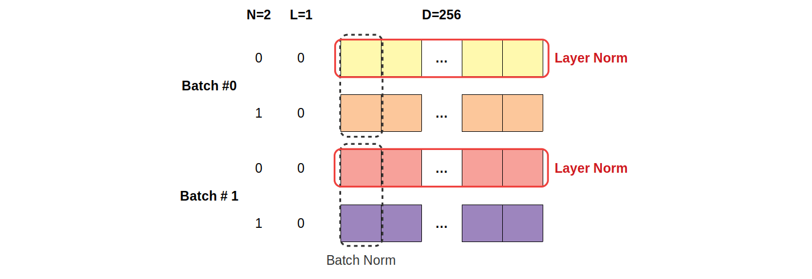

# 归一化方法

> 先看一个朴素问题：深层网络的激活值为什么会乱？

---

## 1. 为什么需要归一化？

**问题**：深层网络中，每层的输出是下一层的输入。如果激活值分布在训练中漂移（"Internal Covariate Shift"），后面的层就要不断追着调整。

更严重的问题：
- 激活值过大 → 梯度爆炸
- 激活值过小 → 梯度消失
- 不同维度量级差异大 → 优化方向被大值主导

**归一化的本质**：在某个维度上把激活值规范到 0 均值、单位方差。

```text
归一化 = 强制激活分布稳定 → 训练更稳、可加更深的网络。
```

---

## 2. 沿哪一维归一？决定了归一化的类别

设输入张量 $X \in \mathbb{R}^{B \times L \times D}$。

**符号说明**：
- $B$（Batch）：批大小（一个 batch 有几个样本）
- $L$（Length）：序列长度（一句话有几个 token）
- $D$（Dimension）：特征维度（每个 token 的向量长度，如 $d=4096$）

不同归一化方法的差别就是**沿哪一维算均值方差**：

| 方法 | 沿哪一维统计 | 直觉 |
|---|---|---|
| **BatchNorm** | $(B, L)$（每个特征独立） | "看看这个特征在整个 batch 中的统计" |
| **LayerNorm** | $D$（每个样本独立） | "看看这个样本所有特征的统计" |
| **RMSNorm** | $D$（只算 RMS，不减均值） | LayerNorm 的简化版 |



> **图：BatchNorm vs LayerNorm 切的维度不同**
> （图源 [dvgodoy/dl-visuals, CC BY 4.0](../02-Transformer篇/assets/CREDITS.md)）
>
> 每个小方块是一个标量（特征的一个分量）。同色方块共享一组 $(\mu, \sigma)$：
> - **LayerNorm（红色框）**：横着圈一行 → 同一个样本、同一个 token 的 $D=256$ 个特征
>   一起算均值方差。**每个 token 独立**，与 batch 内其他样本无关。
> - **BatchNorm（虚线框）**：竖着圈一列 → 不同样本/不同 token、**同一个特征 channel** 一起统计。
>   依赖 batch 维 → NLP 中 batch 小、序列变长，统计不稳。
>
> 所以 Transformer 选 LayerNorm（per-sample 计算，与 batch 大小无关）。

---

## 3. 为什么 Transformer 不用 BatchNorm？

BN 在 CNN 上很成功，但在 NLP 上几乎不能用：

1. **序列长度可变 + padding**：BN 的统计会被 padding 污染
2. **训练 / 推理不一致**：BN 推理用 running stats（训练时累积的均值方差），分布漂移影响生成
3. **小 batch 训练**：BN 统计不可靠（LLM 微调常用小 batch）
4. **自回归推理**：解码时 batch = 1，BN 几乎不可用

LayerNorm 是 per-sample 的，完全避开以上问题。

---

## 4. LayerNorm 公式拆解

$$y = \gamma \cdot \frac{x - \mu}{\sqrt{\sigma^2 + \epsilon}} + \beta$$

**符号说明**：
- $x \in \mathbb{R}^D$：当前 token 的特征向量（输入）
- $y \in \mathbb{R}^D$：归一化后输出
- $\mu$（mu）：$x$ 的均值（标量），$\mu = \frac{1}{D} \sum_{i=1}^D x_i$
- $\sigma^2$（sigma squared）：$x$ 的方差（标量），$\sigma^2 = \frac{1}{D} \sum_{i=1}^D (x_i - \mu)^2$
- $\epsilon$（epsilon）：极小数（如 $10^{-5}$），防止除零
- $\gamma \in \mathbb{R}^D$（gamma）：可训练的缩放因子
- $\beta \in \mathbb{R}^D$（beta）：可训练的平移因子

**两步**：
1. **归一化**：$(x - \mu) / \sqrt{\sigma^2 + \epsilon}$ → 强制 0 均值、单位方差
2. **仿射变换**：$\gamma \cdot (\cdot) + \beta$ → 还原表达力（避免归一化"过分"）

$\gamma$ 初值 1，$\beta$ 初值 0（开始时仿射部分等于恒等映射）。

---

## 5. RMSNorm：删掉均值能行吗？

观察：LayerNorm 的两个作用——
- **re-centering**（减均值）
- **re-scaling**（除标准差）

实验发现：**re-scaling 是主要贡献，re-centering 影响很小**（Zhang & Sennrich, 2019）。

RMSNorm 直接砍掉减均值的部分：

$$y = \gamma \cdot \frac{x}{\sqrt{\text{RMS}(x)^2 + \epsilon}}, \quad \text{RMS}(x) = \sqrt{\frac{1}{D}\sum_{i=1}^D x_i^2}$$

**符号说明**：
- $\text{RMS}(x)$：均方根（Root Mean Square），等于"假设均值为 0 时的标准差"
- 注意：RMSNorm 没有 $\mu$、没有 $\beta$（通常）

**省了**：
- 均值计算 $\mu$（不再算一遍）
- 减均值操作
- 通常也省 $\beta$

**计算节省**：约 7-15%。**效果**：等效或略好。

```text
所以现代 LLM（LLaMA / Qwen / Mistral / DeepSeek）全用 RMSNorm。
```

---

## 6. Pre-Norm vs Post-Norm：放在残差里 vs 外？

### 6.1 两种放法

**Post-Norm**（原始 Transformer）：

$$y = \text{LayerNorm}(x + \text{Sublayer}(x))$$

**符号说明**：
- $x$：子层输入
- $\text{Sublayer}(x)$：Attention 或 FFN 子层的输出
- $y$：block 的输出

**Pre-Norm**（现代 LLM）：

$$y = x + \text{Sublayer}(\text{LayerNorm}(x))$$

### 6.2 为什么 Pre-Norm 更稳

关键看**梯度反传通过残差路径的样子**。

**Post-Norm**：
$$\frac{\partial y}{\partial x} = J_{LN} \cdot (I + J_F)$$

**符号**：
- $J_{LN}$：LayerNorm 的雅可比矩阵
- $J_F$：Sublayer 的雅可比矩阵
- $I$：单位矩阵

**Pre-Norm**：
$$\frac{\partial y}{\partial x} = I + J_F \cdot J_{LN}$$

```text
Pre-Norm 中残差路径是恒等（梯度有"+I"项直通），
深层（几十到上百层）也稳。
```

### 6.3 权衡

| | Pre-Norm | Post-Norm |
|---|---|---|
| 训练稳定性 | **好** | 差（深层难训） |
| Warmup 依赖 | 弱 | 强 |
| 表达能力 | 略弱（残差稀释） | 略强 |
| 现代 LLM | **几乎全用** | 几乎不用 |

---

## 7. 千层网络怎么训？DeepNorm

Pre-Norm 在 100+ 层很稳，但 1000 层仍会发散。

**DeepNorm**（MS 2022）做法：

$$y = \text{LayerNorm}(\alpha \cdot x + \text{Sublayer}(x))$$

**符号**：
- $\alpha$：残差路径的缩放因子（$\alpha > 1$）
- 配合对部分参数的缩小初始化系数 $\beta$（注意：这里 $\beta$ 不是 LN 的 $\beta$，是初始化缩放）

论文给出最优 $\alpha = (2N)^{1/4}, \beta = (8N)^{-1/4}$（$N$ 是层数）。

```text
1000 层 Transformer 主要靠 DeepNorm + Pre-Norm。
```

---

## 8. Final LayerNorm

Pre-Norm 架构中，最后一个 block 出来后**还要加一层 final LN**：

```
embedding → N × block → final RMSNorm → lm_head
```

原因：Pre-Norm 中残差路径不被归一化，最后输出的方差会随层数累积。

---

## 9. 最简记忆

```text
BatchNorm  跨样本归一  → CNN 用，NLP 不用
LayerNorm  跨特征归一  → BERT 用
RMSNorm    LayerNorm 砍掉均值 → 现代 LLM 全用

Pre-Norm  归一化在残差内（梯度直通） → 现代主流
Post-Norm 归一化在残差外（梯度被截断） → 原始 Transformer

千层级 → DeepNorm
最后 → 别忘了 final LN
```

---

## 🎯 高频追问

1. **LN 的 $\gamma, \beta$ 起什么作用**？还原归一化前的表达力（仿射变换）。$\gamma$ 初值 1，$\beta$ 初值 0。

2. **RMSNorm 有 $\beta$ 吗**？通常没有，只有 $\gamma$。

3. **训练 / 推理 LN 一致吗**？一致。永远 per-sample 计算，没有 BN 那种 running stats 漂移。

4. **Pre-Norm 后期效果稍差**？是。深层时残差路径占主导，等效深度变浅。Sandwich Norm（两端都 norm）等方案在尝试缓解。
