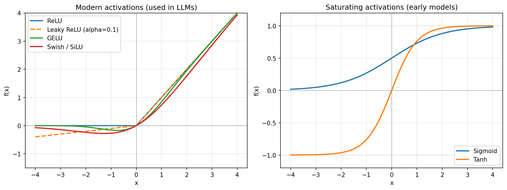
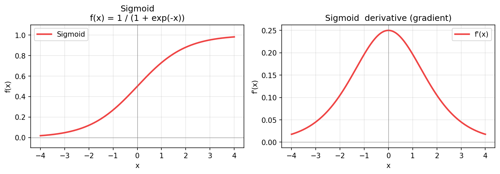
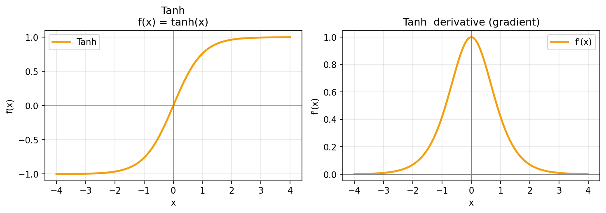
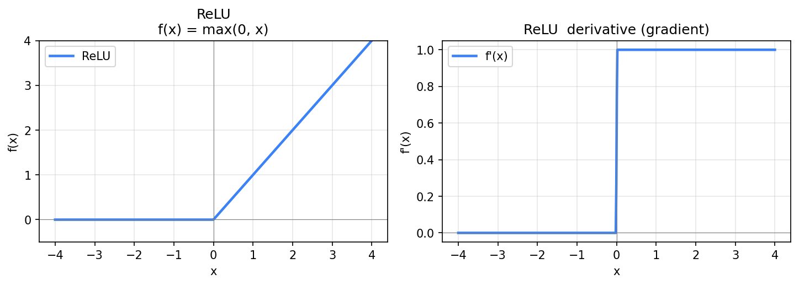
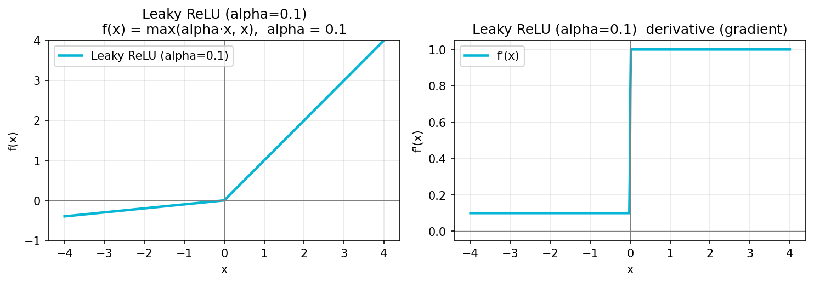
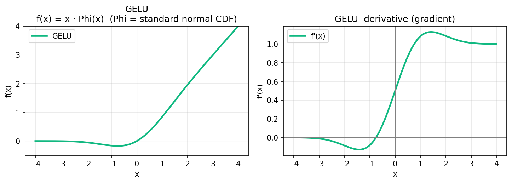
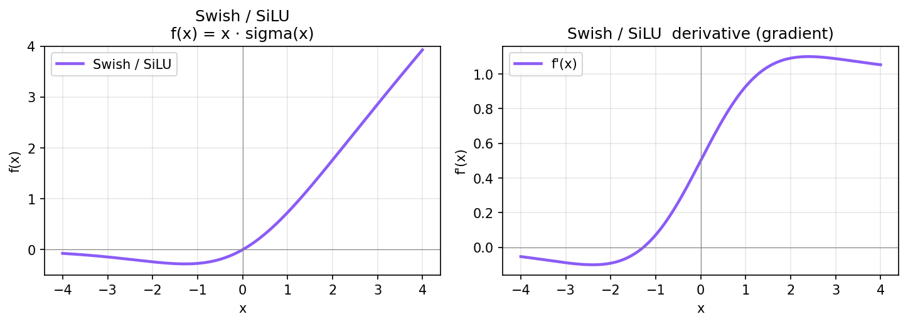
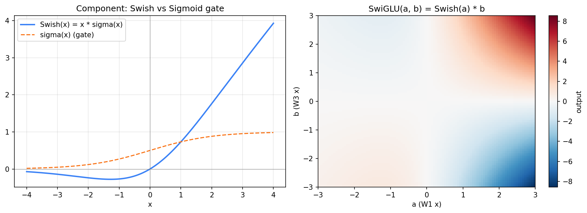
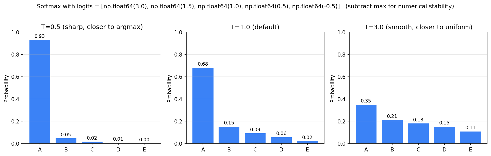

# 激活函数

> 从 ReLU 到 SwiGLU，每次演进都解决了上一代的痛点。



> 左：现代 LLM 主流（ReLU / Leaky ReLU / GELU / Swish），共同点是**正半轴近似线性**、**负半轴留少量信号**。
> 右：早期饱和函数（Sigmoid / Tanh），两侧饱和导致梯度消失，已被淘汰。

---

## 1. 为什么需要非线性？

Attention 和矩阵乘都是**线性的**。多层线性堆叠仍然是线性，能力等于一层。

加非线性激活函数后，模型才能拟合复杂函数。所以 FFN 中的非线性是**绝对必要**的。

---

### 历史回顾：经典饱和函数（Sigmoid / Tanh）

LLM 之前的网络主要用 Sigmoid / Tanh，**两端饱和**导致深层网络梯度消失，已被淘汰。两张单图直观感受一下：

**Sigmoid**：$\sigma(x) = \frac{1}{1 + e^{-x}}$，输出范围 $(0, 1)$。



- 左：函数本身——$x$ 远离 0 时输出贴近 0 或 1。
- 右：**导数**——最大值仅 0.25（在 $x = 0$ 处），两端趋零 → 反传时**梯度连乘很快消失**。
- 另外输出**非零中心**（均值 0.5），让下一层的权重更新偏向一个方向，收敛慢。

**Tanh**：$\tanh(x)$，输出范围 $(-1, 1)$，零中心。



- 比 Sigmoid 好一些（零中心 → 收敛更快、导数峰值 1）
- 但**仍然两端饱和**，深层梯度消失问题没解决

```text
饱和族的共同病：导数两端趋零 → 深层梯度连乘 → 消失。
现代 LLM 几乎不用它们做主激活；仅 sigmoid 在"门控"（gate）里活跃。
```

---

## 2. ReLU：简单粗暴

$$\text{ReLU}(x) = \max(0, x)$$



- 左：函数本身——负半轴恒为 0，正半轴恒等
- 右：**导数**——正区为 1（没有饱和、不会消失）、负区恒为 0（**死神经元**的根源）

**符号说明**：
- $x$：输入（一个标量，激活函数都是逐元素作用）
- $\max(a, b)$：取 $a, b$ 中较大的

**优点**：
- 计算极简
- 缓解梯度消失（正区梯度恒为 1）

**问题**：
- **死神经元**：某神经元长期输出负 → 梯度恒为 0 → 永远不更新
- 不连续可导（0 点处不光滑）

```text
ReLU 是 CNN 时代的主力，但 LLM 嫌它"不够平滑"。
```

### 2.1 Leaky ReLU（缓解死神经元的常见变体）

$$\text{LeakyReLU}(x) = \max(\alpha x, \, x), \quad \alpha \in (0, 1)$$

**符号**：$\alpha$ 是小斜率（典型 0.01-0.1），让负半轴保留少量信号。



- 左：负半轴不再死板，斜率 $\alpha = 0.1$
- 右：**导数**变成"正区 1 / 负区 $\alpha$"——负区也有非零梯度 → **不再有死神经元**

代价：多一个超参 $\alpha$，且改善有限。LLM 时代直接用 GELU/Swish 跳过这个问题。

---

## 3. GELU：让 ReLU 平滑

$$\text{GELU}(x) = x \cdot \Phi(x)$$



- 左：在 0 附近**平滑过渡**（不像 ReLU 一刀切），$x \approx -0.7$ 处有个小凹（保留少量负信号）
- 右：导数**处处连续**，正区接近 1、$x < 0$ 时也有微小非零梯度 → **没有死神经元**

**符号说明**：
- $\Phi(x)$（大写 phi）：标准正态分布的累积分布函数（CDF）
- $\Phi(x) = P(X \leq x)$，其中 $X \sim \mathcal{N}(0, 1)$（标准正态）

**直觉**：
- $x \gg 0$ → $\Phi(x) \approx 1$ → GELU ≈ $x$（保留）
- $x \ll 0$ → $\Phi(x) \approx 0$ → GELU ≈ 0（抑制）
- $x \approx 0$ → 平滑过渡

**常用近似**：

$$\text{GELU}(x) \approx 0.5 x \left(1 + \tanh\left(\sqrt{\frac{2}{\pi}}(x + 0.044715 x^3)\right)\right)$$

**对比 ReLU**：
- ReLU 在 0 处一刀切（不可导）
- GELU 处处平滑可导
- 对负输入不完全截断

**用在哪**：BERT、GPT-2、GPT-3。

---

## 4. Swish / SiLU：和 GELU 近亲

$$\text{Swish}(x) = x \cdot \sigma(x)$$



- 左：形状与 GELU 几乎重合（同样在 $x \approx -1$ 附近有小凹）
- 右：导数也几乎一致，正区平滑过渡到 1、负区温和衰减

**符号说明**：
- $\sigma(x) = \frac{1}{1 + e^{-x}}$：sigmoid 函数（小写 sigma，与方差的 $\sigma^2$ 不是一回事）

与 GELU 形状非常接近（差异 < 0.1 PPL）。LLaMA 用 Swish（论文里叫 SiLU）。

```text
GELU 和 Swish 实质都是 "x × 平滑门"。
```

---

## 5. GLU 系列：从"激活"到"门控"

### 5.1 朴素 FFN

$$\text{FFN}(x) = W_2 \cdot \text{GELU}(W_1 x)$$

**符号说明**：
- $x \in \mathbb{R}^d$：当前 token 的特征
- $W_1 \in \mathbb{R}^{d_{ff} \times d}$：第一层权重（扩展，典型 $d_{ff} = 4d$）
- $W_2 \in \mathbb{R}^{d \times d_{ff}}$：第二层权重（投影回）
- $d$：模型隐藏维度
- $d_{ff}$：FFN 中间维度

只有一个非线性，无信息选择。

### 5.2 GLU 思路：加一个"门"

**Gated Linear Unit**：

$$\text{GLU}(x) = (W_1 x) \otimes \sigma(W_2 x)$$

**符号说明**：
- $\otimes$：逐元素乘（element-wise product，又叫 Hadamard product）
- $W_1, W_2 \in \mathbb{R}^{d_{ff} \times d}$：两个独立的权重矩阵
- $(W_1 x)$：内容部分
- $\sigma(W_2 x)$：门部分（0~1，决定让多少信息通过）

**类比 LSTM 的门**：模型学到"对哪些 token 的哪些维度更敏感"。

### 5.3 SwiGLU（LLaMA 选用）

把 sigmoid 门换成 Swish 门：

$$\text{SwiGLU}(x) = \text{Swish}(W_1 x) \otimes (W_3 x)$$

完整 FFN：

$$\text{FFN}_{\text{SwiGLU}}(x) = W_2 \cdot \left[\text{Swish}(W_1 x) \otimes (W_3 x)\right]$$

**符号说明**：
- $W_1, W_3 \in \mathbb{R}^{h \times d}$：两个独立的"扩展"矩阵
- $W_2 \in \mathbb{R}^{d \times h}$：投影回原维度
- $h$：FFN 中间维度（见下）

注意：3 个权重矩阵（原 FFN 只有 2 个）。



> 左：Swish(x) = x · σ(x) 的曲线；可以看作"输入 x 被 sigmoid 门 σ(x) 软门控"。
> 右：SwiGLU(a, b) = Swish(a) · b 的二维输出热图。
>   - 当门控信号 $a = W_1 x$ 接近 0 时（中间区域），无论 $b = W_3 x$ 多大，输出都接近 0 → **"门关上"**。
>   - 当 $a$ 大且 $b$ 大时（右上），输出强正 → "门打开，内容直通"。
>   - 这种"按维度学到通断"的能力就是 SwiGLU 比纯 GELU 强的核心。

---

## 6. 为什么 SwiGLU 的中间维度是 $\frac{8}{3}d$？

**保持参数量不变**的约束。

| FFN 形式 | 矩阵数 | 中间维度 | 总参数 |
|---|---|---|---|
| 原 FFN | 2（$W_1, W_2$） | $4d$ | $2 \cdot 4d \cdot d = 8d^2$ |
| SwiGLU | 3（$W_1, W_3, W_2$） | $h$ | $3 \cdot h \cdot d$ |

对齐参数量：

$$3 h d = 8 d^2 \quad \Rightarrow \quad h = \frac{8}{3} d$$

工程上向 64 / 128 倍数对齐。例：LLaMA-7B $d = 4096$，中间维度 $11008 \approx \frac{8}{3} \times 4096$。

```text
SwiGLU 既加了门控（强表达），又保持参数预算不变。
现代 LLM 几乎全用 SwiGLU。
```

---

## 7. Softmax：注意力的"加权"

$$\text{softmax}(x_i) = \frac{e^{x_i}}{\sum_j e^{x_j}}$$

**符号说明**：
- $x \in \mathbb{R}^n$：一个向量
- $x_i$：第 $i$ 个分量
- $\sum_j e^{x_j}$：对所有分量求和（分母是个标量）
- 输出和原向量同维度，每个值在 $(0, 1)$，所有值和为 1

**性质**：
- 输出严格归一到 1 → 自然解释为"权重分配"
- 平移不变：$\text{softmax}(x + c) = \text{softmax}(x)$（$c$ 是任意常数）



> 同一组 logits `[3.0, 1.5, 1.0, 0.5, -0.5]`，温度 $T$ 不同时 softmax 输出分布大不相同：
> - **T=0.5**：A 概率 0.93，分布尖锐（趋近 argmax）→ 用于"确定性任务"（代码、数学）
> - **T=1.0**：A 概率 0.68，正常分布 → 默认 chat
> - **T=3.0**：A 概率 0.35，分布平坦（趋近均匀）→ 用于"创意写作"或蒸馏暴露暗知识

### 7.1 数值稳定写法

$x$ 较大时 $e^x$ 溢出。利用平移不变性，减最大值：

$$\text{softmax}(x_i) = \frac{e^{x_i - x_{\max}}}{\sum_j e^{x_j - x_{\max}}}$$

**符号**：$x_{\max} = \max_j x_j$。

最大项变成 $e^0 = 1$，绝不溢出。PyTorch 的 `cross_entropy` / `log_softmax` 都用这种稳定形式（接收 logits 而非 softmax 输出）。

### 7.2 Online Softmax（FlashAttention 用）

分块计算 softmax 时，维护 running max 和 running sum：

```text
新块来了 → 更新 max → 缩放历史累积 → 加入新块贡献
```

让 softmax 能"流式"算，不需要一次性看到所有数据。FlashAttention 的核心技巧之一（详见高效注意力篇）。

---

## 8. 最简记忆

```text
ReLU       简单粗暴，死神经元 → CNN 时代
GELU       平滑版 ReLU         → BERT/GPT-2 时代
Swish/SiLU GELU 的近亲          → 与 GELU 几乎等价
SwiGLU     Swish + 门控         → 现代 LLM 默认
              中间维度 8/3 d（保持参数量）

Softmax    分配权重，必须减最大值数值稳定
Online Softmax → FlashAttention 的基础技巧
```

---

## 🎯 高频追问

1. **GELU vs Swish 谁更好**？差别极小。GELU 在 BERT/GPT-2 时代成名；Swish 在 LLM 时代主流（SwiGLU 用 Swish 作基底）。

2. **激活函数会影响推理速度吗**？会。SwiGLU 因为多一个矩阵乘 + 逐元素乘，比 GELU 慢约 50%。但效果提升足够补偿。

3. **能用 Sigmoid 替代 Softmax 做 Attention 吗**？Apple 等做过尝试，可行但不主流。Softmax 的"归一为 1"语义太强势。

4. **死神经元问题怎么缓解**？合理初始化（He/Kaiming）、Leaky ReLU、加 LayerNorm。现代 GELU/Swish 已不太遇到。
