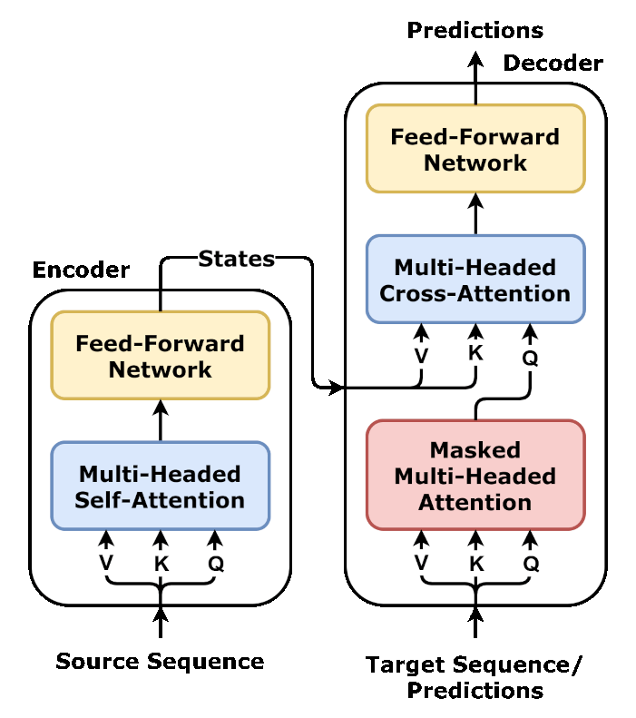

# Transformer 整体架构

> 不要先看图，先想"为什么这么设计"。先看下面这张全景图，对各组件位置有个印象。


> **图：原始 Transformer 完整架构**（Encoder-Decoder 形式，"Attention Is All You Need" 2017）
> （图源 [Wikimedia Commons / dvgodoy, CC BY 4.0](./assets/CREDITS.md)）

**快速读图**（自下而上）：
- **左半边（Encoder）**：源序列 → Embedding + 位置编码 → N 层 [Norm → **Self-Attention** → 残差 → Norm → **FFN** → 残差] → 顶部 Norm 输出"上下文表示"
- **右半边（Decoder）**：目标序列（右移一位）→ Embedding + PE → N 层 [Norm → **Masked Self-Attention** → 残差 → Norm → **Cross-Attention（Q 来自 Decoder，K/V 来自 Encoder 顶部）** → 残差 → Norm → **FFN** → 残差] → Norm → **Linear** → Softmax 得到下一个 token 的概率
- **关键箭头**：从 Encoder 顶部出来的那条横线就是 Cross-Attention 的 K, V 来源
- **三种 Attention 一目了然**：Encoder 的 Self-Attention（蓝）、Decoder 的 Masked Self-Attention（红）、Cross-Attention（蓝）

> 现代 LLM（GPT / LLaMA / Qwen 等）只用**右半边的 Decoder**，并把其中的 Cross-Attention 去掉——这就是"Decoder-only"路线。具体差别见 §3。

---

## 1. Transformer 解决了什么问题？

**2017 年之前**：序列建模主要靠 RNN/LSTM。

**RNN 的两大痛点**：
1. **串行训练**：必须按时间步走，不能并行 → GPU 利用率低
2. **长程依赖**：信号沿时间传播会衰减 → 难记住远处信息

**Transformer 的两个核心动作**：
1. 用 **Attention** 让任意两个 token 直接通信（$O(1)$ 距离）
2. 整个序列**并行计算**（同时处理所有位置）

```text
Transformer = 用 Attention 替代 RNN 的循环，
换来"并行训练 + 长程依赖"。
```

代价：复杂度从 $O(n)$ 变 $O(n^2)$（每对 token 都要算相似度）。**符号**：$n$ 是序列长度。

---

## 2. 三种结构：Encoder-only / Decoder-only / Enc-Dec

按 **Attention 能看到什么** 划分：

| 类型 | Attention 看到什么 | 任务 | 代表 |
|---|---|---|---|
| **Encoder-only** | 全部（双向） | 理解（分类、抽取） | BERT |
| **Decoder-only** | 只看过去（单向 + Causal Mask） | 生成 | GPT、LLaMA |
| **Encoder-Decoder** | Enc 双向 + Dec 单向 + Cross-Attn | 翻译、摘要 | T5、原始 Transformer |



> **图：单个 Encoder-Decoder Block 的精简形式**（去掉了残差和 Norm，突出"三种 Attention"）
> （图源 [Wikimedia Commons / dvgodoy, CC BY 4.0](./assets/CREDITS.md)）
>
> - **Encoder**：Self-Attention（蓝）→ FFN
> - **Decoder**：Masked Self-Attention（红，看不到未来）→ **Cross-Attention（K/V 从 Encoder 输出引过来，Q 是 Decoder 自己的）** → FFN
> - 三类模型的差别：
>   - **Encoder-only** = 只保留左半边
>   - **Decoder-only** = 只保留右半边，并**去掉 Cross-Attention**
>   - **Encoder-Decoder** = 两边都保留

---

## 3. 为什么现代 LLM 都是 Decoder-only？

高频"灵魂题"，几个层面回答：

### 3.1 训练目标更高效

**CLM（Causal LM）**：每个位置预测下一个 token。

$$\mathcal{L}_{\text{CLM}} = -\sum_{t=1}^{N} \log P(x_t \mid x_{<t})$$

**符号说明**：
- $x_t$：第 $t$ 个 token
- $x_{<t}$：第 $t$ 个之前所有 token
- $N$：序列长度
- $\mathcal{L}$：loss

每个 token 都贡献 loss → 数据利用率 100%。

**MLM（BERT 用）**：只对 15% mask 的 token 算 loss → 数据利用率 15%。

### 3.2 Zero-shot / In-context Learning 强

GPT-3 证明：Decoder-only + scaling 在 zero/few-shot 上吊打 Encoder-Decoder（如 T5）。

Causal mask + 任意长 prompt 天然支持 in-context learning。

### 3.3 部署 / 工程友好

- 无 Cross-Attention：架构简单
- KV Cache 直接 work（每生成一个 token，复用历史）
- TP / PP 切分容易

```text
"训练目标更好 + scaling 路径已验证 + 部署简单"
→ 三方面共同让 Decoder-only 成为主流。
```

---

## 4. Causal Mask：Decoder-only 的关键

### 4.1 为什么需要

生成第 $t$ 个 token 时，模型不能偷看 $t+1, t+2, \dots$（那等于看答案）。

### 4.2 怎么实现

构造 mask 矩阵 $M \in \mathbb{R}^{L \times L}$：

$$M_{i,j} = \begin{cases} 0, & j \leq i \\ -\infty, & j > i \end{cases}$$

**符号说明**：
- $L$：序列长度
- $i$：query 位置（行）
- $j$：key 位置（列）
- $j > i$ 表示"未来位置"

加到 attention scores 上：

$$\text{scores}_{i,j} = \frac{q_i \cdot k_j}{\sqrt{d_k}} + M_{i,j}$$

**符号**：
- $q_i, k_j$：第 $i$ 个 query、第 $j$ 个 key 向量
- $d_k$：每个头的维度

softmax 后，被 mask 的位置权重为 0（因为 $e^{-\infty} = 0$）。

### 4.3 推理时的简化

KV Cache 阶段，每步 Q 只有 1 个 token，要看所有历史 K/V。这时 mask 退化为"全部可见"，可以省去。

---

## 5. 一个 Transformer Block 长什么样

**Pre-Norm 现代版**（LLaMA 风格）：

$$h' = h + \text{Attention}(\text{RMSNorm}(h))$$
$$h'' = h' + \text{FFN}(\text{RMSNorm}(h'))$$

**符号说明**：
- $h \in \mathbb{R}^{L \times d}$：block 输入（每行一个 token 的特征）
- $h', h''$：中间和最终输出
- $d$：模型隐藏维度

**两个子层**：
- **Attention**：让 token 之间通信
- **FFN**：每个 token 独立做变换（无 token 间通信）

**完整模型**：
```
input → embedding → [N × block] → final RMSNorm → lm_head → logits
```

---

## 6. 参数构成

以 LLaMA-7B（$d = 4096, N_{\text{layers}} = 32$）为例：

| 模块 | 参数量（粗估） |
|---|---|
| Embedding | $|V| \times d \approx 130$M |
| 每个 block 的 Attention（QKVO 共 4 个 $d \times d$） | $4d^2 \approx 67$M |
| 每个 block 的 FFN（SwiGLU 3 个矩阵） | $8d^2 \approx 134$M |
| LM Head（常与 embedding 共享） | -- |

**符号**：$|V|$ = 词表大小。

每层 FFN ≈ 2× Attention。FFN 是参数主体（约 65%）。

---

## 7. Transformer vs RNN vs CNN

| | RNN/LSTM | CNN | Transformer |
|---|---|---|---|
| 长程依赖 | 衰减 | 受感受野限制 | $O(1)$ 直接访问 |
| 并行训练 | ❌（沿时间串行） | ✅ | ✅ |
| 复杂度 | $O(n)$ | $O(kn)$ | $O(n^2)$ |
| 归纳偏置 | 时序 | 局部 + 平移不变 | 弱 |

**符号**：$k$ 是 CNN 的 kernel size。

```text
Transformer 用 O(n²) 复杂度，换来完全并行 + 长程直达 + 弱归纳偏置（适合 scaling）。
```

弱归纳偏置 + 大数据 = scaling laws 的成立条件。

---

## 8. 最简记忆

```text
Transformer 的两个动作：
  1. Attention 让 token 之间通信（O(1) 长程）
  2. FFN 让每个 token 独立变换

Decoder-only 主导原因：
  - 训练目标统一（CLM 利用率高）
  - Zero/few-shot 强
  - 部署简单

Block = 残差(Attention) + 残差(FFN)，全套 Pre-Norm。

Causal Mask：上三角设为 -∞，softmax 后变 0。
```

---

## 🎯 高频追问

1. **能否完全去掉 FFN**？不能。Attention 是线性的（softmax 加权 + 线性投影），没有 FFN 提供的非线性就退化。

2. **Encoder-Decoder 还有意义吗**？翻译、摘要等"输入输出明显分离"的场景仍有优势；通用对话已被 Decoder-only 取代。

3. **PrefixLM 是什么**？输入部分双向、输出部分单向。介于 Encoder-Decoder 和 Decoder-only 之间。GLM 早期用过，后来回归 Decoder-only。

4. **Attention 是 $O(n^2)$，长序列怎么办**？FlashAttention 优化 IO（$O(n^2)$ 计算不变但 IO 降到 $O(n)$）、Sliding Window 局部注意力、KV Cache 压缩等。
