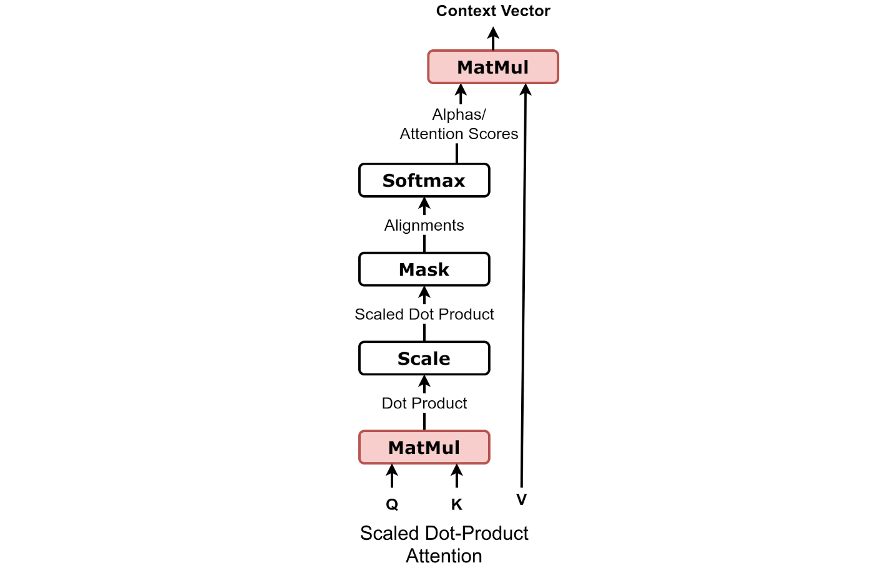
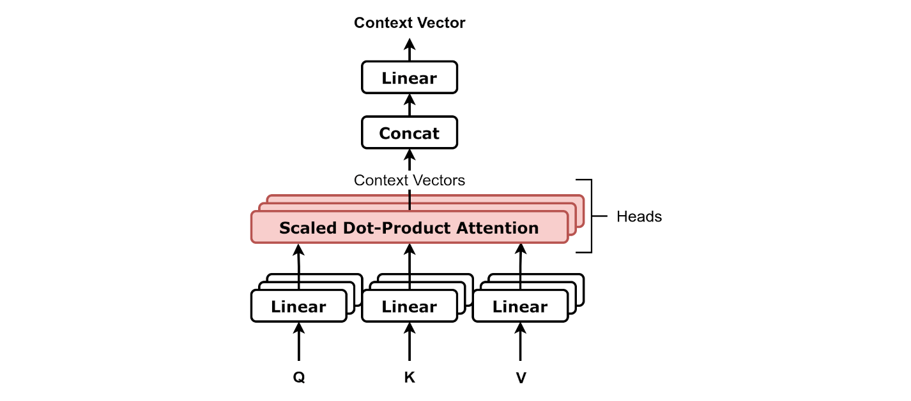

# 注意力机制（核心）

> Scaled Dot-Product Attention 必须能"拆着讲"。

---

## 1. Attention 想做什么？

输入 $n$ 个 token 的向量。**目标**：让每个 token 根据"和其他 token 的相关性"，去聚合其他 token 的信息。

**类比数据库查询**：
- **Query (Q)**：我要找什么样的信息？
- **Key (K)**：每个 token "我能提供什么"？
- **Value (V)**：实际被聚合的内容

流程：用 Q 和每个 K 算相似度 → softmax 归一化 → 用权重对 V 加权求和。

---

## 2. 公式拆解：Scaled Dot-Product Attention

$$\text{Attention}(Q, K, V) = \text{softmax}\left(\frac{Q K^T}{\sqrt{d_k}}\right) V$$



> **图：Scaled Dot-Product Attention 的计算流（自下而上）**
> （图源 [dvgodoy/dl-visuals, CC BY 4.0](./assets/CREDITS.md)）
>
> 顺着箭头看：
> 1. **MatMul (QK)**：$Q$ 与 $K$ 矩阵相乘 → 得到原始相似度（"Dot Product"）
> 2. **Scale**：除以 $\sqrt{d_k}$ → 控制方差防 softmax 饱和（"Scaled Dot Product"）
> 3. **Mask**（可选，Decoder 用）：上三角设为 $-\infty$，阻止偷看未来
> 4. **Softmax**：转成"和为 1 的权重"（Attention Scores）
> 5. **MatMul (·V)**：用权重对 $V$ 做加权求和 → 得到 Context Vector

**符号说明**：
- $Q \in \mathbb{R}^{n \times d_k}$：query 矩阵（每行是一个 token 的 Q 向量）
- $K \in \mathbb{R}^{n \times d_k}$：key 矩阵
- $V \in \mathbb{R}^{n \times d_v}$：value 矩阵
- $n$：序列长度（token 数）
- $d_k$：每头的 K（也是 Q）维度
- $d_v$：每头的 V 维度（通常 $d_v = d_k$）
- $K^T$：$K$ 的转置（变成 $d_k \times n$）

### 2.1 $Q K^T$：算相似度

$$(Q K^T)_{i,j} = q_i \cdot k_j$$

**符号**：$q_i, k_j \in \mathbb{R}^{d_k}$ 分别是第 $i$ 个 query、第 $j$ 个 key 向量。

得到 $n \times n$ 矩阵，元素 $(i, j)$ = token $i$ 对 token $j$ 的相似度。

### 2.2 为什么除以 $\sqrt{d_k}$？

**数学推导**：假设 $q_i, k_j$ 各分量独立、均值 0、方差 1。

$$q \cdot k = \sum_{i=1}^{d_k} q_i k_i$$

是 $d_k$ 项独立随机变量的和：

$$\mathbb{E}[q \cdot k] = 0, \quad \text{Var}[q \cdot k] = d_k$$

**符号**：$\mathbb{E}[\cdot]$ 是期望，$\text{Var}[\cdot]$ 是方差。

不除会怎样？$d_k = 64$ 时方差为 64，标准差约 8。softmax 输入跨度约 $\pm 16$：

```text
softmax([16, -16, ...]) ≈ one-hot
→ 最大项概率 ≈ 1，其他 ≈ 0
→ 梯度对 argmax 之外几乎为 0 → 训练困难
```

除以 $\sqrt{d_k}$ → 方差归一到 1 → softmax 输入跨度合理。

### 2.3 softmax：转成权重

把相似度变成"和为 1 的权重"。每行归一化（一个 token 对所有其他 token 的权重总和 = 1）。

### 2.4 $\cdot V$：加权聚合

最终输出 $\in \mathbb{R}^{n \times d_v}$，每行是其他 token 的 V 的加权和。

---

## 3. Self-Attention vs Cross-Attention

| | Q 来自 | K, V 来自 |
|---|---|---|
| **Self-Attention** | 同一序列 | 同一序列 |
| **Cross-Attention** | 序列 A（如 Decoder） | 序列 B（如 Encoder 输出） |

Decoder-only LLM 只有 Self-Attention。

---

## 4. Multi-Head Attention：为什么要多头？

### 4.1 动机

单头 Attention 只能学一种"关系模式"。多头让模型在不同子空间学不同关系。

类比 CNN 多通道。

### 4.2 实现

$$\text{MultiHead}(Q, K, V) = \text{Concat}(\text{head}_1, \dots, \text{head}_h) \cdot W^O$$

$$\text{head}_i = \text{Attention}(Q W^Q_i, \, K W^K_i, \, V W^V_i)$$



> **图：Multi-Head Attention 的并行结构**
> （图源 [dvgodoy/dl-visuals, CC BY 4.0](./assets/CREDITS.md)）
>
> Q、K、V 各自经过 $h$ 个独立的 Linear 投影（图中"Linear"堆叠表示 $h$ 份），
> 得到 $h$ 套 $(Q_i, K_i, V_i)$，并行送入 $h$ 个 Scaled Dot-Product Attention（红色堆叠）。
> 每个头输出一个 context vector → **Concat 拼接** → 再经一个 $W^O$ Linear → 输出。

**符号说明**：
- $h$：头数（如 32, 64）
- $d$：模型总隐藏维度
- $d_k = d / h$：每头的维度
- $W^Q_i, W^K_i, W^V_i \in \mathbb{R}^{d \times d_k}$：第 $i$ 个头的投影矩阵
- $W^O \in \mathbb{R}^{d \times d}$：输出投影矩阵
- $\text{Concat}(\cdot)$：把 $h$ 个 $\mathbb{R}^{n \times d_k}$ 拼成 $\mathbb{R}^{n \times d}$

把 $d$ 维拆成 $h$ 个 $d_k$ 维子空间，每个头独立算 attention，拼接后经 $W^O$ 融合。

### 4.3 参数量

$W^Q, W^K, W^V$（每个 $d \times d$）+ $W^O$（$d \times d$）= **$4 d^2$**。

**巧妙**：和单头维度 $d$ 的 attention 参数量相同！

### 4.4 头之间学什么？

论文分析表明各头学到不同模式：句法依赖、共指、位置邻接、长程依赖。也有"懒头"几乎没学东西（可剪枝）。

```text
Attention 是"每个 token 用相似度去汇总其他 token 信息"。
Scale √d_k 保证 softmax 不饱和。
Multi-Head 让多个子空间并行学不同关系。
```

---

## 5. 复杂度

**计算复杂度**：$O(n^2 d)$
- $Q K^T$：$O(n^2 d)$
- $\cdot V$：$O(n^2 d)$

**显存复杂度**：$O(n^2)$（attention 矩阵）→ 长序列瓶颈 → FlashAttention 不实例化它。

**何时 attention 主导**：$n > d$ 时。例 LLaMA-7B（$d = 4096$）：
- $n = 4K$ 勉强 attention 主导
- $n = 32K$ 完全 attention 主导

---

## 6. 推理时的特殊形态（KV Cache）

自回归生成时：
- 历史 token 的 K/V 在生成过程中**不变** → 缓存复用
- 每步新 token 只需算 1 个 Q，与全部历史 K/V 做 attention

复杂度：朴素 $O(t^2)$ → KV Cache $O(t)$ per step。

详见 KV Cache 篇。

---

## 7. 一个简洁实现

```python
def attention(Q, K, V, mask=None):
    # Q, K, V: [B, H, L, d_k]
    # B=batch, H=heads, L=seq_len, d_k=head_dim
    d_k = Q.size(-1)
    scores = Q @ K.transpose(-1, -2) / math.sqrt(d_k)  # [B,H,L,L]
    if mask is not None:
        scores.masked_fill_(mask, float('-inf'))
    attn = scores.softmax(dim=-1)
    return attn @ V  # [B,H,L,d_v]
```

---

## 8. 最简记忆

```text
Attention = softmax(QK^T / √d_k) V

Q：我找什么
K：我有什么
V：实际内容

√d_k：归一方差，避免 softmax 饱和
Multi-Head：参数总量 4d² 不变，但分多个子空间各学一种关系
复杂度：O(n²d)，长序列瓶颈
```

---

## 🎯 高频追问

1. **为什么 Q 和 K 用不同矩阵**？让"找信息的方式"和"被找的特征"独立。共享会显著降低效果。

2. **head_dim 怎么选**？经验 64 / 128。LLaMA-2/3 用 128。太小表达力弱、太大冗余。

3. **能用加性 attention 吗**？可以（Bahdanau），但点积可用矩阵乘并行，加性需逐对计算，慢得多。

4. **温度怎么影响 Attention**？$Q K^T / T$ 中 $T$ 大平滑、$T$ 小尖锐。$\sqrt{d_k}$ 实质就是固定的温度选择。

5. **能不能用 Sigmoid 替代 Softmax**？可以（如 Apple 的 Sigmoid Attention），但 Softmax 的"分配权重"语义更主流。
