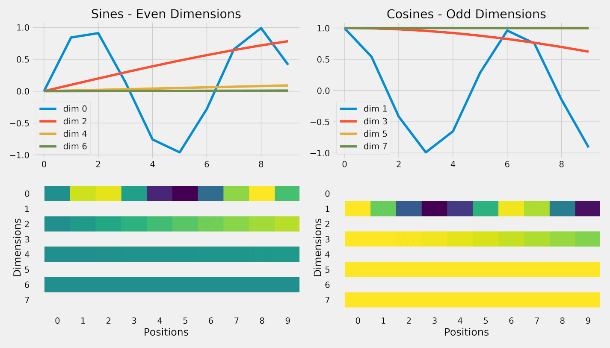

# 位置编码（必考 RoPE）

> Transformer 的 attention 不知道 token 顺序，必须显式注入位置信息。

---

## 1. 为什么需要位置编码？

**self-attention 的置换不变性**：

如果把输入序列 $[x_1, x_2, x_3]$ 打乱成 $[x_3, x_1, x_2]$，attention 输出会跟着打乱，但**每个位置的特征不变**——也就是说 attention 把序列当成"集合"，看不到顺序。

而语言显然依赖顺序（"狗咬人" vs "人咬狗"），所以必须显式注入位置信息。

**注入方式**：
1. 加到输入 embedding 上（Sinusoidal、Learned）
2. 作用于 Q、K（RoPE）
3. 加在 attention logits 上（ALiBi、T5 bias）

---

## 2. Sinusoidal：原始方案

$$PE_{(pos, 2i)} = \sin\left(\frac{pos}{10000^{2i/d}}\right)$$

$$PE_{(pos, 2i+1)} = \cos\left(\frac{pos}{10000^{2i/d}}\right)$$

**符号说明**：
- $pos$：token 在序列中的位置（$0, 1, 2, \dots$）
- $i$：维度索引（$0, 1, \dots, d/2 - 1$）
- $d$：embedding 维度
- $2i, 2i+1$：偶数维和奇数维分别用 sin 和 cos
- $10000$：base，控制频率范围（经验值）

**关键性质**：
- 不同维度对应不同频率：从 $\omega_0 = 1$ 到 $\omega_{d/2-1} = 1/10000$
- $PE$ 加到 token embedding 上，作为输入

**为什么这样设计**：
- 唯一性：不同位置编码不同
- 有界：sin/cos 取值在 $[-1, 1]$
- 相对位置可学：$PE_{pos+k}$ 是 $PE_{pos}$ 的线性组合



> **图：Sinusoidal 位置编码各维度的可视化**（横轴 = 位置 0-9，纵轴 = 值）
> （图源 [dvgodoy/dl-visuals, CC BY 4.0](./assets/CREDITS.md)）
>
> 上排曲线 + 下排色块从两个角度展示**同一件事**：不同维度用不同频率的 sin/cos。
> - **左图 = 偶数维（sin）**、**右图 = 奇数维（cos）**
> - **低维（dim 0, 1）频率高**：曲线起伏快，邻位差异显著 → 编码**精细的短距离信息**
> - **高维（dim 6, 7）频率极低**：在 0-9 这 10 个位置上几乎是直线 → 编码**长距离的粗粒度信息**
> - 下排色块更直观：dim 0 颜色变化丰富、dim 6/7 几乎一色
>
> 这正是"不同维度对应不同频率"的设计——多频率叠加让每个位置得到**独一无二**的编码，
> 且模型能从中同时感知"短距离 + 长距离"两种位置信息。

---

## 3. 绝对 PE vs 相对 PE

| 类型 | 代表 | 特点 |
|---|---|---|
| 绝对 PE | Sinusoidal、Learned PE | 每个位置一个独立向量 |
| 相对 PE | RoPE、ALiBi、T5 bias | 编码 token 之间的相对距离 |

**绝对 PE 的问题**：
- 外推性差（位置 $N+1$ 没见过）
- attention 看到的是绝对位置，对"距离"不敏感

**相对 PE 的优势**：
- 自然支持外推
- 更符合"前面那个词"这种相对依赖直觉

---

## 4. RoPE（旋转位置编码）— 必考

### 4.1 核心思想

把 Q、K 中每两个相邻维度看作复平面上的 2D 向量，按位置**旋转一个角度**。

### 4.2 二维情形

位置 $m$ 处的 Q 应用旋转矩阵：

$$R_m = \begin{pmatrix} \cos m\theta & -\sin m\theta \\ \sin m\theta & \cos m\theta \end{pmatrix}$$

**符号说明**：
- $m$：当前 token 的位置索引
- $\theta$：基础旋转角（与维度有关，是常数）
- $R_m \in \mathbb{R}^{2 \times 2}$：位置 $m$ 处的旋转矩阵（正交）

旋转后的 Q、K：

$$q_m' = R_m \, q_m, \quad k_n' = R_n \, k_n$$

**符号**：$q_m, k_n$ 分别是位置 $m$ 处的 Q 向量和位置 $n$ 处的 K 向量（2D 形式）。

### 4.3 关键性质（必须会推）

$$\langle q_m', k_n' \rangle = q_m^T R_m^T R_n k_n = q_m^T R_{n-m} k_n$$

**符号补充**：
- $\langle a, b \rangle = a^T b$：内积
- 利用 $R_m^T R_n = R_{n-m}$（旋转矩阵性质：转置 = 逆，相乘等于角度相减）

```text
旋转后的内积只依赖相对位置 (n - m)，与绝对位置 m, n 无关。
这就是 RoPE 是"相对"位置编码的本质。
```

### 4.4 高维实现

把 $d$ 维向量分成 $d/2$ 对，每对独立旋转，频率不同：

$$\theta_i = 10000^{-2i/d}, \quad i = 0, 1, \dots, d/2 - 1$$

**符号**：
- $\theta_i$：第 $i$ 对维度的基础旋转角
- 高频（小 $i$）→ 短距离精细
- 低频（大 $i$）→ 长距离平滑

### 4.5 伪代码

```python
def apply_rope(x, pos):
    # x: [..., d]
    # pos: [seq_len], 当前 token 的位置索引
    
    # 把最后一维分两半（成对）
    x1, x2 = x[..., 0::2], x[..., 1::2]   # 偶 / 奇维度，shape [..., d/2]
    
    # 算每对的旋转角
    freq = 1.0 / (10000 ** (torch.arange(0, d, 2) / d))  # [d/2]
    angle = pos.unsqueeze(-1) * freq      # [seq_len, d/2]
    cos, sin = angle.cos(), angle.sin()
    
    # 旋转
    rotated = torch.stack([x1 * cos - x2 * sin,
                           x1 * sin + x2 * cos], dim=-1).flatten(-2)
    return rotated
```

---

## 5. ALiBi：另一种相对 PE

**思路**：不动 Q/K，直接在 attention 分数上加一个线性惩罚：

$$\text{score}_{ij} = q_i \cdot k_j - m \cdot |i - j|$$

**符号说明**：
- $i, j$：query、key 的位置索引
- $|i - j|$：相对距离
- $m$：每个头特定的斜率（不同头不同 $m$，几何级数分布）

```text
距离越远，惩罚越大（线性衰减）。
天然外推（设计目标）。
```

**优点**：极简、外推性好。
**缺点**：限制了对远距离的关注。BLOOM、MPT 用，但 LLaMA 后选择 RoPE。

---

## 6. RoPE 的外推与扩展

**直接外推问题**：训练 4K，推理 128K → 远距离旋转角度远超训练分布 → 效果暴跌。

### 6.1 Position Interpolation (PI)

把推理位置 $m'$ 缩放回训练范围：

$$m = m' \cdot \frac{L_{\text{train}}}{L_{\text{infer}}}$$

**符号**：
- $m'$：推理时的实际位置
- $m$：缩放后给 RoPE 的"等效位置"
- $L_{\text{train}}$：训练时上下文长度
- $L_{\text{infer}}$：推理时目标长度

**缺点**：模糊局部位置（"1 和 2 的距离变小"）。

### 6.2 NTK-Aware Scaling

不同频率维度差异化缩放：
- 高频（短距离信息）几乎不变
- 低频（长距离信息）大幅缩放

实现：把 RoPE 的 base 从 10000 改大：

$$b' = b \cdot s^{d / (d - 2)}$$

**符号**：$s$ 是扩展比（如 4 倍上下文 → $s = 4$）。

**好处**：零样本即可扩展几倍。

### 6.3 YaRN（当前主流）

组合 NTK + 注意力温度修正 + 分段缩放。LLaMA-3 / Qwen-2 等扩长用此。

---

## 7. 位置编码加在哪一层？

| 方案 | 加在哪 |
|---|---|
| Sinusoidal / Learned | 只在最底层（input embedding） |
| RoPE / T5 bias / ALiBi | **每一层 attention 中** |

RoPE 在每层都注入位置信号，信号比绝对 PE 强。

---

## 8. 最简记忆

```text
为什么需要 PE：
  self-attention 看不到顺序（置换不变），必须显式注入位置。

Sinusoidal：sin/cos 不同频率 → 绝对位置
RoPE：把 Q, K 按位置旋转 → 相对位置（内积只依赖 n-m）
ALiBi：在 score 上加 -m·|i-j| 惩罚 → 相对位置（外推好）

外推：YaRN > NTK > PI（依次更强）

R_m^T R_n = R_{n-m} 是 RoPE 是相对编码的数学核心。
```

---

## 🎯 高频追问

1. **RoPE 的 base 为什么是 10000，能改吗**？经验值，源自 Sinusoidal。扩展上下文时常改大（如 500000），让低频维度衰减得更慢。

2. **RoPE 作用在 Q、K 还是 V**？只在 Q 和 K。V 不需要位置信息（它是"内容"，位置已通过 attention 权重表达）。

3. **head_dim 必须是偶数吗**？是。要分对儿旋转。LLaMA head_dim = 128 满足。

4. **RoPE 实际外推为什么差**？远距离的旋转角度大、旋转出训练分布之外，注意力分数变得难以预测。需要 YaRN 等。

5. **MLA 怎么和 RoPE 兼容**？低秩压缩破坏位置信息，DeepSeek 的解法是**解耦**：单独留一小段维度承载 RoPE，不压缩。
