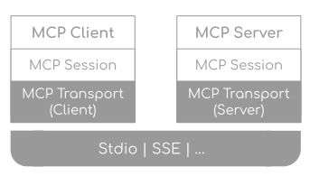

# MCP 与外部系统集成

> **一句话定位**：MCP（Model Context Protocol）用统一的客户端—服务端协议向 AI 应用暴露工具、资源和提示模板，降低每个模型客户端重复对接数据源的成本。

---

## 1. 先给结论

MCP（Model Context Protocol）用统一的客户端—服务端协议向 AI 应用暴露工具、资源和提示模板，降低每个模型客户端重复对接数据源的成本。它解决的是集成契约和能力发现，不自动解决身份认证、权限隔离、提示注入、审计或业务幂等。生产接入时应把 MCP Server 当作新的 API/插件边界，执行最小权限、来源信任和运行隔离。

### 面试答题路线

回答这类题不要从名词堆砌开始，按下面四步展开最稳：

1. **先定边界**：它解决什么问题，不解决什么问题。
2. **再讲机制**：把核心数据结构、状态机或调用链讲清楚。
3. **补充取舍**：说明复杂度、正确性、资源和可维护性的代价。
4. **落到生产**：给出超时、幂等、观测、压测与回滚方案。

---

## 2. 核心原理

### 角色与能力

Host 是承载用户体验和安全策略的 AI 应用；Client 在 Host 内维护与某个 Server 的会话；Server 暴露能力。常见能力包括：

- **Tools**：模型可请求执行的动作；
- **Resources**：应用可读取的上下文资源；
- **Prompts**：可复用的提示模板。

Client 与 Server 通过协议协商能力和版本。传输可以是本地标准输入输出，也可以是适合远程服务的 HTTP 方案。传输方式不应改变授权边界。

### 与普通函数调用的关系

函数调用描述的是模型和单个应用内部工具之间的交互；MCP 进一步标准化工具/资源如何被发现和调用，使相同 Server 能被多个兼容 Host 复用。Host 最终仍会把适合当前任务的工具 schema 提供给模型，并负责调用审批与结果处理。

### 2.1 一张图建立整体心智模型



> **图：MCP Client、Server 与传输层协议栈**
> （图源与许可见 [assets/CREDITS.md](./assets/CREDITS.md)）
>
> 对照本文阅读时，把图中的输入、状态、执行器和输出依次映射为：
> **Host 创建 MCP Client → 连接一个或多个 Server → 发现 tools / resources / prompts → Server 访问外部系统并返回结构化结果**。
> 图负责建立全局位置，具体正确性仍要回到本文的数据流、状态边界和失败路径。

---

## 3. 工作流程与关键路径

```text
[Host 创建 MCP Client]
    │
    ▼
[连接一个或多个 Server]
    │
    ▼
[发现 tools / resources / prompts]
    │
    ▼
[模型发起受控调用]
    │
    ▼
[Server 访问外部系统并返回结构化结果]
```

### 3.1 每一步分别承担什么

- **入口与约束**：`Host 创建 MCP Client` 决定后续处理的语义、权限和容量边界。
- **核心决策**：`连接一个或多个 Server` 与 `发现 tools / resources / prompts` 是最容易答成“只会背名词”的地方，要讲清状态如何变化。
- **执行与副作用**：中间步骤必须说明失败是否可重试、是否会重复，以及资源何时释放。
- **完成条件**：`Server 访问外部系统并返回结构化结果` 不能只看“没有抛异常”，还要有业务结果、指标或持久化证据。

### 3.2 复杂度不只是一行大 O

面试里给出时间复杂度后，还要补三件事：**数据规模是否会放大常数项、最坏路径何时触发、资源上限在哪里**。生产环境更常被队列等待、锁竞争、网络、序列化、缓存失效或外部限流拖慢；因此复杂度分析必须和实际访问分布、尾延迟及容量模型一起讲。

---

## 4. 关键实现

下面的片段不是完整框架，而是把最关键的边界写出来：

```json
{
  "jsonrpc": "2.0",
  "id": 17,
  "method": "tools/call",
  "params": {
    "name": "search_orders",
    "arguments": {"customer_id": "c-42", "limit": 20}
  }
}

// Host 仍要在发送前校验用户身份、Server 信任级别和参数范围。
```

### 4.1 实现时盯住的状态

| 状态 | 需要回答的问题 |
|---|---|
| 输入 | `Host 创建 MCP Client` 是否已经校验语义、权限、大小与版本？ |
| 中间状态 | `发现 tools / resources / prompts` 能否持久化、观测或在并发下保持不变量？ |
| 副作用 | 失败重试会不会重复执行？是否有幂等键、事务或补偿？ |
| 完成 | `Server 访问外部系统并返回结构化结果` 由什么证据确认？调用方能否区分成功、部分成功与失败？ |

---

## 5. 对比与选型

| 决策维度 | 面试中要说清 | 生产验证 |
|---|---|---|
| **协议与边界** | 模型只提出意图，执行器和策略层掌握权限 | Schema、超时、幂等和审计在协议边界统一 |
| **确定性** | 关键合规节点由工作流控制 | Agent 只在受限工具集和预算内选择 |
| **恢复** | 副作用前写意图，完成后写结果 | 检查点与外部幂等键共同支持接管 |
| **评测** | 离线回归、线上观测和人工抽检闭环 | 版本化数据集并按失败类型切片 |

真正的选型结论应带条件：**在什么规模、读写比例、故障模型、SLO 和团队维护能力下选择它**。离开约束谈“谁更快”“谁更高级”没有工程意义。

---

## 6. 工程实践

- 本地 Server 部署简单但能接触宿主文件和环境变量，必须控制来源与进程权限。
- 远程 Server 便于集中升级，却引入网络、租户隔离、令牌管理和供应链风险。
- 不要把所有企业 API 原样暴露；应封装任务级、最小权限工具。
- 能力列表和 schema 需要缓存与版本化，但权限变化后必须及时失效。

### 6.1 落地检查表

- 工具、提示、工作流、模型策略和评测集全部版本化。
- 副作用前写意图与幂等键，节点完成后原子保存检查点。
- 每个 run 保留可关联 Trace，但日志不记录密钥和私有推理。
- 发布门禁同时看任务成功、安全违规、成本和尾延迟。

---

## 7. 常见故障

1. 默认信任第三方 Server 的工具描述或返回内容。
2. 多租户请求复用错误的认证上下文，造成越权访问。
3. Server 升级 schema，旧运行中的参数与重放记录失效。
4. 远程连接中断后重复执行写工具，产生副作用。

### 7.1 推荐排查顺序

1. **先确认现象**：影响哪些请求、数据、租户与时间窗，是否与发布或流量变化相关。
2. **再沿关键路径定位**：从 `Host 创建 MCP Client` 逐步检查到 `Server 访问外部系统并返回结构化结果`，不要跳过排队、缓存、代理或外部依赖。
3. **区分原因和结果**：高 CPU、线程多、token 多、连接满可能只是症状；用日志、指标、Trace 和状态快照互相印证。
4. **最后验证修复**：用最小复现、压力或故障注入证明问题消失，同时保留一键回滚。

最常见的错误是：**默认信任第三方 Server 的工具描述或返回内容。**


---

## 8. 最简记忆

```text
一句话：MCP（Model Context Protocol）用统一的客户端—服务端协议向 AI 应用暴露工具、资源和提示模板，降低每个模型客户端重复对接数据源的成本。

主链路：Host 创建 MCP Client → 连接一个或多个 Server → 发现 tools / resources / prompts → 模型发起受控调用 → Server 访问外部系统并返回结构化结果
核心状态：发现 tools / resources / prompts
完成证据：Server 访问外部系统并返回结构化结果
高频坑：默认信任第三方 Server 的工具描述或返回内容。
```

---

## 🎯 高频追问

1. **MCP 主要解决什么问题？**

   MCP 以统一协议让 AI Host 发现并使用 Server 提供的工具、资源和提示模板，减少每个客户端为每个数据源编写专用适配的成本。它标准化集成契约，但不会自动提供正确授权、安全隔离、业务幂等或抵御提示注入。

2. **MCP 中 Host、Client、Server 分别承担什么职责？**

   Host 承载用户体验、模型编排和总体安全策略；Client 位于 Host 内，维护与一个 Server 的协议连接和能力协商；Server 暴露工具、资源或提示等能力。用户授权和高风险动作控制不能简单下放给模型或不可信 Server。

3. **MCP 与模型函数调用是什么关系？**

   函数调用定义模型如何从应用提供的工具中选择并生成参数；MCP 定义外部能力如何被发现、描述和调用。Host 可通过 MCP 获取工具 schema，再以模型支持的函数调用形式提供给模型。两者层次不同、可以组合，而非互相替代。

4. **本地 MCP Server 有哪些主要安全风险？**

   本地 Server 可能继承宿主用户权限，读取文件、环境变量和网络资源；恶意或被劫持的 Server 还可伪造工具结果、诱导高风险调用。应审查来源、锁定版本、沙箱运行、限制文件和网络权限、最小化凭证，并对敏感动作显式确认和审计。

5. **多租户远程 MCP 集成如何避免越权？**

   每次调用都绑定经过验证的租户与最终用户身份，使用短期、最小 scope 的凭证；Server 端独立鉴权，不能只信工具参数中的 userId；连接池和缓存按安全主体隔离；资源标识再次校验归属，并记录可关联 Host 与 Server 的审计 ID。
