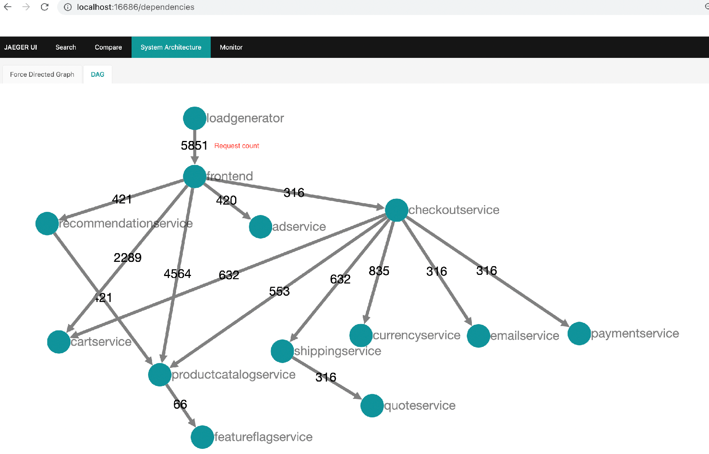

# Agent 评测与可观测性

> **先记住**：Agent 评测要分层：最终任务是否完成、轨迹是否安全高效、单步工具选择和参数是否正确，以及延迟与成本是否达标。

---

## 1. 它在解决什么问题？

Agent 评测要分层：最终任务是否完成、轨迹是否安全高效、单步工具选择和参数是否正确，以及延迟与成本是否达标。离线评测用于版本回归，在线观测用于发现真实分布和异常，两者通过生产失败样本形成闭环。可观测性应记录一次 run 下的模型调用、工具调用、状态变化、token、耗时和错误，同时做隐私脱敏与采样。

读这一节时，先带着三个问题：

1. **核心对象是什么？** 哪些状态会在处理过程中发生变化？
2. **主链路怎么走？** 一次处理从哪里开始，到哪里才算结束？
3. **边界在哪里？** 数据量、并发或故障出现后，哪一环最先承压？

---

## 2. 先看全貌



<p class="diagram-caption">先建立整体位置感：构造版本化评测集 → 执行 Agent 并采集完整 Trace → 规则、模型与人工联合评分 → 门禁阻止问题版本发布</p>

### 主链路

```text
[构造版本化评测集]
    │
    ▼
[执行 Agent 并采集完整 Trace]
    │
    ▼
[规则、模型与人工联合评分]
    │
    ▼
[按任务切片定位退化]
    │
    ▼
[门禁阻止问题版本发布]
```

先把这条链路记住即可。接下来再逐层拆开每一步为什么这样设计。

---

## 3. 核心机制，逐层拆开

### 评测分层

- **结果指标**：任务成功率、答案事实性、业务约束满足率；
- **轨迹指标**：工具选择正确率、参数正确率、无效步骤数、重复调用率；
- **安全指标**：越权尝试、敏感信息泄漏、高风险动作确认率；
- **系统指标**：端到端 P50/P95、token 与工具成本、超时和恢复率。

只评最终文本会漏掉“碰巧答对但过程危险”，只评轨迹又可能惩罚有效的新路径。应同时设置硬性约束与软评分。

### 数据集与评审器

评测集应覆盖正常样本、边界条件、工具失败、提示注入和长任务，并按业务类别分层报告。精确规则适合判断 schema、工具和数据库结果；LLM-as-a-judge 适合语义质量，但需要明确 rubric、校准样本和人工抽检，不能把同一模型的偏好当作真值。

### Trace

一次 run 作为根 trace，每个模型或工具调用是 span，记录父子关系、版本、输入摘要、输出状态、耗时、token、错误码与重试。通过稳定 correlation ID 串联 API、队列和外部服务，才能复现“模型为什么走到这一步”。

---

## 4. 用一段实现把概念落地

下面只保留最关键的主干。阅读时，把代码与上一节的流程一一对应：

```python
case = EvalCase(
    id="refund-policy-017",
    input={"question": question, "tenant": "demo"},
    expected={"must_cite": ["refund-policy"], "forbid_tool": ["issue_refund"]},
)
trace = runner.run(case.input, capture_trace=True)
score = combine(
    deterministic_checks(case, trace),
    citation_grounding(trace),
    human_review_sample(trace),
)
gate.require(score.total >= 0.85 and score.safety == 1.0)
```

### 对照着看

- **从哪里开始**：构造版本化评测集
- **关键状态变化**：规则、模型与人工联合评分
- **怎样才算完成**：门禁阻止问题版本发布

---

## 5. 怎么选才不容易错

| 关注点 | 怎么理解 | 怎么验证 |
|---|---|---|
| **协议与边界** | 模型只提出意图，执行器和策略层掌握权限 | Schema、超时、幂等和审计在协议边界统一 |
| **确定性** | 关键合规节点由工作流控制 | Agent 只在受限工具集和预算内选择 |
| **恢复** | 副作用前写意图，完成后写结果 | 检查点与外部幂等键共同支持接管 |
| **评测** | 离线回归、线上观测和人工抽检闭环 | 版本化数据集并按失败类型切片 |

没有脱离场景的“最佳方案”。先写清数据规模、读写比例、故障模型和延迟目标，再做选择。

---

## 6. 放进真实系统，还要考虑什么

- 全量保存上下文便于复盘，但有隐私、合规与存储风险；应字段级脱敏、分级留存。
- 线上 A/B 要设置安全护栏和回滚条件，不能只看平均成功率。
- 缓存会改善延迟与成本，也可能掩盖模型版本变化，评测时要明确缓存策略。
- 指标聚合不能替代原始失败轨迹，低频高风险问题尤其需要单独告警。

### 上线前检查

- 工具、提示、工作流、模型策略和评测集全部版本化。
- 副作用前写意图与幂等键，节点完成后原子保存检查点。
- 每个 run 保留可关联 Trace，但日志不记录密钥和私有推理。
- 发布门禁同时看任务成功、安全违规、成本和尾延迟。

---

## 7. 常见误区与排查

### 容易踩的坑

1. 只维护十几个“演示成功”样本，发布后遇到真实长尾立即退化。
2. 提示词或模型变更后不跑固定回归集。
3. trace 中明文记录用户隐私、访问令牌或完整数据库结果。
4. 只监控 HTTP 200，忽略 Agent 已循环、答非所问或错误调用工具。

### 出现问题时，按这个顺序看

1. **还原现场**：确认受影响的请求、数据、时间窗，以及最近是否有发布或流量变化。
2. **沿链路定位**：从“构造版本化评测集”一路检查到“门禁阻止问题版本发布”，找出状态第一次偏离预期的位置。
3. **验证修复**：用最小复现、压力测试或故障注入证明问题消失，同时保留回滚方案。

---

## 8. 最后做一次复盘

> **一句话**：Agent 评测要分层：最终任务是否完成、轨迹是否安全高效、单步工具选择和参数是否正确，以及延迟与成本是否达标。
>
> **主链路**：构造版本化评测集 → 执行 Agent 并采集完整 Trace → 规则、模型与人工联合评分 → 按任务切片定位退化 → 门禁阻止问题版本发布
>
> **关键状态**：规则、模型与人工联合评分
>
> **最容易踩的坑**：只维护十几个“演示成功”样本，发布后遇到真实长尾立即退化。

---

## 9. 高频追问

### Q1. Agent 评测为什么不能只看最终答案？

Agent 可能碰巧得到正确答案，却在过程中调用了错误或越权工具、泄露数据、重复写入或浪费大量成本。应同时评估任务结果、工具轨迹、硬性安全约束、延迟和成本，才能判断系统是否可安全稳定上线。

### Q2. 一套有代表性的 Agent 评测集应包含什么？

除正常任务外，要覆盖边界输入、歧义目标、工具超时与错误、权限不足、提示注入、长上下文和需要人工确认的动作；按业务类型、难度和风险分层。样本来源应结合专家设计与脱敏后的生产失败，并保留固定回归集防止版本间漂移。

### Q3. LLM-as-a-judge 有哪些风险，如何控制？

评审模型可能受措辞、顺序、自身风格和被评答案中的注入内容影响，也可能与业务真值不一致。应使用明确 rubric、结构化评分、参考答案和校准样本，随机化顺序，必要时多评审器复核，并持续用人工标注集测量一致性，关键硬约束仍用确定性规则。

### Q4. 一次 Agent trace 至少应记录哪些信息？

稳定 run/correlation ID、模型和提示版本、各步骤父子关系、工具名与参数摘要、结构化结果状态、状态转移、耗时、token/费用、重试和错误码。敏感正文应脱敏或受控留存，不能为了可观测性无条件记录密钥和用户隐私。

### Q5. 如何把评测变成发布门禁？

为关键分层指标设置基线和不可退化阈值，每次模型、提示、工具或编排变更都跑固定回归集与安全集；结果按场景而非只看总平均汇报。未达硬约束则阻断发布，软指标显著退化需审批；上线再做小流量观测并配置自动回滚和人工复核。
