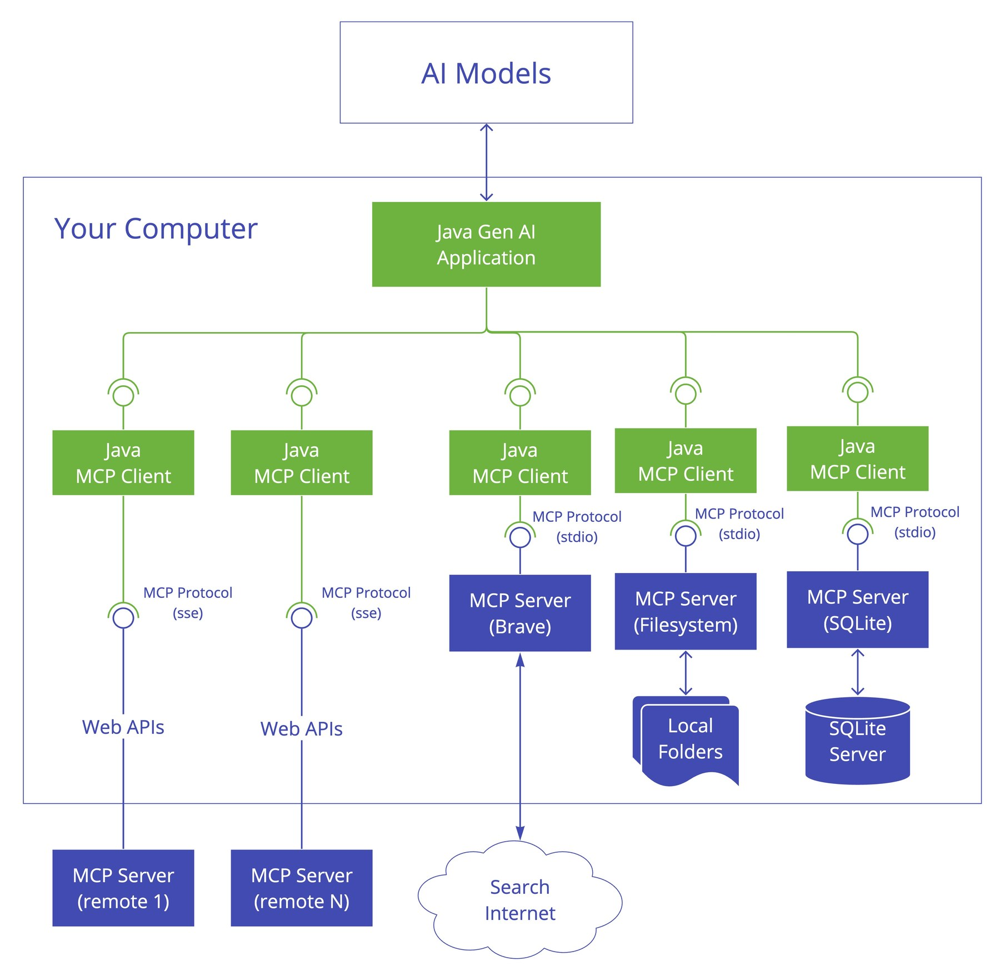

# Human-in-the-loop 与审批

> **一句话定位**：Human-in-the-loop 把人工判断放在高风险、低置信或不可逆步骤，而不是让人审核每个 token。

---

## 1. 先给结论

Human-in-the-loop 把人工判断放在高风险、低置信或不可逆步骤，而不是让人审核每个 token。系统需要呈现动作、影响范围、证据和差异，审批决定必须绑定具体参数与版本；等待期间持久化状态，超时后安全取消或升级，禁止把批准复用于已变化的操作。

### 面试答题路线

回答这类题不要从名词堆砌开始，按下面四步展开最稳：

1. **先定边界**：它解决什么问题，不解决什么问题。
2. **再讲机制**：把核心数据结构、状态机或调用链讲清楚。
3. **补充取舍**：说明复杂度、正确性、资源和可维护性的代价。
4. **落到生产**：给出超时、幂等、观测、压测与回滚方案。

---

## 2. 核心原理

### 触发策略

按风险、金额、权限范围、模型置信度、规则命中和异常检测触发人工。读取公开信息可自动执行，删除数据、付款、发布和外发敏感内容通常需要更严格审批。

### 审批对象

审批应针对规范化动作计划，包括工具、目标资源、参数、预计影响、证据、幂等键和过期时间。参数变化、权限变化或等待过久后必须重新审批。

### 交互与恢复

界面支持批准、拒绝、编辑、请求更多证据和委派，并显示关键 diff。Agent 进入 waiting 状态释放 worker，审批结果以事件唤醒，从检查点继续。

### 2.1 一张图建立整体心智模型



> **图：Client 在调用外部能力前承载控制面**
> （图源与许可见 [assets/CREDITS.md](./assets/CREDITS.md)）
>
> 对照本文阅读时，把图中的输入、状态、执行器和输出依次映射为：
> **Agent 生成拟执行动作 → 策略引擎识别高风险副作用 → 生成可读 diff 与影响说明 → 执行后记录审批人与证据**。
> 图负责建立全局位置，具体正确性仍要回到本文的数据流、状态边界和失败路径。

---

## 3. 工作流程与关键路径

```text
[Agent 生成拟执行动作]
    │
    ▼
[策略引擎识别高风险副作用]
    │
    ▼
[生成可读 diff 与影响说明]
    │
    ▼
[人工批准、修改或拒绝]
    │
    ▼
[执行后记录审批人与证据]
```

### 3.1 每一步分别承担什么

- **入口与约束**：`Agent 生成拟执行动作` 决定后续处理的语义、权限和容量边界。
- **核心决策**：`策略引擎识别高风险副作用` 与 `生成可读 diff 与影响说明` 是最容易答成“只会背名词”的地方，要讲清状态如何变化。
- **执行与副作用**：中间步骤必须说明失败是否可重试、是否会重复，以及资源何时释放。
- **完成条件**：`执行后记录审批人与证据` 不能只看“没有抛异常”，还要有业务结果、指标或持久化证据。

### 3.2 复杂度不只是一行大 O

面试里给出时间复杂度后，还要补三件事：**数据规模是否会放大常数项、最坏路径何时触发、资源上限在哪里**。生产环境更常被队列等待、锁竞争、网络、序列化、缓存失效或外部限流拖慢；因此复杂度分析必须和实际访问分布、尾延迟及容量模型一起讲。

---

## 4. 关键实现

下面的片段不是完整框架，而是把最关键的边界写出来：

```python
proposal = ActionProposal(
    action="send_email",
    target="customer@example.com",
    diff={"subject": subject, "body": body},
    risk="external_side_effect",
    expires_at=now() + timedelta(minutes=10),
)
approval = approvals.wait(proposal, allowed=["approve", "edit", "reject"])
if approval.decision != "approve":
    return handle_non_approval(approval)
return mailer.send(**approval.final_payload, idempotency_key=proposal.id)
```

### 4.1 实现时盯住的状态

| 状态 | 需要回答的问题 |
|---|---|
| 输入 | `Agent 生成拟执行动作` 是否已经校验语义、权限、大小与版本？ |
| 中间状态 | `生成可读 diff 与影响说明` 能否持久化、观测或在并发下保持不变量？ |
| 副作用 | 失败重试会不会重复执行？是否有幂等键、事务或补偿？ |
| 完成 | `执行后记录审批人与证据` 由什么证据确认？调用方能否区分成功、部分成功与失败？ |

---

## 5. 对比与选型

| 决策维度 | 面试中要说清 | 生产验证 |
|---|---|---|
| **协议与边界** | 模型只提出意图，执行器和策略层掌握权限 | Schema、超时、幂等和审计在协议边界统一 |
| **确定性** | 关键合规节点由工作流控制 | Agent 只在受限工具集和预算内选择 |
| **恢复** | 副作用前写意图，完成后写结果 | 检查点与外部幂等键共同支持接管 |
| **评测** | 离线回归、线上观测和人工抽检闭环 | 版本化数据集并按失败类型切片 |

真正的选型结论应带条件：**在什么规模、读写比例、故障模型、SLO 和团队维护能力下选择它**。离开约束谈“谁更快”“谁更高级”没有工程意义。

---

## 6. 工程实践

- 人工越多越安全是误区，频繁低价值弹窗会造成审批疲劳。
- 允许编辑动作提高效率，但编辑后的参数要重新校验与记录。
- 紧急场景可设置 break-glass 流程，同时要求更强身份认证和事后审计。

### 6.1 落地检查表

- 工具、提示、工作流、模型策略和评测集全部版本化。
- 副作用前写意图与幂等键，节点完成后原子保存检查点。
- 每个 run 保留可关联 Trace，但日志不记录密钥和私有推理。
- 发布门禁同时看任务成功、安全违规、成本和尾延迟。

---

## 7. 常见故障

1. 用户批准发送草稿后，Agent 又修改正文却沿用旧批准。
2. 审批页面没有显示收件人或影响范围，导致误操作。
3. 等待审批一直占用线程和锁，造成资源耗尽。

### 7.1 推荐排查顺序

1. **先确认现象**：影响哪些请求、数据、租户与时间窗，是否与发布或流量变化相关。
2. **再沿关键路径定位**：从 `Agent 生成拟执行动作` 逐步检查到 `执行后记录审批人与证据`，不要跳过排队、缓存、代理或外部依赖。
3. **区分原因和结果**：高 CPU、线程多、token 多、连接满可能只是症状；用日志、指标、Trace 和状态快照互相印证。
4. **最后验证修复**：用最小复现、压力或故障注入证明问题消失，同时保留一键回滚。

最常见的错误是：**用户批准发送草稿后，Agent 又修改正文却沿用旧批准。**


---

## 8. 最简记忆

```text
一句话：Human-in-the-loop 把人工判断放在高风险、低置信或不可逆步骤，而不是让人审核每个 token。

主链路：Agent 生成拟执行动作 → 策略引擎识别高风险副作用 → 生成可读 diff 与影响说明 → 人工批准、修改或拒绝 → 执行后记录审批人与证据
核心状态：生成可读 diff 与影响说明
完成证据：执行后记录审批人与证据
高频坑：用户批准发送草稿后，Agent 又修改正文却沿用旧批准。
```

---

## 🎯 高频追问

1. **请用一分钟说明Human-in-the-loop 与审批的核心目标与工作机制。**

   Human-in-the-loop 把人工判断放在高风险、低置信或不可逆步骤，而不是让人审核每个 token。系统需要呈现动作、影响范围、证据和差异，审批决定必须绑定具体参数与版本；等待期间持久化状态，超时后安全取消或升级，禁止把批准复用于已变化的操作。

2. **触发策略的核心机制是什么？**

   按风险、金额、权限范围、模型置信度、规则命中和异常检测触发人工。读取公开信息可自动执行，删除数据、付款、发布和外发敏感内容通常需要更严格审批。

3. **审批对象为什么重要，实际如何落地？**

   审批应针对规范化动作计划，包括工具、目标资源、参数、预计影响、证据、幂等键和过期时间。参数变化、权限变化或等待过久后必须重新审批。

4. **Human-in-the-loop 与审批在工程落地时如何做取舍？**

   人工越多越安全是误区，频繁低价值弹窗会造成审批疲劳；允许编辑动作提高效率，但编辑后的参数要重新校验与记录；紧急场景可设置 break-glass 流程，同时要求更强身份认证和事后审计。

5. **Human-in-the-loop 与审批最常见的故障与排查重点是什么？**

   用户批准发送草稿后，Agent 又修改正文却沿用旧批准；审批页面没有显示收件人或影响范围，导致误操作；等待审批一直占用线程和锁，造成资源耗尽。排查时应关联运行状态、模型请求、工具调用、外部证据和最终结果，先判断是数据、模型、编排、权限还是依赖故障。
