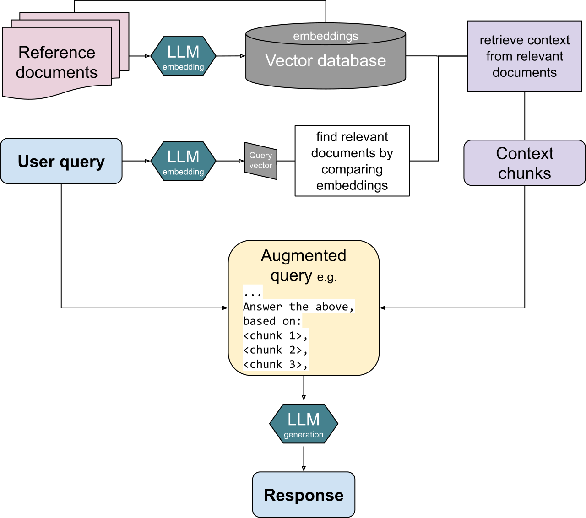

# Embedding 与向量检索

> **先记住**：Embedding 把查询和内容映射到向量空间，用相似度召回语义相关候选。

---

## 1. 它在解决什么问题？

Embedding 把查询和内容映射到向量空间，用相似度召回语义相关候选。工程效果取决于模型与领域匹配、向量归一化、索引参数、过滤条件和数据版本；向量检索擅长语义近似，但不能单独保证关键词、数字、时效和权限正确。

读这一节时，先带着三个问题：

1. **核心对象是什么？** 哪些状态会在处理过程中发生变化？
2. **主链路怎么走？** 一次处理从哪里开始，到哪里才算结束？
3. **边界在哪里？** 数据量、并发或故障出现后，哪一环最先承压？

---

## 2. 先看全貌



<p class="diagram-caption">先建立整体位置感：查询编码为向量 → ANN 索引召回近邻 → 按权限与元数据过滤 → 将证据交给重排或生成</p>

### 主链路

```text
[查询编码为向量]
    │
    ▼
[ANN 索引召回近邻]
    │
    ▼
[按权限与元数据过滤]
    │
    ▼
[计算相似度并截取候选]
    │
    ▼
[将证据交给重排或生成]
```

先把这条链路记住即可。接下来再逐层拆开每一步为什么这样设计。

---

## 3. 核心机制，逐层拆开

### 向量表示

选择支持目标语言、领域和查询/文档非对称编码的模型，并遵循其前缀和归一化要求。离线评估 Recall@K、MRR 等指标，模型升级需全量或双索引重嵌入。

### 近似最近邻

HNSW 查询快、召回高但内存较大；IVF/PQ 通过聚类和压缩降低成本但需要训练和参数调优。索引参数要结合数据规模、延迟与召回压测。

### 过滤与多租户

时间、类型、租户和 ACL 过滤应尽量在检索阶段执行。过滤过强会让 ANN 候选不足，需要预过滤、分区索引或扩大候选池，且缓存键必须包含安全主体。

---

## 4. 用一段实现把概念落地

下面只保留最关键的主干。阅读时，把代码与上一节的流程一一对应：

```python
query_vector = embedder.encode(normalize(question))
hits = vector_index.search(
    vector=query_vector,
    top_k=80,
    filter={"tenant_id": tenant_id, "acl": {"contains": user.group}},
)
candidates = [
    hit for hit in hits
    if hit.score >= threshold and not metadata_expired(hit.metadata)
]
return candidates[:20]
```

### 对照着看

- **从哪里开始**：查询编码为向量
- **关键状态变化**：按权限与元数据过滤
- **怎样才算完成**：将证据交给重排或生成

---

## 5. 怎么选才不容易错

| 关注点 | 怎么理解 | 怎么验证 |
|---|---|---|
| **召回** | 先保证正确证据能进入候选集 | 用 recall@k、MRR 和无答案集验证 |
| **排序** | 词法、向量与图检索各有盲区 | 按查询类型切片比较，不只看总分 |
| **生成** | 回答必须受证据约束并绑定引用 | 逐 claim 验证引用支持关系 |
| **新鲜度与权限** | 索引必须携带版本、时间和 ACL | 检索前过滤，删除与更新可追踪 |

没有脱离场景的“最佳方案”。先写清数据规模、读写比例、故障模型和延迟目标，再做选择。

---

## 6. 放进真实系统，还要考虑什么

- 更大向量维度不必然更准，却增加存储、网络和计算。
- 单一全局索引运维简单，多租户隔离和噪声控制更困难。
- Top-K 过小漏召回，过大增加重排和生成成本，应通过评测集确定。

### 上线前检查

- 文档、chunk、embedding、索引和提示版本可追踪。
- 权限在检索阶段过滤，不能只靠生成阶段提醒模型保密。
- 分别评估召回、排序、事实性、引用精度和无答案拒答。
- 建立删除、更新、反馈和错误证据回流的数据闭环。

---

## 7. 常见误区与排查

### 容易踩的坑

1. 查询和文档使用了不同版本或不同归一化方式的 embedding。
2. 距离度量与模型训练假设不匹配，排序异常。
3. 向量缓存未包含租户和权限，返回其他用户候选。

### 出现问题时，按这个顺序看

1. **还原现场**：确认受影响的请求、数据、时间窗，以及最近是否有发布或流量变化。
2. **沿链路定位**：从“查询编码为向量”一路检查到“将证据交给重排或生成”，找出状态第一次偏离预期的位置。
3. **验证修复**：用最小复现、压力测试或故障注入证明问题消失，同时保留回滚方案。

---

## 8. 最后做一次复盘

> **一句话**：Embedding 把查询和内容映射到向量空间，用相似度召回语义相关候选。
>
> **主链路**：查询编码为向量 → ANN 索引召回近邻 → 按权限与元数据过滤 → 计算相似度并截取候选 → 将证据交给重排或生成
>
> **关键状态**：按权限与元数据过滤
>
> **最容易踩的坑**：查询和文档使用了不同版本或不同归一化方式的 embedding。

---

## 9. 高频追问

### Q1. 请用一分钟说明Embedding 与向量检索的核心目标与工作机制。

Embedding 把查询和内容映射到向量空间，用相似度召回语义相关候选。工程效果取决于模型与领域匹配、向量归一化、索引参数、过滤条件和数据版本；向量检索擅长语义近似，但不能单独保证关键词、数字、时效和权限正确。

### Q2. 向量表示的核心机制是什么？

选择支持目标语言、领域和查询/文档非对称编码的模型，并遵循其前缀和归一化要求。离线评估 Recall@K、MRR 等指标，模型升级需全量或双索引重嵌入。

### Q3. 近似最近邻为什么重要，实际如何落地？

HNSW 查询快、召回高但内存较大；IVF/PQ 通过聚类和压缩降低成本但需要训练和参数调优。索引参数要结合数据规模、延迟与召回压测。

### Q4. Embedding 与向量检索在工程落地时如何做取舍？

更大向量维度不必然更准，却增加存储、网络和计算；单一全局索引运维简单，多租户隔离和噪声控制更困难；Top-K 过小漏召回，过大增加重排和生成成本，应通过评测集确定。

### Q5. Embedding 与向量检索最常见的故障与排查重点是什么？

查询和文档使用了不同版本或不同归一化方式的 embedding；距离度量与模型训练假设不匹配，排序异常；向量缓存未包含租户和权限，返回其他用户候选。排查时应关联运行状态、模型请求、工具调用、外部证据和最终结果，先判断是数据、模型、编排、权限还是依赖故障。
