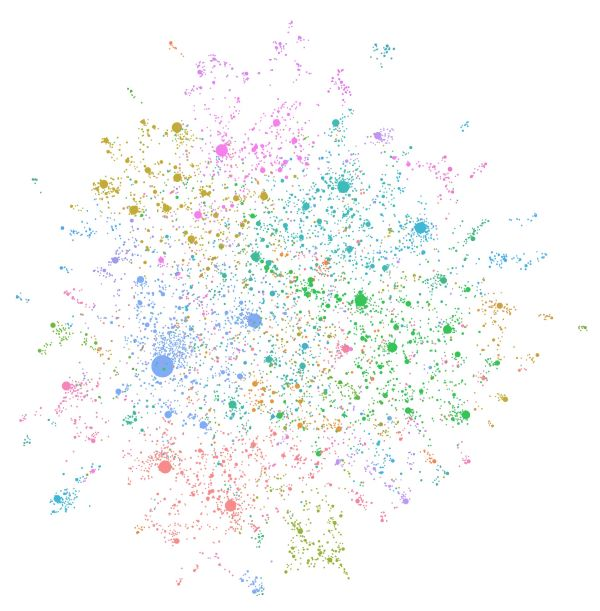

# GraphRAG 与结构化知识

> **先记住**：GraphRAG 把实体、关系、事件和文档证据组织为图，适合多跳关系、全局主题和可解释路径；结构化知识也可来自数据库、搜索索引和知识图谱。

---

## 1. 它在解决什么问题？

GraphRAG 把实体、关系、事件和文档证据组织为图，适合多跳关系、全局主题和可解释路径；结构化知识也可来自数据库、搜索索引和知识图谱。它不是向量库的替代品，常见架构是实体链接与图遍历负责结构约束，文本检索提供细节证据。

读这一节时，先带着三个问题：

1. **核心对象是什么？** 哪些状态会在处理过程中发生变化？
2. **主链路怎么走？** 一次处理从哪里开始，到哪里才算结束？
3. **边界在哪里？** 数据量、并发或故障出现后，哪一环最先承压？

---

## 2. 先看全貌



<p class="diagram-caption">先建立整体位置感：抽取实体、关系和证据 → 实体消歧并写入图 → 查询定位起始实体 → 图路径和原文共同支撑回答</p>

### 主链路

```text
[抽取实体、关系和证据]
    │
    ▼
[实体消歧并写入图]
    │
    ▼
[查询定位起始实体]
    │
    ▼
[受限多跳遍历与社区检索]
    │
    ▼
[图路径和原文共同支撑回答]
```

先把这条链路记住即可。接下来再逐层拆开每一步为什么这样设计。

---

## 3. 核心机制，逐层拆开

### 图构建

从可信结构化源或文本抽取实体、关系和属性，执行实体消歧、schema 映射、来源记录和版本管理。每条边要能追溯证据，模型抽取结果不能无审核成为权威事实。

### 图检索

根据查询识别起始实体，执行受限跳数遍历、路径搜索、邻域聚合或社区摘要。遍历要限制关系类型、时间和权限，避免高连接节点造成组合爆炸。

### 图文融合

图返回候选实体和关系路径，向量/词法检索补充原文，生成器同时引用路径与文本。结构化查询适合精确约束，文本检索适合解释和未建模信息。

---

## 4. 用一段实现把概念落地

下面只保留最关键的主干。阅读时，把代码与上一节的流程一一对应：

```cypher
MATCH path = (start:Entity {canonical_id: $entity})
             -[rels:RELATED_TO*1..3]->(target:Entity)
WHERE ALL(r IN rels WHERE r.tenant_id = $tenant
                       AND r.valid_from <= $at
                       AND (r.valid_to IS NULL OR r.valid_to > $at))
RETURN path, [r IN rels | r.evidence_chunk_id] AS evidence
ORDER BY reduce(score = 1.0, r IN rels | score * r.confidence) DESC
LIMIT 20
```

### 对照着看

- **从哪里开始**：抽取实体、关系和证据
- **关键状态变化**：查询定位起始实体
- **怎样才算完成**：图路径和原文共同支撑回答

---

## 5. 怎么选才不容易错

| 关注点 | 怎么理解 | 怎么验证 |
|---|---|---|
| **召回** | 先保证正确证据能进入候选集 | 用 recall@k、MRR 和无答案集验证 |
| **排序** | 词法、向量与图检索各有盲区 | 按查询类型切片比较，不只看总分 |
| **生成** | 回答必须受证据约束并绑定引用 | 逐 claim 验证引用支持关系 |
| **新鲜度与权限** | 索引必须携带版本、时间和 ACL | 检索前过滤，删除与更新可追踪 |

没有脱离场景的“最佳方案”。先写清数据规模、读写比例、故障模型和延迟目标，再做选择。

---

## 6. 放进真实系统，还要考虑什么

- 图谱构建和实体治理成本高，只有多跳与全局分析需求明确时才值得引入。
- 自动抽取覆盖广但噪声高，核心领域可采用规则、人工和模型混合。
- 预计算社区摘要响应快，但更新复杂且可能掩盖少数事实。

### 上线前检查

- 文档、chunk、embedding、索引和提示版本可追踪。
- 权限在检索阶段过滤，不能只靠生成阶段提醒模型保密。
- 分别评估召回、排序、事实性、引用精度和无答案拒答。
- 建立删除、更新、反馈和错误证据回流的数据闭环。

---

## 7. 常见误区与排查

### 容易踩的坑

1. 同一实体存在多个别名节点，关系被割裂。
2. 图边没有时间范围，历史关系被当作当前事实。
3. 遍历未做租户和边级权限过滤，泄露关系信息。

### 出现问题时，按这个顺序看

1. **还原现场**：确认受影响的请求、数据、时间窗，以及最近是否有发布或流量变化。
2. **沿链路定位**：从“抽取实体、关系和证据”一路检查到“图路径和原文共同支撑回答”，找出状态第一次偏离预期的位置。
3. **验证修复**：用最小复现、压力测试或故障注入证明问题消失，同时保留回滚方案。

---

## 8. 最后做一次复盘

> **一句话**：GraphRAG 把实体、关系、事件和文档证据组织为图，适合多跳关系、全局主题和可解释路径；结构化知识也可来自数据库、搜索索引和知识图谱。
>
> **主链路**：抽取实体、关系和证据 → 实体消歧并写入图 → 查询定位起始实体 → 受限多跳遍历与社区检索 → 图路径和原文共同支撑回答
>
> **关键状态**：查询定位起始实体
>
> **最容易踩的坑**：同一实体存在多个别名节点，关系被割裂。

---

## 9. 高频追问

### Q1. 请用一分钟说明GraphRAG 与结构化知识的核心目标与工作机制。

GraphRAG 把实体、关系、事件和文档证据组织为图，适合多跳关系、全局主题和可解释路径；结构化知识也可来自数据库、搜索索引和知识图谱。它不是向量库的替代品，常见架构是实体链接与图遍历负责结构约束，文本检索提供细节证据。

### Q2. 图构建的核心机制是什么？

从可信结构化源或文本抽取实体、关系和属性，执行实体消歧、schema 映射、来源记录和版本管理。每条边要能追溯证据，模型抽取结果不能无审核成为权威事实。

### Q3. 图检索为什么重要，实际如何落地？

根据查询识别起始实体，执行受限跳数遍历、路径搜索、邻域聚合或社区摘要。遍历要限制关系类型、时间和权限，避免高连接节点造成组合爆炸。

### Q4. GraphRAG 与结构化知识在工程落地时如何做取舍？

图谱构建和实体治理成本高，只有多跳与全局分析需求明确时才值得引入；自动抽取覆盖广但噪声高，核心领域可采用规则、人工和模型混合；预计算社区摘要响应快，但更新复杂且可能掩盖少数事实。

### Q5. GraphRAG 与结构化知识最常见的故障与排查重点是什么？

同一实体存在多个别名节点，关系被割裂；图边没有时间范围，历史关系被当作当前事实；遍历未做租户和边级权限过滤，泄露关系信息。排查时应关联运行状态、模型请求、工具调用、外部证据和最终结果，先判断是数据、模型、编排、权限还是依赖故障。
