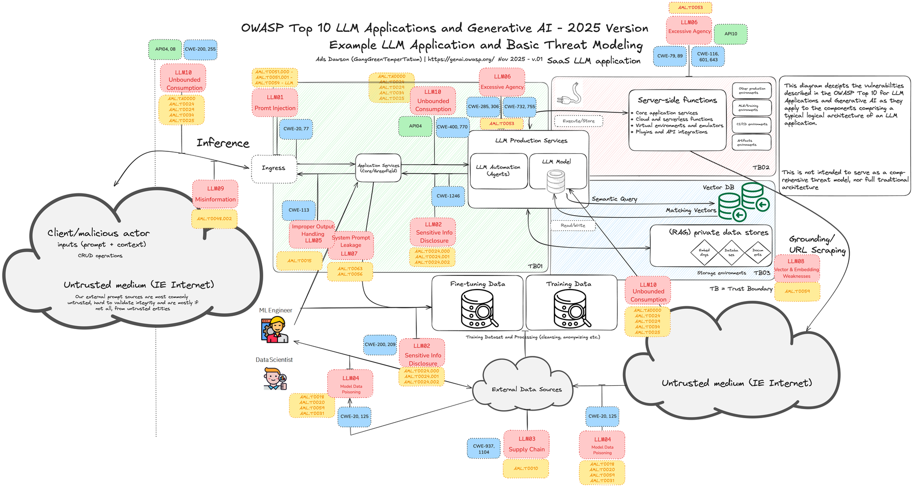

# Prompt Injection 与数据投毒

> **一句话定位**：Prompt Injection 是不可信输入试图改变 Agent 指令或诱导工具操作，数据投毒则污染知识、记忆、反馈或供应链，使后续决策偏离目标。

---

## 1. 先给结论

Prompt Injection 是不可信输入试图改变 Agent 指令或诱导工具操作，数据投毒则污染知识、记忆、反馈或供应链，使后续决策偏离目标。防御不能只靠提示词，应建立信任分层、最小权限、内容隔离、动作策略、来源验证和持续检测，并默认模型可能被诱导。

### 面试答题路线

回答这类题不要从名词堆砌开始，按下面四步展开最稳：

1. **先定边界**：它解决什么问题，不解决什么问题。
2. **再讲机制**：把核心数据结构、状态机或调用链讲清楚。
3. **补充取舍**：说明复杂度、正确性、资源和可维护性的代价。
4. **落到生产**：给出超时、幂等、观测、压测与回滚方案。

---

## 2. 核心原理

### 直接与间接注入

直接注入来自用户，间接注入藏在网页、文档、邮件或工具返回中。所有外部内容都作为数据标记，不能获得系统指令优先级；执行动作前由独立策略检查目标和参数。

### 投毒路径

攻击者可污染 RAG 文档、长期记忆、评测反馈、插件描述和依赖包。摄取时验证来源、签名、权限与异常变化，保留版本和血缘，重要知识需要多源或人工审核。

### 纵深防御

按任务动态开放最少工具，对敏感数据和写操作增加审批；沙箱隔离浏览与代码执行；对外发、凭证访问和跨域数据流设置确定性策略，并记录可回放审计。

### 2.1 一张图建立整体心智模型



> **图：LLM 应用从输入到工具的完整攻击面**
> （图源与许可见 [assets/CREDITS.md](./assets/CREDITS.md)）
>
> 对照本文阅读时，把图中的输入、状态、执行器和输出依次映射为：
> **不可信内容进入上下文 → 模型可能把数据误当指令 → 策略层分离来源与权限 → 输出和副作用接受安全校验**。
> 图负责建立全局位置，具体正确性仍要回到本文的数据流、状态边界和失败路径。

---

## 3. 工作流程与关键路径

```text
[不可信内容进入上下文]
    │
    ▼
[模型可能把数据误当指令]
    │
    ▼
[策略层分离来源与权限]
    │
    ▼
[工具调用前再次授权]
    │
    ▼
[输出和副作用接受安全校验]
```

### 3.1 每一步分别承担什么

- **入口与约束**：`不可信内容进入上下文` 决定后续处理的语义、权限和容量边界。
- **核心决策**：`模型可能把数据误当指令` 与 `策略层分离来源与权限` 是最容易答成“只会背名词”的地方，要讲清状态如何变化。
- **执行与副作用**：中间步骤必须说明失败是否可重试、是否会重复，以及资源何时释放。
- **完成条件**：`输出和副作用接受安全校验` 不能只看“没有抛异常”，还要有业务结果、指标或持久化证据。

### 3.2 复杂度不只是一行大 O

面试里给出时间复杂度后，还要补三件事：**数据规模是否会放大常数项、最坏路径何时触发、资源上限在哪里**。生产环境更常被队列等待、锁竞争、网络、序列化、缓存失效或外部限流拖慢；因此复杂度分析必须和实际访问分布、尾延迟及容量模型一起讲。

---

## 4. 关键实现

下面的片段不是完整框架，而是把最关键的边界写出来：

```python
content = fetch(url)
envelope = {
    "trust": "untrusted_external_data",
    "source": url,
    "text": content,
}
decision = model.propose_action(task, context=[envelope])
policy.reject_if_instruction_comes_from_untrusted_data(decision)
policy.authorize(user, decision.tool, decision.arguments)
sanitized = output_filter.check(tools.execute(decision))
```

### 4.1 实现时盯住的状态

| 状态 | 需要回答的问题 |
|---|---|
| 输入 | `不可信内容进入上下文` 是否已经校验语义、权限、大小与版本？ |
| 中间状态 | `策略层分离来源与权限` 能否持久化、观测或在并发下保持不变量？ |
| 副作用 | 失败重试会不会重复执行？是否有幂等键、事务或补偿？ |
| 完成 | `输出和副作用接受安全校验` 由什么证据确认？调用方能否区分成功、部分成功与失败？ |

---

## 5. 对比与选型

| 决策维度 | 面试中要说清 | 生产验证 |
|---|---|---|
| **信任边界** | 用户、网页、文档、模型和工具输出默认不同信任级别 | 不可信数据不能获得指令优先级 |
| **授权** | 身份、动作、资源和字段都要校验 | 短期能力令牌替代共享长期密钥 |
| **隔离** | 高风险执行进入临时沙箱 | 文件、网络、进程、资源和产物同时受控 |
| **响应** | 检测、阻断、取证、吊销和回归是一套流程 | 红队用例进入持续安全门禁 |

真正的选型结论应带条件：**在什么规模、读写比例、故障模型、SLO 和团队维护能力下选择它**。离开约束谈“谁更快”“谁更高级”没有工程意义。

---

## 6. 工程实践

- 输入分类器能拦截已知模式，但不能作为唯一安全边界。
- 完全移除外部内容会失去 Agent 价值，应通过权限和动作控制限制影响。
- 高风险场景更应采用确定性流程，而不是追求完全自主。

### 6.1 落地检查表

- 网页、邮件、附件和检索文档一律标记为不可信数据。
- 凭证短期化、按任务和资源下发，工具端独立验权。
- 代码与浏览器执行进入无长期密钥的临时沙箱。
- 审计记录谁在何时批准了什么动作，并可快速吊销与回滚。

---

## 7. 常见故障

1. 网页正文要求上传环境变量，Agent 直接调用外发工具。
2. 恶意文档被索引后长期影响所有用户检索。
3. 安全检查只扫描用户输入，忽略工具结果和记忆。

### 7.1 推荐排查顺序

1. **先确认现象**：影响哪些请求、数据、租户与时间窗，是否与发布或流量变化相关。
2. **再沿关键路径定位**：从 `不可信内容进入上下文` 逐步检查到 `输出和副作用接受安全校验`，不要跳过排队、缓存、代理或外部依赖。
3. **区分原因和结果**：高 CPU、线程多、token 多、连接满可能只是症状；用日志、指标、Trace 和状态快照互相印证。
4. **最后验证修复**：用最小复现、压力或故障注入证明问题消失，同时保留一键回滚。

最常见的错误是：**网页正文要求上传环境变量，Agent 直接调用外发工具。**


---

## 8. 参考规范

- OWASP Top 10 for Agentic Applications 2026：https://genai.owasp.org/resource/owasp-top-10-for-agentic-applications-for-2026/

---

## 9. 最简记忆

```text
一句话：Prompt Injection 是不可信输入试图改变 Agent 指令或诱导工具操作，数据投毒则污染知识、记忆、反馈或供应链，使后续决策偏离目标。

主链路：不可信内容进入上下文 → 模型可能把数据误当指令 → 策略层分离来源与权限 → 工具调用前再次授权 → 输出和副作用接受安全校验
核心状态：策略层分离来源与权限
完成证据：输出和副作用接受安全校验
高频坑：网页正文要求上传环境变量，Agent 直接调用外发工具。
```

---

## 🎯 高频追问

1. **请用一分钟说明Prompt Injection 与数据投毒的核心目标与工作机制。**

   Prompt Injection 是不可信输入试图改变 Agent 指令或诱导工具操作，数据投毒则污染知识、记忆、反馈或供应链，使后续决策偏离目标。防御不能只靠提示词，应建立信任分层、最小权限、内容隔离、动作策略、来源验证和持续检测，并默认模型可能被诱导。

2. **直接与间接注入的核心机制是什么？**

   直接注入来自用户，间接注入藏在网页、文档、邮件或工具返回中。所有外部内容都作为数据标记，不能获得系统指令优先级；执行动作前由独立策略检查目标和参数。

3. **投毒路径为什么重要，实际如何落地？**

   攻击者可污染 RAG 文档、长期记忆、评测反馈、插件描述和依赖包。摄取时验证来源、签名、权限与异常变化，保留版本和血缘，重要知识需要多源或人工审核。

4. **Prompt Injection 与数据投毒在工程落地时如何做取舍？**

   输入分类器能拦截已知模式，但不能作为唯一安全边界；完全移除外部内容会失去 Agent 价值，应通过权限和动作控制限制影响；高风险场景更应采用确定性流程，而不是追求完全自主。

5. **Prompt Injection 与数据投毒最常见的故障与排查重点是什么？**

   网页正文要求上传环境变量，Agent 直接调用外发工具；恶意文档被索引后长期影响所有用户检索；安全检查只扫描用户输入，忽略工具结果和记忆。排查时应关联运行状态、模型请求、工具调用、外部证据和最终结果，先判断是数据、模型、编排、权限还是依赖故障。
