# Agent 身份、审计与供应链

> **先记住**：每个 Agent 运行都应有可验证身份、代表的用户、使用的模型/提示/工具版本和完整动作审计。

---

## 1. 它在解决什么问题？

每个 Agent 运行都应有可验证身份、代表的用户、使用的模型/提示/工具版本和完整动作审计。供应链治理覆盖模型、MCP Server、插件、依赖、镜像和数据源，要求来源验证、版本锁定、签名、漏洞管理和变更审批，避免不可信组件进入高权限执行链。

读这一节时，先带着三个问题：

1. **核心对象是什么？** 哪些状态会在处理过程中发生变化？
2. **主链路怎么走？** 一次处理从哪里开始，到哪里才算结束？
3. **边界在哪里？** 数据量、并发或故障出现后，哪一环最先承压？

---

## 2. 先看全貌



<p class="diagram-caption">先建立整体位置感：验证模型、工具与插件来源 → 固定版本并校验签名 → 运行时绑定 Agent 身份 → 发现异常后吊销凭证和回滚依赖</p>

### 主链路

```text
[验证模型、工具与插件来源]
    │
    ▼
[固定版本并校验签名]
    │
    ▼
[运行时绑定 Agent 身份]
    │
    ▼
[每次动作写不可抵赖审计]
    │
    ▼
[发现异常后吊销凭证和回滚依赖]
```

先把这条链路记住即可。接下来再逐层拆开每一步为什么这样设计。

---

## 3. 核心机制，逐层拆开

### 运行身份

为 run 和服务分配唯一 ID，短期凭证绑定租户、用户、任务和 scope。Agent 对外动作携带可追踪身份，不能共享无法归责的超级账号。

### 审计事件

记录请求主体、决策版本、工具参数摘要、审批、外部结果、数据访问和最终影响，使用关联 ID 串联全链路。日志应防篡改、访问受控并对敏感字段脱敏。

### 供应链控制

维护模型、提示、工具、Server、包和镜像清单，锁定哈希/版本并扫描漏洞。新组件在隔离环境评测权限、网络行为和输出，生产变更可回滚。

---

## 4. 用一段实现把概念落地

下面只保留最关键的主干。阅读时，把代码与上一节的流程一一对应：

```text
verify_signature(tool_package, trusted_publishers)
verify_digest(tool_package, lockfile_digest)
issue_runtime_identity(run_id, tool_name, ttl=5m)
append_audit_event(
  actor=runtime_identity,
  action=tool_call,
  input_digest=sha256(canonical_arguments),
  output_digest=sha256(canonical_result)
)
```

### 对照着看

- **从哪里开始**：验证模型、工具与插件来源
- **关键状态变化**：运行时绑定 Agent 身份
- **怎样才算完成**：发现异常后吊销凭证和回滚依赖

---

## 5. 怎么选才不容易错

| 关注点 | 怎么理解 | 怎么验证 |
|---|---|---|
| **信任边界** | 用户、网页、文档、模型和工具输出默认不同信任级别 | 不可信数据不能获得指令优先级 |
| **授权** | 身份、动作、资源和字段都要校验 | 短期能力令牌替代共享长期密钥 |
| **隔离** | 高风险执行进入临时沙箱 | 文件、网络、进程、资源和产物同时受控 |
| **响应** | 检测、阻断、取证、吊销和回归是一套流程 | 红队用例进入持续安全门禁 |

没有脱离场景的“最佳方案”。先写清数据规模、读写比例、故障模型和延迟目标，再做选择。

---

## 6. 放进真实系统，还要考虑什么

- 记录完整模型上下文便于取证，但隐私和存储风险高，应分级保存。
- 自动更新修复及时，却可能破坏兼容或引入恶意版本，高权限组件宜审核后升级。
- 第三方评分不能代替自身威胁建模和运行时约束。

### 上线前检查

- 网页、邮件、附件和检索文档一律标记为不可信数据。
- 凭证短期化、按任务和资源下发，工具端独立验权。
- 代码与浏览器执行进入无长期密钥的临时沙箱。
- 审计记录谁在何时批准了什么动作，并可快速吊销与回滚。

---

## 7. 常见误区与排查

### 容易踩的坑

1. 多个 Agent 共用管理员账号，发生误操作后无法归责。
2. 远程工具自动更新 schema，旧审批与策略失效。
3. 审计只有模型文本，没有真实 API 响应和资源变化。

### 出现问题时，按这个顺序看

1. **还原现场**：确认受影响的请求、数据、时间窗，以及最近是否有发布或流量变化。
2. **沿链路定位**：从“验证模型、工具与插件来源”一路检查到“发现异常后吊销凭证和回滚依赖”，找出状态第一次偏离预期的位置。
3. **验证修复**：用最小复现、压力测试或故障注入证明问题消失，同时保留回滚方案。

---

## 8. 最后做一次复盘

> **一句话**：每个 Agent 运行都应有可验证身份、代表的用户、使用的模型/提示/工具版本和完整动作审计。
>
> **主链路**：验证模型、工具与插件来源 → 固定版本并校验签名 → 运行时绑定 Agent 身份 → 每次动作写不可抵赖审计 → 发现异常后吊销凭证和回滚依赖
>
> **关键状态**：运行时绑定 Agent 身份
>
> **最容易踩的坑**：多个 Agent 共用管理员账号，发生误操作后无法归责。

---

## 9. 高频追问

### Q1. 请用一分钟说明Agent 身份、审计与供应链的核心目标与工作机制。

每个 Agent 运行都应有可验证身份、代表的用户、使用的模型/提示/工具版本和完整动作审计。供应链治理覆盖模型、MCP Server、插件、依赖、镜像和数据源，要求来源验证、版本锁定、签名、漏洞管理和变更审批，避免不可信组件进入高权限执行链。

### Q2. 运行身份的核心机制是什么？

为 run 和服务分配唯一 ID，短期凭证绑定租户、用户、任务和 scope。Agent 对外动作携带可追踪身份，不能共享无法归责的超级账号。

### Q3. 审计事件为什么重要，实际如何落地？

记录请求主体、决策版本、工具参数摘要、审批、外部结果、数据访问和最终影响，使用关联 ID 串联全链路。日志应防篡改、访问受控并对敏感字段脱敏。

### Q4. Agent 身份、审计与供应链在工程落地时如何做取舍？

记录完整模型上下文便于取证，但隐私和存储风险高，应分级保存；自动更新修复及时，却可能破坏兼容或引入恶意版本，高权限组件宜审核后升级；第三方评分不能代替自身威胁建模和运行时约束。

### Q5. Agent 身份、审计与供应链最常见的故障与排查重点是什么？

多个 Agent 共用管理员账号，发生误操作后无法归责；远程工具自动更新 schema，旧审批与策略失效；审计只有模型文本，没有真实 API 响应和资源变化。排查时应关联运行状态、模型请求、工具调用、外部证据和最终结果，先判断是数据、模型、编排、权限还是依赖故障。
