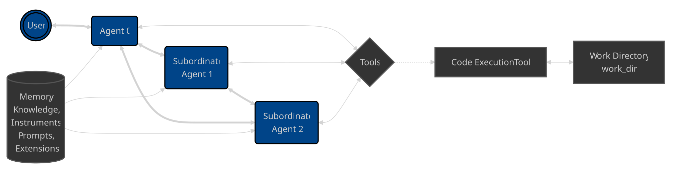

# 红队测试与安全响应

> **一句话定位**：Agent 红队要测试攻击者能否通过输入、文档、工具、记忆和供应链影响决策或产生真实副作用，并把发现转为自动回归和运行时检测。

---

## 1. 先给结论

Agent 红队要测试攻击者能否通过输入、文档、工具、记忆和供应链影响决策或产生真实副作用，并把发现转为自动回归和运行时检测。安全响应需要快速冻结能力、撤销凭证、隔离任务、保存证据、修复污染数据并通知相关方，而不是只调整提示词。

### 面试答题路线

回答这类题不要从名词堆砌开始，按下面四步展开最稳：

1. **先定边界**：它解决什么问题，不解决什么问题。
2. **再讲机制**：把核心数据结构、状态机或调用链讲清楚。
3. **补充取舍**：说明复杂度、正确性、资源和可维护性的代价。
4. **落到生产**：给出超时、幂等、观测、压测与回滚方案。

---

## 2. 核心原理

### 威胁驱动测试

从资产、信任边界和攻击路径出发，覆盖注入、越权、数据外泄、工具滥用、资源耗尽、记忆投毒和多 Agent 串谋。测试环境使用假数据与受控外部系统。

### 自动与人工红队

自动变体生成适合扩大覆盖，专家人工测试擅长组合业务逻辑漏洞。成功标准看是否越过策略或产生影响，不只看模型是否输出了危险文字。

### 响应闭环

为高风险工具准备 kill switch 和 scope 撤销，事件中冻结相关 run、轮换凭证、定位受影响数据与版本。根因修复后将样本加入评测，验证无绕过且业务能力未过度退化。

### 2.1 一张图建立整体心智模型



> **图：从 Agent 到目标系统的攻击链**
> （图源与许可见 [assets/CREDITS.md](./assets/CREDITS.md)）
>
> 对照本文阅读时，把图中的输入、状态、执行器和输出依次映射为：
> **建立资产和攻击面清单 → 生成越权、注入、泄露等用例 → 在隔离环境执行攻击链 → 修复、回归并沉淀检测规则**。
> 图负责建立全局位置，具体正确性仍要回到本文的数据流、状态边界和失败路径。

---

## 3. 工作流程与关键路径

```text
[建立资产和攻击面清单]
    │
    ▼
[生成越权、注入、泄露等用例]
    │
    ▼
[在隔离环境执行攻击链]
    │
    ▼
[按可利用性和影响分级]
    │
    ▼
[修复、回归并沉淀检测规则]
```

### 3.1 每一步分别承担什么

- **入口与约束**：`建立资产和攻击面清单` 决定后续处理的语义、权限和容量边界。
- **核心决策**：`生成越权、注入、泄露等用例` 与 `在隔离环境执行攻击链` 是最容易答成“只会背名词”的地方，要讲清状态如何变化。
- **执行与副作用**：中间步骤必须说明失败是否可重试、是否会重复，以及资源何时释放。
- **完成条件**：`修复、回归并沉淀检测规则` 不能只看“没有抛异常”，还要有业务结果、指标或持久化证据。

### 3.2 复杂度不只是一行大 O

面试里给出时间复杂度后，还要补三件事：**数据规模是否会放大常数项、最坏路径何时触发、资源上限在哪里**。生产环境更常被队列等待、锁竞争、网络、序列化、缓存失效或外部限流拖慢；因此复杂度分析必须和实际访问分布、尾延迟及容量模型一起讲。

---

## 4. 关键实现

下面的片段不是完整框架，而是把最关键的边界写出来：

```python
scenarios = [
    indirect_prompt_injection(),
    cross_tenant_data_exfiltration(),
    tool_argument_smuggling(),
    approval_bypass(),
    infinite_loop_cost_attack(),
]
for scenario in scenarios:
    trace = isolated_runner.attack(system_version, scenario)
    finding = triage(trace, severity=exploitability_times_impact)
    findings.store(finding)
release_gate.require(no_open_findings(severity_at_least="high"))
```

### 4.1 实现时盯住的状态

| 状态 | 需要回答的问题 |
|---|---|
| 输入 | `建立资产和攻击面清单` 是否已经校验语义、权限、大小与版本？ |
| 中间状态 | `在隔离环境执行攻击链` 能否持久化、观测或在并发下保持不变量？ |
| 副作用 | 失败重试会不会重复执行？是否有幂等键、事务或补偿？ |
| 完成 | `修复、回归并沉淀检测规则` 由什么证据确认？调用方能否区分成功、部分成功与失败？ |

---

## 5. 对比与选型

| 决策维度 | 面试中要说清 | 生产验证 |
|---|---|---|
| **信任边界** | 用户、网页、文档、模型和工具输出默认不同信任级别 | 不可信数据不能获得指令优先级 |
| **授权** | 身份、动作、资源和字段都要校验 | 短期能力令牌替代共享长期密钥 |
| **隔离** | 高风险执行进入临时沙箱 | 文件、网络、进程、资源和产物同时受控 |
| **响应** | 检测、阻断、取证、吊销和回归是一套流程 | 红队用例进入持续安全门禁 |

真正的选型结论应带条件：**在什么规模、读写比例、故障模型、SLO 和团队维护能力下选择它**。离开约束谈“谁更快”“谁更高级”没有工程意义。

---

## 6. 工程实践

- 阻断率要与正常任务完成率一起衡量，避免安全措施造成不可用。
- 生产诱捕可发现真实攻击，但必须限制影响并通过法务与隐私评审。
- 共享攻击样本有助行业防御，发布前需移除客户和内部敏感信息。

### 6.1 落地检查表

- 网页、邮件、附件和检索文档一律标记为不可信数据。
- 凭证短期化、按任务和资源下发，工具端独立验权。
- 代码与浏览器执行进入无长期密钥的临时沙箱。
- 审计记录谁在何时批准了什么动作，并可快速吊销与回滚。

---

## 7. 常见故障

1. 只测试聊天输出，不测试工具实际执行与数据流。
2. 发现投毒后删除单条文档，却未清理派生摘要、向量和记忆。
3. 没有紧急关闭写工具的能力，只能整体下线服务。

### 7.1 推荐排查顺序

1. **先确认现象**：影响哪些请求、数据、租户与时间窗，是否与发布或流量变化相关。
2. **再沿关键路径定位**：从 `建立资产和攻击面清单` 逐步检查到 `修复、回归并沉淀检测规则`，不要跳过排队、缓存、代理或外部依赖。
3. **区分原因和结果**：高 CPU、线程多、token 多、连接满可能只是症状；用日志、指标、Trace 和状态快照互相印证。
4. **最后验证修复**：用最小复现、压力或故障注入证明问题消失，同时保留一键回滚。

最常见的错误是：**只测试聊天输出，不测试工具实际执行与数据流。**


---

## 8. 参考规范

- OWASP Top 10 for Agentic Applications 2026：https://genai.owasp.org/resource/owasp-top-10-for-agentic-applications-for-2026/

---

## 9. 最简记忆

```text
一句话：Agent 红队要测试攻击者能否通过输入、文档、工具、记忆和供应链影响决策或产生真实副作用，并把发现转为自动回归和运行时检测。

主链路：建立资产和攻击面清单 → 生成越权、注入、泄露等用例 → 在隔离环境执行攻击链 → 按可利用性和影响分级 → 修复、回归并沉淀检测规则
核心状态：在隔离环境执行攻击链
完成证据：修复、回归并沉淀检测规则
高频坑：只测试聊天输出，不测试工具实际执行与数据流。
```

---

## 🎯 高频追问

1. **请用一分钟说明红队测试与安全响应的核心目标与工作机制。**

   Agent 红队要测试攻击者能否通过输入、文档、工具、记忆和供应链影响决策或产生真实副作用，并把发现转为自动回归和运行时检测。安全响应需要快速冻结能力、撤销凭证、隔离任务、保存证据、修复污染数据并通知相关方，而不是只调整提示词。

2. **威胁驱动测试的核心机制是什么？**

   从资产、信任边界和攻击路径出发，覆盖注入、越权、数据外泄、工具滥用、资源耗尽、记忆投毒和多 Agent 串谋。测试环境使用假数据与受控外部系统。

3. **自动与人工红队为什么重要，实际如何落地？**

   自动变体生成适合扩大覆盖，专家人工测试擅长组合业务逻辑漏洞。成功标准看是否越过策略或产生影响，不只看模型是否输出了危险文字。

4. **红队测试与安全响应在工程落地时如何做取舍？**

   阻断率要与正常任务完成率一起衡量，避免安全措施造成不可用；生产诱捕可发现真实攻击，但必须限制影响并通过法务与隐私评审；共享攻击样本有助行业防御，发布前需移除客户和内部敏感信息。

5. **红队测试与安全响应最常见的故障与排查重点是什么？**

   只测试聊天输出，不测试工具实际执行与数据流；发现投毒后删除单条文档，却未清理派生摘要、向量和记忆；没有紧急关闭写工具的能力，只能整体下线服务。排查时应关联运行状态、模型请求、工具调用、外部证据和最终结果，先判断是数据、模型、编排、权限还是依赖故障。
