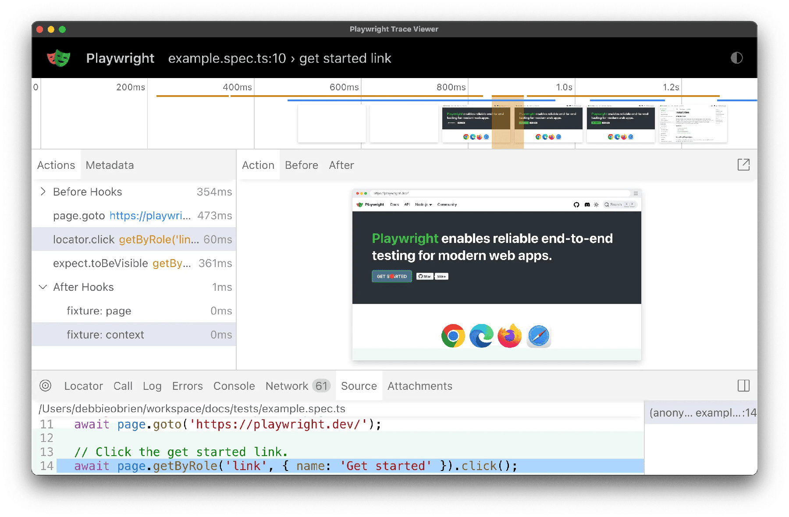

# Browser 与 Computer Use Agent

> **先记住**：Browser/Computer Use Agent 通过 DOM、可访问性树、截图和鼠标键盘操作完成网页或桌面任务。

---

## 1. 它在解决什么问题？

Browser/Computer Use Agent 通过 DOM、可访问性树、截图和鼠标键盘操作完成网页或桌面任务。可靠实现优先使用结构化定位和稳定 API，视觉操作作为补充；每步执行后重新观察并验证状态，对登录、验证码、支付、发布和删除设置权限、审批和防注入边界。

读这一节时，先带着三个问题：

1. **核心对象是什么？** 哪些状态会在处理过程中发生变化？
2. **主链路怎么走？** 一次处理从哪里开始，到哪里才算结束？
3. **边界在哪里？** 数据量、并发或故障出现后，哪一环最先承压？

---

## 2. 先看全貌



<p class="diagram-caption">先建立整体位置感：观察 DOM / 截图与当前页面 → 规划最小下一动作 → 校验域名、权限和风险 → 重新观察并验证页面状态</p>

### 主链路

```text
[观察 DOM / 截图与当前页面]
    │
    ▼
[规划最小下一动作]
    │
    ▼
[校验域名、权限和风险]
    │
    ▼
[执行点击、输入或下载]
    │
    ▼
[重新观察并验证页面状态]
```

先把这条链路记住即可。接下来再逐层拆开每一步为什么这样设计。

---

## 3. 核心机制，逐层拆开

### 观察与定位

浏览器可使用 DOM、ARIA role、文本和截图建立当前状态。选择器应基于语义和稳定属性，避免固定坐标；页面跳转或重渲染后重新定位，不能继续使用过期元素引用。

### 动作与验证

把点击、输入、上传和导航封装成小步动作，每步检查 URL、元素状态、提示信息或后端结果。提交前展示关键字段和影响，提交后保存回执与截图。

### 安全与恢复

隔离浏览器 profile 和下载目录，限制域名、上传、剪贴板与凭证。遇到验证码、异常页面或敏感动作请求人工，失败时从业务检查点恢复而非盲目重复点击。

---

## 4. 用一段实现把概念落地

下面只保留最关键的主干。阅读时，把代码与上一节的流程一一对应：

```python
page.goto(allowed_url)
observation = browser.observe(mode="dom+Screenshot")
action = model.next_action(task, observation)
policy.validate_origin(action, allowed_origins)
policy.require_confirmation(action, when=["purchase", "send", "delete"])
browser.execute(action, timeout=10_000)
after = browser.observe(mode="dom")
verifier.assert_state_change(action.expected, after)
trace.save(observation, action, after)
```

### 对照着看

- **从哪里开始**：观察 DOM / 截图与当前页面
- **关键状态变化**：校验域名、权限和风险
- **怎样才算完成**：重新观察并验证页面状态

---

## 5. 怎么选才不容易错

| 关注点 | 怎么理解 | 怎么验证 |
|---|---|---|
| **可验证性** | 每一步都有可观察前置状态和验收条件 | DOM、测试、SQL 计划或引用充当证据 |
| **副作用** | 发送、购买、删除和提交必须明确确认 | 展示 diff、目标、风险和撤销方式 |
| **用户控制** | 计划、进度、暂停、取消和接管始终可见 | 失败时给可恢复下一步，不只报错 |
| **领域约束** | 通用模型不能绕过代码、数据、语音或搜索领域规则 | 专用校验器和最小权限工具守门 |

没有脱离场景的“最佳方案”。先写清数据规模、读写比例、故障模型和延迟目标，再做选择。

---

## 6. 放进真实系统，还要考虑什么

- 视觉通用性强但慢且易受布局变化影响，能用 API 时优先 API。
- 无头浏览器资源效率高，部分网站兼容和调试可见性较差。
- 复用登录会话降低摩擦，也提高会话泄露与跨用户污染风险。

### 上线前检查

- 对用户展示计划、进度、证据和即将发生的副作用。
- 观察—行动—再观察，每一步都验证真实状态变化。
- 领域校验器限制 SQL、代码、浏览器、语音和搜索的危险边界。
- 支持暂停、取消、重试、编辑、撤销和人工接管。

---

## 7. 常见误区与排查

### 容易踩的坑

1. 页面按钮位置变化后点击了删除而不是保存。
2. 提交超时后重复点击，创建多个订单。
3. 网页提示注入诱导 Agent 上传本地文件或泄露凭证。

### 出现问题时，按这个顺序看

1. **还原现场**：确认受影响的请求、数据、时间窗，以及最近是否有发布或流量变化。
2. **沿链路定位**：从“观察 DOM / 截图与当前页面”一路检查到“重新观察并验证页面状态”，找出状态第一次偏离预期的位置。
3. **验证修复**：用最小复现、压力测试或故障注入证明问题消失，同时保留回滚方案。

---

## 8. 最后做一次复盘

> **一句话**：Browser/Computer Use Agent 通过 DOM、可访问性树、截图和鼠标键盘操作完成网页或桌面任务。
>
> **主链路**：观察 DOM / 截图与当前页面 → 规划最小下一动作 → 校验域名、权限和风险 → 执行点击、输入或下载 → 重新观察并验证页面状态
>
> **关键状态**：校验域名、权限和风险
>
> **最容易踩的坑**：页面按钮位置变化后点击了删除而不是保存。

---

## 9. 高频追问

### Q1. 请用一分钟说明Browser 与 Computer Use Agent的核心目标与工作机制。

Browser/Computer Use Agent 通过 DOM、可访问性树、截图和鼠标键盘操作完成网页或桌面任务。可靠实现优先使用结构化定位和稳定 API，视觉操作作为补充；每步执行后重新观察并验证状态，对登录、验证码、支付、发布和删除设置权限、审批和防注入边界。

### Q2. 观察与定位的核心机制是什么？

浏览器可使用 DOM、ARIA role、文本和截图建立当前状态。选择器应基于语义和稳定属性，避免固定坐标；页面跳转或重渲染后重新定位，不能继续使用过期元素引用。

### Q3. 动作与验证为什么重要，实际如何落地？

把点击、输入、上传和导航封装成小步动作，每步检查 URL、元素状态、提示信息或后端结果。提交前展示关键字段和影响，提交后保存回执与截图。

### Q4. Browser 与 Computer Use Agent在工程落地时如何做取舍？

视觉通用性强但慢且易受布局变化影响，能用 API 时优先 API；无头浏览器资源效率高，部分网站兼容和调试可见性较差；复用登录会话降低摩擦，也提高会话泄露与跨用户污染风险。

### Q5. Browser 与 Computer Use Agent最常见的故障与排查重点是什么？

页面按钮位置变化后点击了删除而不是保存；提交超时后重复点击，创建多个订单；网页提示注入诱导 Agent 上传本地文件或泄露凭证。排查时应关联运行状态、模型请求、工具调用、外部证据和最终结果，先判断是数据、模型、编排、权限还是依赖故障。
