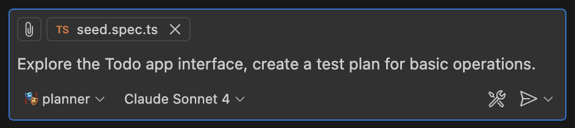

# Code Agent 与仓库级开发

> **先记住**：仓库级 Code Agent 需要理解代码、配置、测试、版本控制和运行环境，在受控工作区中完成检索、编辑、验证和提交。

---

## 1. 它在解决什么问题？

仓库级 Code Agent 需要理解代码、配置、测试、版本控制和运行环境，在受控工作区中完成检索、编辑、验证和提交。核心不是一次生成大量代码，而是先建立仓库地图，做最小变更，运行针对性测试与静态检查，审查 diff，并把危险命令、网络和凭证限制在沙箱策略内。

读这一节时，先带着三个问题：

1. **核心对象是什么？** 哪些状态会在处理过程中发生变化？
2. **主链路怎么走？** 一次处理从哪里开始，到哪里才算结束？
3. **边界在哪里？** 数据量、并发或故障出现后，哪一环最先承压？

---

## 2. 先看全貌



<p class="diagram-caption">先建立整体位置感：读取仓库约束与任务 → 检索相关代码和测试 → 生成小步补丁 → 展示 diff，审批后提交</p>

### 主链路

```text
[读取仓库约束与任务]
    │
    ▼
[检索相关代码和测试]
    │
    ▼
[生成小步补丁]
    │
    ▼
[运行静态检查与测试]
    │
    ▼
[展示 diff，审批后提交]
```

先把这条链路记住即可。接下来再逐层拆开每一步为什么这样设计。

---

## 3. 核心机制，逐层拆开

### 仓库理解

读取项目说明、依赖、目录、构建脚本和相邻实现，使用符号检索、引用关系和测试定位影响范围。保持任务假设清单，不确定时通过代码和运行结果验证。

### 编辑与验证循环

先制定可回滚的小步骤，使用结构化补丁修改，随后格式化、编译、运行目标测试和必要的端到端验证。失败先解释根因，不通过删除测试或放宽断言伪造成功。

### Git 与安全

在独立分支或工作树执行，提交只包含任务相关文件并保留 diff。限制递归删除、外部脚本和密钥访问，依赖安装与网络请求通过批准或白名单。

---

## 4. 用一段实现把概念落地

下面只保留最关键的主干。阅读时，把代码与上一节的流程一一对应：

```bash
git status --short
rg "target_symbol" src tests
# Agent 只修改与任务相关的最小文件集
git diff --check
./gradlew test
./gradlew check
git diff --stat
git diff

# 测试、静态检查和可读 diff 都通过后才允许提交。
```

### 对照着看

- **从哪里开始**：读取仓库约束与任务
- **关键状态变化**：生成小步补丁
- **怎样才算完成**：展示 diff，审批后提交

---

## 5. 怎么选才不容易错

| 关注点 | 怎么理解 | 怎么验证 |
|---|---|---|
| **可验证性** | 每一步都有可观察前置状态和验收条件 | DOM、测试、SQL 计划或引用充当证据 |
| **副作用** | 发送、购买、删除和提交必须明确确认 | 展示 diff、目标、风险和撤销方式 |
| **用户控制** | 计划、进度、暂停、取消和接管始终可见 | 失败时给可恢复下一步，不只报错 |
| **领域约束** | 通用模型不能绕过代码、数据、语音或搜索领域规则 | 专用校验器和最小权限工具守门 |

没有脱离场景的“最佳方案”。先写清数据规模、读写比例、故障模型和延迟目标，再做选择。

---

## 6. 放进真实系统，还要考虑什么

- 全仓索引提高导航效率，但要处理更新、生成文件和敏感代码隔离。
- 自动提交适合低风险修复，架构和数据迁移仍需要人工 review。
- 运行更多测试提高信心，也增加耗时，应按影响范围分层验证。

### 上线前检查

- 对用户展示计划、进度、证据和即将发生的副作用。
- 观察—行动—再观察，每一步都验证真实状态变化。
- 领域校验器限制 SQL、代码、浏览器、语音和搜索的危险边界。
- 支持暂停、取消、重试、编辑、撤销和人工接管。

---

## 7. 常见误区与排查

### 容易踩的坑

1. 未读仓库规范就大规模重构，破坏既有约定。
2. 只看测试通过，不检查生成文件、迁移和安全影响。
3. 把用户未跟踪文件误加入提交或执行危险清理。

### 出现问题时，按这个顺序看

1. **还原现场**：确认受影响的请求、数据、时间窗，以及最近是否有发布或流量变化。
2. **沿链路定位**：从“读取仓库约束与任务”一路检查到“展示 diff，审批后提交”，找出状态第一次偏离预期的位置。
3. **验证修复**：用最小复现、压力测试或故障注入证明问题消失，同时保留回滚方案。

---

## 8. 最后做一次复盘

> **一句话**：仓库级 Code Agent 需要理解代码、配置、测试、版本控制和运行环境，在受控工作区中完成检索、编辑、验证和提交。
>
> **主链路**：读取仓库约束与任务 → 检索相关代码和测试 → 生成小步补丁 → 运行静态检查与测试 → 展示 diff，审批后提交
>
> **关键状态**：生成小步补丁
>
> **最容易踩的坑**：未读仓库规范就大规模重构，破坏既有约定。

---

## 9. 高频追问

### Q1. 请用一分钟说明Code Agent 与仓库级开发的核心目标与工作机制。

仓库级 Code Agent 需要理解代码、配置、测试、版本控制和运行环境，在受控工作区中完成检索、编辑、验证和提交。核心不是一次生成大量代码，而是先建立仓库地图，做最小变更，运行针对性测试与静态检查，审查 diff，并把危险命令、网络和凭证限制在沙箱策略内。

### Q2. 仓库理解的核心机制是什么？

读取项目说明、依赖、目录、构建脚本和相邻实现，使用符号检索、引用关系和测试定位影响范围。保持任务假设清单，不确定时通过代码和运行结果验证。

### Q3. 编辑与验证循环为什么重要，实际如何落地？

先制定可回滚的小步骤，使用结构化补丁修改，随后格式化、编译、运行目标测试和必要的端到端验证。失败先解释根因，不通过删除测试或放宽断言伪造成功。

### Q4. Code Agent 与仓库级开发在工程落地时如何做取舍？

全仓索引提高导航效率，但要处理更新、生成文件和敏感代码隔离；自动提交适合低风险修复，架构和数据迁移仍需要人工 review；运行更多测试提高信心，也增加耗时，应按影响范围分层验证。

### Q5. Code Agent 与仓库级开发最常见的故障与排查重点是什么？

未读仓库规范就大规模重构，破坏既有约定；只看测试通过，不检查生成文件、迁移和安全影响；把用户未跟踪文件误加入提交或执行危险清理。排查时应关联运行状态、模型请求、工具调用、外部证据和最终结果，先判断是数据、模型、编排、权限还是依赖故障。
