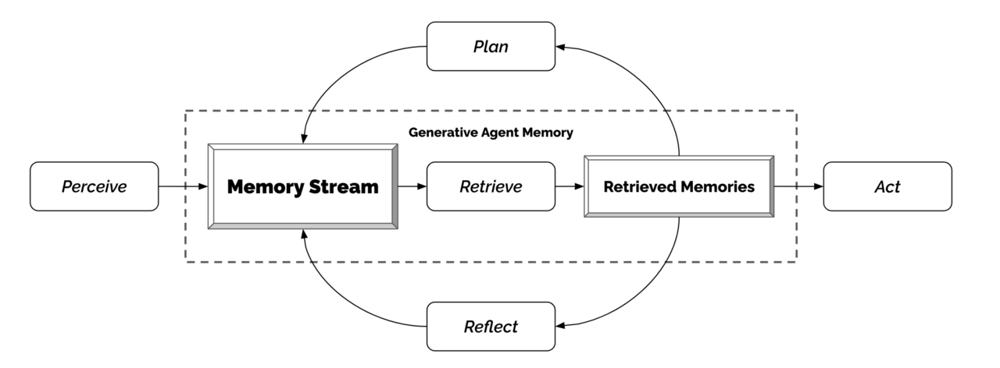

# Voice 与 Realtime Agent

> **先记住**：Voice/Realtime Agent 在语音识别、模型推理、工具调用和语音合成之间维持低延迟双向会话。

---

## 1. 它在解决什么问题？

Voice/Realtime Agent 在语音识别、模型推理、工具调用和语音合成之间维持低延迟双向会话。关键问题包括端点检测、打断、并发说话、流式状态、弱网恢复和工具等待时的反馈；涉及身份、交易或隐私时，语音自然度不能替代明确确认与安全认证。

读这一节时，先带着三个问题：

1. **核心对象是什么？** 哪些状态会在处理过程中发生变化？
2. **主链路怎么走？** 一次处理从哪里开始，到哪里才算结束？
3. **边界在哪里？** 数据量、并发或故障出现后，哪一环最先承压？

---

## 2. 先看全貌



<p class="diagram-caption">先建立整体位置感：音频流进入 VAD / ASR → 增量文本驱动模型决策 → 工具与知识调用并行 → 打断时取消旧生成并保留会话状态</p>

### 主链路

```text
[音频流进入 VAD / ASR]
    │
    ▼
[增量文本驱动模型决策]
    │
    ▼
[工具与知识调用并行]
    │
    ▼
[TTS 流式合成]
    │
    ▼
[打断时取消旧生成并保留会话状态]
```

先把这条链路记住即可。接下来再逐层拆开每一步为什么这样设计。

---

## 3. 核心机制，逐层拆开

### 实时流水线

音频分片经过 VAD/端点检测和 ASR，模型流式生成文本或音频，TTS 播放可被用户打断。各阶段使用时间戳和 turn_id，取消旧输出，避免用户已换话题系统仍继续播放。

### 打断与状态

检测 barge-in 后立即停止播放和生成，把已播放范围与用户新输入写入状态。工具调用较慢时播放简短进度提示，但不能虚构已完成；断线重连从已确认状态恢复。

### 安全与体验

敏感信息避免大声复述，付款、转账和身份变更要求二次确认或外部认证。明确告知录音、存储和 AI 身份，支持字幕、静音和人工坐席转接。

---

## 4. 用一段实现把概念落地

下面只保留最关键的主干。阅读时，把代码与上一节的流程一一对应：

```python
generation = CancelHandle.noop()
async for frame in audio_stream:
    if vad.detect_speech(frame):
        partial = await asr.push(frame)
        session.update_transcript(partial)
    if vad.detect_user_interrupt(frame):
        generation.cancel()
        tts.cancel()
    if turn_detector.complete(session.transcript):
        generation = model.stream(session.context())
        async for token in generation:
            await tts.push(token)
```

### 对照着看

- **从哪里开始**：音频流进入 VAD / ASR
- **关键状态变化**：工具与知识调用并行
- **怎样才算完成**：打断时取消旧生成并保留会话状态

---

## 5. 怎么选才不容易错

| 关注点 | 怎么理解 | 怎么验证 |
|---|---|---|
| **可验证性** | 每一步都有可观察前置状态和验收条件 | DOM、测试、SQL 计划或引用充当证据 |
| **副作用** | 发送、购买、删除和提交必须明确确认 | 展示 diff、目标、风险和撤销方式 |
| **用户控制** | 计划、进度、暂停、取消和接管始终可见 | 失败时给可恢复下一步，不只报错 |
| **领域约束** | 通用模型不能绕过代码、数据、语音或搜索领域规则 | 专用校验器和最小权限工具守门 |

没有脱离场景的“最佳方案”。先写清数据规模、读写比例、故障模型和延迟目标，再做选择。

---

## 6. 放进真实系统，还要考虑什么

- 更激进端点检测响应快，却容易截断停顿中的用户。
- 端到端语音模型自然度高，但文本审计和精细工具编排更复杂。
- 持续连接体验好，也增加资源占用和网络波动处理成本。

### 上线前检查

- 对用户展示计划、进度、证据和即将发生的副作用。
- 观察—行动—再观察，每一步都验证真实状态变化。
- 领域校验器限制 SQL、代码、浏览器、语音和搜索的危险边界。
- 支持暂停、取消、重试、编辑、撤销和人工接管。

---

## 7. 常见误区与排查

### 容易踩的坑

1. 用户打断后旧 TTS 仍播放，与新回答重叠。
2. 背景电视被识别为用户指令并触发工具。
3. 网络重连后重复执行上一次已成功的操作。

### 出现问题时，按这个顺序看

1. **还原现场**：确认受影响的请求、数据、时间窗，以及最近是否有发布或流量变化。
2. **沿链路定位**：从“音频流进入 VAD / ASR”一路检查到“打断时取消旧生成并保留会话状态”，找出状态第一次偏离预期的位置。
3. **验证修复**：用最小复现、压力测试或故障注入证明问题消失，同时保留回滚方案。

---

## 8. 最后做一次复盘

> **一句话**：Voice/Realtime Agent 在语音识别、模型推理、工具调用和语音合成之间维持低延迟双向会话。
>
> **主链路**：音频流进入 VAD / ASR → 增量文本驱动模型决策 → 工具与知识调用并行 → TTS 流式合成 → 打断时取消旧生成并保留会话状态
>
> **关键状态**：工具与知识调用并行
>
> **最容易踩的坑**：用户打断后旧 TTS 仍播放，与新回答重叠。

---

## 9. 高频追问

### Q1. 请用一分钟说明Voice 与 Realtime Agent的核心目标与工作机制。

Voice/Realtime Agent 在语音识别、模型推理、工具调用和语音合成之间维持低延迟双向会话。关键问题包括端点检测、打断、并发说话、流式状态、弱网恢复和工具等待时的反馈；涉及身份、交易或隐私时，语音自然度不能替代明确确认与安全认证。

### Q2. 实时流水线的核心机制是什么？

音频分片经过 VAD/端点检测和 ASR，模型流式生成文本或音频，TTS 播放可被用户打断。各阶段使用时间戳和 turn_id，取消旧输出，避免用户已换话题系统仍继续播放。

### Q3. 打断与状态为什么重要，实际如何落地？

检测 barge-in 后立即停止播放和生成，把已播放范围与用户新输入写入状态。工具调用较慢时播放简短进度提示，但不能虚构已完成；断线重连从已确认状态恢复。

### Q4. Voice 与 Realtime Agent在工程落地时如何做取舍？

更激进端点检测响应快，却容易截断停顿中的用户；端到端语音模型自然度高，但文本审计和精细工具编排更复杂；持续连接体验好，也增加资源占用和网络波动处理成本。

### Q5. Voice 与 Realtime Agent最常见的故障与排查重点是什么？

用户打断后旧 TTS 仍播放，与新回答重叠；背景电视被识别为用户指令并触发工具；网络重连后重复执行上一次已成功的操作。排查时应关联运行状态、模型请求、工具调用、外部证据和最终结果，先判断是数据、模型、编排、权限还是依赖故障。
