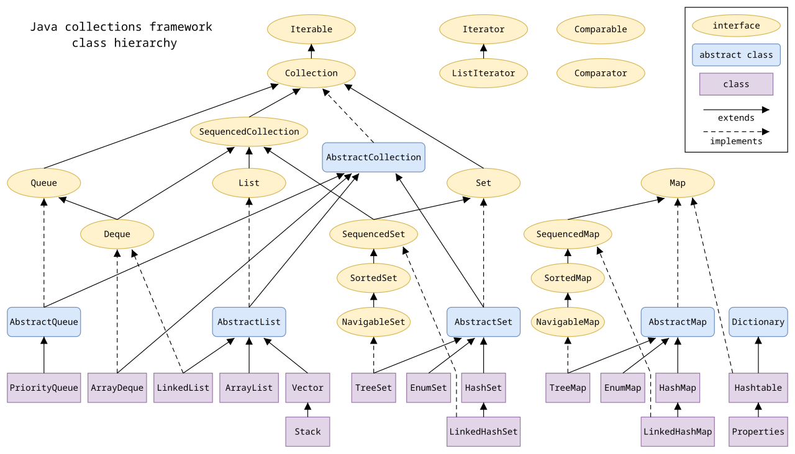

# Java 集合框架

> **一句话定位**：Java 集合先按语义选接口：有序可重复用 `List`，唯一元素用 `Set`，键值映射用 `Map`，队列语义用 `Queue/Deque`。

---

## 1. 先给结论

Java 集合先按语义选接口：有序可重复用 `List`，唯一元素用 `Set`，键值映射用 `Map`，队列语义用 `Queue/Deque`。实现层面，`ArrayList` 适合随机访问和尾部追加，`HashMap` 依靠数组、链表与红黑树提供均摊 O(1) 查询，`ConcurrentHashMap` 用 CAS 与桶级同步支持并发。面试中不要只背复杂度，还要说明数据规模、读写比例、顺序要求和并发模型。

### 面试答题路线

回答这类题不要从名词堆砌开始，按下面四步展开最稳：

1. **先定边界**：它解决什么问题，不解决什么问题。
2. **再讲机制**：把核心数据结构、状态机或调用链讲清楚。
3. **补充取舍**：说明复杂度、正确性、资源和可维护性的代价。
4. **落到生产**：给出超时、幂等、观测、压测与回滚方案。

---

## 2. 核心原理

### ArrayList 与 LinkedList

`ArrayList` 底层是连续对象引用数组。容量不足时创建更大的数组并复制，尾部追加均摊 O(1)，按下标读取 O(1)，中间插入或删除要搬移元素。`LinkedList` 是双向链表，找到节点之后插入很快，但按下标访问仍需 O(n) 遍历；节点对象和指针也带来更差的缓存局部性。因此多数业务列表优先 `ArrayList`，而不是看到“频繁插入”就机械选择链表。

### HashMap

JDK 8 的 `HashMap` 由桶数组组成。键的 `hashCode` 经扰动后定位桶；冲突先形成链表，当桶内节点达到阈值且数组容量足够时树化为红黑树。扩容通常把容量翻倍，节点根据哈希新增的高位留在原索引或移动到“原索引 + 旧容量”，不必重新计算完整位置。

正确性依赖 `equals` 与 `hashCode` 契约：相等对象必须有相同哈希值；作为 key 的字段在入表后不应变化。哈希分布不佳会增加碰撞，极端情况下查询退化。

### 并发集合

`HashMap` 不是线程安全容器。`Collections.synchronizedMap` 以单锁包装所有操作，简单但竞争大。JDK 8 `ConcurrentHashMap` 的读取大多无锁，空桶插入使用 CAS，桶发生冲突时只锁桶头；扩容还能由多个线程协助迁移。它不允许 `null` key/value，从而避免并发读取时无法区分“不存在”和“值为 null”。

### 2.1 一张图建立整体心智模型



> **图：Java 集合框架的接口与实现层次**
> （图源与许可见 [assets/CREDITS.md](./assets/CREDITS.md)）
>
> 对照本文阅读时，把图中的输入、状态、执行器和输出依次映射为：
> **业务语义与访问模式 → 选择 List / Set / Map / Queue → 选择具体实现与初始容量 → 用顺序、冲突率与延迟验证**。
> 图负责建立全局位置，具体正确性仍要回到本文的数据流、状态边界和失败路径。

---

## 3. 工作流程与关键路径

```text
[业务语义与访问模式]
    │
    ▼
[选择 List / Set / Map / Queue]
    │
    ▼
[选择具体实现与初始容量]
    │
    ▼
[执行读写和扩容]
    │
    ▼
[用顺序、冲突率与延迟验证]
```

### 3.1 每一步分别承担什么

- **入口与约束**：`业务语义与访问模式` 决定后续处理的语义、权限和容量边界。
- **核心决策**：`选择 List / Set / Map / Queue` 与 `选择具体实现与初始容量` 是最容易答成“只会背名词”的地方，要讲清状态如何变化。
- **执行与副作用**：中间步骤必须说明失败是否可重试、是否会重复，以及资源何时释放。
- **完成条件**：`用顺序、冲突率与延迟验证` 不能只看“没有抛异常”，还要有业务结果、指标或持久化证据。

### 3.2 复杂度不只是一行大 O

面试里给出时间复杂度后，还要补三件事：**数据规模是否会放大常数项、最坏路径何时触发、资源上限在哪里**。生产环境更常被队列等待、锁竞争、网络、序列化、缓存失效或外部限流拖慢；因此复杂度分析必须和实际访问分布、尾延迟及容量模型一起讲。

---

## 4. 关键实现

下面的片段不是完整框架，而是把最关键的边界写出来：

```java
Map<String, List<Order>> byUser = new HashMap<>();
for (Order order : orders) {
    byUser.computeIfAbsent(order.userId(), ignored -> new ArrayList<>())
          .add(order);
}

// 复合操作交给容器的原子 API，不写 containsKey + put。
ConcurrentHashMap<String, LongAdder> counters = new ConcurrentHashMap<>();
counters.computeIfAbsent("paid", ignored -> new LongAdder()).increment();
```

### 4.1 实现时盯住的状态

| 状态 | 需要回答的问题 |
|---|---|
| 输入 | `业务语义与访问模式` 是否已经校验语义、权限、大小与版本？ |
| 中间状态 | `选择具体实现与初始容量` 能否持久化、观测或在并发下保持不变量？ |
| 副作用 | 失败重试会不会重复执行？是否有幂等键、事务或补偿？ |
| 完成 | `用顺序、冲突率与延迟验证` 由什么证据确认？调用方能否区分成功、部分成功与失败？ |

---

## 5. 对比与选型

| 决策维度 | 面试中要说清 | 生产验证 |
|---|---|---|
| **语义** | 先确定顺序、唯一性、键值、对象身份或异常边界 | 用接口表达约束，不让调用方依赖偶然实现 |
| **复杂度** | 同时说平均、最坏和触发退化的条件 | 用真实数据规模和访问分布压测 |
| **内存** | 关注对象头、引用、扩容、装箱和临时对象 | 观察分配率、存活集与 GC 压力 |
| **并发** | 区分可见性、原子性、不可变与容器线程安全 | 优先缩小共享状态，再选同步原语 |

真正的选型结论应带条件：**在什么规模、读写比例、故障模型、SLO 和团队维护能力下选择它**。离开约束谈“谁更快”“谁更高级”没有工程意义。

---

## 6. 工程实践

- 需要稳定插入顺序时用 `LinkedHashMap`，需要按 key 排序及范围查询时用 `TreeMap`。
- 高读低写且集合很小时，`CopyOnWriteArrayList` 可用快照换取无锁遍历；写多时复制成本很高。
- 复合操作即使在并发容器上也未必原子，应优先用 `computeIfAbsent`、`merge` 等原子 API，而不是“先查再改”。
- 预估元素量并设置初始容量，可以降低扩容和瞬时内存峰值，但不要盲目分配巨型数组。

### 6.1 落地检查表

- 写清 API 的空值、异常、顺序与线程安全契约。
- 给复杂度时补充数据规模、最坏路径和内存代价。
- 用单元测试覆盖 equals/hashCode、资源关闭和边界输入。
- 热点代码再用 JFR / profiler 验证，不凭直觉微优化。

---

## 7. 常见故障

1. key 是可变对象，字段变化后无法再从 `HashMap` 中找到。
2. 遍历普通集合时直接结构性修改，触发 `ConcurrentModificationException`；应使用迭代器的 `remove` 或明确的并发集合。
3. 错把线程安全容器理解为业务事务安全，多个容器之间的组合更新仍可能不一致。
4. `computeIfAbsent` 的计算函数执行慢操作，导致同一桶的竞争时间变长。

### 7.1 推荐排查顺序

1. **先确认现象**：影响哪些请求、数据、租户与时间窗，是否与发布或流量变化相关。
2. **再沿关键路径定位**：从 `业务语义与访问模式` 逐步检查到 `用顺序、冲突率与延迟验证`，不要跳过排队、缓存、代理或外部依赖。
3. **区分原因和结果**：高 CPU、线程多、token 多、连接满可能只是症状；用日志、指标、Trace 和状态快照互相印证。
4. **最后验证修复**：用最小复现、压力或故障注入证明问题消失，同时保留一键回滚。

最常见的错误是：**key 是可变对象，字段变化后无法再从 `HashMap` 中找到。**


---

## 8. 最简记忆

```text
一句话：Java 集合先按语义选接口：有序可重复用 `List`，唯一元素用 `Set`，键值映射用 `Map`，队列语义用 `Queue/Deque`。

主链路：业务语义与访问模式 → 选择 List / Set / Map / Queue → 选择具体实现与初始容量 → 执行读写和扩容 → 用顺序、冲突率与延迟验证
核心状态：选择具体实现与初始容量
完成证据：用顺序、冲突率与延迟验证
高频坑：key 是可变对象，字段变化后无法再从 `HashMap` 中找到。
```

---

## 🎯 高频追问

1. **ArrayList 和 LinkedList 应该如何选择？**

   `ArrayList` 连续存储引用，按下标读取 O(1)，尾部追加均摊 O(1)，缓存局部性好；中间插删要搬移元素。`LinkedList` 找到节点后的插删是 O(1)，但按位置查找 O(n)，节点额外占用指针空间，局部性也更差。多数业务优先 `ArrayList`；只有已经持有节点/迭代器且确实频繁在中间插删时，链表才可能占优。

2. **HashMap 为什么要求相等对象具有相同 hashCode？**

   `HashMap` 先用哈希值定位桶，再在桶内用 `equals` 判断键。若两个 `equals` 相等的对象哈希值不同，它们会进入不同桶，查询就可能找不到已存在的键，违反 Map 的唯一键语义。反过来哈希相同不要求对象相等，冲突由桶内比较解决。

3. **JDK 8 的 HashMap 扩容为什么不必为每个节点重新取模？**

   容量是 2 的幂，索引等于哈希值与 `capacity - 1` 的按位与。容量翻倍后只新增一个有效高位：节点该位为 0 就留在原索引，为 1 就移动到“原索引 + 旧容量”。因此可以按这一位拆分链表或树，避免完整重算位置。

4. **ConcurrentHashMap 为什么不允许 null？**

   并发读取时，`get` 返回 `null` 若既可能表示“不存在”，也可能表示“值就是 null”，调用方无法在一次原子观察中区分两者；随后再调用 `containsKey`，状态可能已经变化。禁止 `null` 消除了这个歧义，也简化了并发 API 的语义。

5. **线程安全 Map 上“先判断不存在再 put”安全吗？**

   不安全。`containsKey/get` 和 `put` 各自线程安全，不代表组合操作原子；多个线程可能同时判断不存在并重复初始化。应使用 `putIfAbsent`、`computeIfAbsent` 或在更高层加锁。计算函数还应避免长时间阻塞、递归修改同一映射和不可控副作用。
