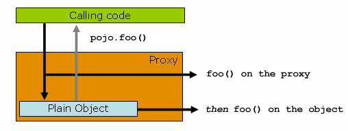

# 反射、注解与动态代理

> **先记住**：反射让程序在运行期检查类型并调用成员，注解提供结构化元数据，动态代理把统一拦截逻辑织入调用链。

---

## 1. 它在解决什么问题？

反射让程序在运行期检查类型并调用成员，注解提供结构化元数据，动态代理把统一拦截逻辑织入调用链。它们是 Spring、ORM 和测试框架的基础，但会削弱静态检查并引入访问、性能、模块边界和代理语义问题，应封装在基础设施层。

读这一节时，先带着三个问题：

1. **核心对象是什么？** 哪些状态会在处理过程中发生变化？
2. **主链路怎么走？** 一次处理从哪里开始，到哪里才算结束？
3. **边界在哪里？** 数据量、并发或故障出现后，哪一环最先承压？

---

## 2. 先看全貌



<p class="diagram-caption">先建立整体位置感：读取类、方法与注解元数据 → 框架构建调用计划 → 代理对象拦截方法 → 反射或 MethodHandle 调用目标</p>

### 主链路

```text
[读取类、方法与注解元数据]
    │
    ▼
[框架构建调用计划]
    │
    ▼
[代理对象拦截方法]
    │
    ▼
[通知链执行横切逻辑]
    │
    ▼
[反射或 MethodHandle 调用目标]
```

先把这条链路记住即可。接下来再逐层拆开每一步为什么这样设计。

---

## 3. 核心机制，逐层拆开

### 反射元模型

Class、Method、Field、Constructor 描述运行期类型结构。框架通常先扫描并缓存元数据，再通过 MethodHandle、生成字节码或反射执行，避免在热路径反复查找成员。

### 注解生命周期

Retention 决定注解保留到源码、class 文件还是运行期，Target 限制使用位置。组合注解和元注解可构建声明式模型，但解释规则必须明确优先级与继承关系。

### 代理调用边界

JDK 动态代理基于接口，子类代理通过重写方法拦截调用。final/private 方法、构造阶段调用和对象内部 this 调用都可能绕过代理，声明式事务和 AOP 需特别注意。

---

## 4. 用一段实现把概念落地

下面只保留最关键的主干。阅读时，把代码与上一节的流程一一对应：

```java
PaymentService target = new DefaultPaymentService();
PaymentService proxy = (PaymentService) Proxy.newProxyInstance(
    target.getClass().getClassLoader(),
    new Class<?>[]{PaymentService.class},
    (ignored, method, args) -> {
        long start = System.nanoTime();
        try {
            return method.invoke(target, args);
        } catch (InvocationTargetException e) {
            throw e.getCause();
        } finally {
            metrics.record(method.getName(), System.nanoTime() - start);
        }
    });
```

### 对照着看

- **从哪里开始**：读取类、方法与注解元数据
- **关键状态变化**：代理对象拦截方法
- **怎样才算完成**：反射或 MethodHandle 调用目标

---

## 5. 怎么选才不容易错

| 关注点 | 怎么理解 | 怎么验证 |
|---|---|---|
| **语义** | 先确定顺序、唯一性、键值、对象身份或异常边界 | 用接口表达约束，不让调用方依赖偶然实现 |
| **复杂度** | 同时说平均、最坏和触发退化的条件 | 用真实数据规模和访问分布压测 |
| **内存** | 关注对象头、引用、扩容、装箱和临时对象 | 观察分配率、存活集与 GC 压力 |
| **并发** | 区分可见性、原子性、不可变与容器线程安全 | 优先缩小共享状态，再选同步原语 |

没有脱离场景的“最佳方案”。先写清数据规模、读写比例、故障模型和延迟目标，再做选择。

---

## 6. 放进真实系统，还要考虑什么

- 启动期扫描可换取运行期简洁，但大型应用要建立索引、缓存或 AOT 元数据以控制启动时间。
- 基础设施可使用反射，核心业务 API 仍应保持显式类型和可测试边界。
- 代理对象的 equals、序列化、类型判断和调试体验要纳入框架设计。

### 上线前检查

- 写清 API 的空值、异常、顺序与线程安全契约。
- 给复杂度时补充数据规模、最坏路径和内存代价。
- 用单元测试覆盖 equals/hashCode、资源关闭和边界输入。
- 热点代码再用 JFR / profiler 验证，不凭直觉微优化。

---

## 7. 常见误区与排查

### 容易踩的坑

1. 每次请求都做 classpath 扫描或 Method 查找，造成 CPU 与锁竞争。
2. 代理注入的是接口类型，业务却强转为实现类导致 ClassCastException。
3. 模块化 JDK 下未开放包，深反射触发 InaccessibleObjectException。

### 出现问题时，按这个顺序看

1. **还原现场**：确认受影响的请求、数据、时间窗，以及最近是否有发布或流量变化。
2. **沿链路定位**：从“读取类、方法与注解元数据”一路检查到“反射或 MethodHandle 调用目标”，找出状态第一次偏离预期的位置。
3. **验证修复**：用最小复现、压力测试或故障注入证明问题消失，同时保留回滚方案。

---

## 8. 最后做一次复盘

> **一句话**：反射让程序在运行期检查类型并调用成员，注解提供结构化元数据，动态代理把统一拦截逻辑织入调用链。
>
> **主链路**：读取类、方法与注解元数据 → 框架构建调用计划 → 代理对象拦截方法 → 通知链执行横切逻辑 → 反射或 MethodHandle 调用目标
>
> **关键状态**：代理对象拦截方法
>
> **最容易踩的坑**：每次请求都做 classpath 扫描或 Method 查找，造成 CPU 与锁竞争。

---

## 9. 高频追问

### Q1. 请用一分钟说明反射、注解与动态代理的核心目标与工作机制。

反射让程序在运行期检查类型并调用成员，注解提供结构化元数据，动态代理把统一拦截逻辑织入调用链。它们是 Spring、ORM 和测试框架的基础，但会削弱静态检查并引入访问、性能、模块边界和代理语义问题，应封装在基础设施层。

### Q2. 反射元模型的核心机制是什么？

Class、Method、Field、Constructor 描述运行期类型结构。框架通常先扫描并缓存元数据，再通过 MethodHandle、生成字节码或反射执行，避免在热路径反复查找成员。

### Q3. 注解生命周期为什么重要，实际如何落地？

Retention 决定注解保留到源码、class 文件还是运行期，Target 限制使用位置。组合注解和元注解可构建声明式模型，但解释规则必须明确优先级与继承关系。

### Q4. 反射、注解与动态代理在工程落地时如何做取舍？

启动期扫描可换取运行期简洁，但大型应用要建立索引、缓存或 AOT 元数据以控制启动时间；基础设施可使用反射，核心业务 API 仍应保持显式类型和可测试边界；代理对象的 equals、序列化、类型判断和调试体验要纳入框架设计。

### Q5. 反射、注解与动态代理最常见的故障与排查重点是什么？

每次请求都做 classpath 扫描或 Method 查找，造成 CPU 与锁竞争；代理注入的是接口类型，业务却强转为实现类导致 ClassCastException；模块化 JDK 下未开放包，深反射触发 InaccessibleObjectException。排查时应先用指标和日志确认现象，再缩小到线程、资源、依赖或数据边界。
