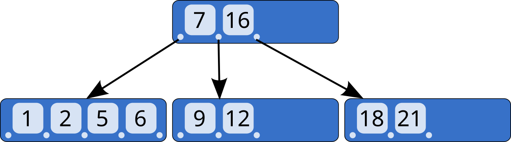

# MySQL 索引与事务

> **一句话定位**：InnoDB 的聚簇索引叶子节点保存整行数据，二级索引叶子节点保存索引列和主键，因此二级索引查非覆盖列通常需要回表。

---

## 1. 先给结论

InnoDB 的聚簇索引叶子节点保存整行数据，二级索引叶子节点保存索引列和主键，因此二级索引查非覆盖列通常需要回表。联合索引设计要围绕真实查询的过滤、排序和覆盖需求。事务依靠 undo log 实现回滚与 MVCC，redo log 保证崩溃恢复，锁处理当前读冲突。优化时应以执行计划和真实数据分布为依据，不能只背“最左前缀”。

### 面试答题路线

回答这类题不要从名词堆砌开始，按下面四步展开最稳：

1. **先定边界**：它解决什么问题，不解决什么问题。
2. **再讲机制**：把核心数据结构、状态机或调用链讲清楚。
3. **补充取舍**：说明复杂度、正确性、资源和可维护性的代价。
4. **落到生产**：给出超时、幂等、观测、压测与回滚方案。

---

## 2. 核心原理

### B+Tree 索引

B+Tree 扇出高、层数低，叶子节点有序且互相链接，既适合等值查询也适合范围扫描。聚簇索引通常按主键组织数据；没有合适主键时 InnoDB 会选择唯一非空索引或生成隐藏行 ID。过长、随机的主键会增大所有二级索引并造成页分裂。

联合索引 `(a, b, c)` 可支持从最左列开始的匹配。范围条件之后的列未必还能用于缩小扫描区间，但可能用于索引下推或覆盖。是否有效必须看 `EXPLAIN`、扫描行数和实际执行统计。

### MVCC 与锁

快照读通过事务可见性规则与 undo 版本链读取历史版本，普通 `SELECT` 在可重复读下通常不加行锁。`SELECT ... FOR UPDATE`、更新和删除属于当前读，需要读取最新版本并加锁。InnoDB 的 next-key lock 组合记录锁和间隙锁，在可重复读下抑制幻读，但锁范围取决于索引和查询条件。

### 2.1 一张图建立整体心智模型



> **图：B-Tree 的层级索引结构**
> （图源与许可见 [assets/CREDITS.md](./assets/CREDITS.md)）
>
> 对照本文阅读时，把图中的输入、状态、执行器和输出依次映射为：
> **SQL 进入优化器 → 根据统计信息选择索引与访问路径 → InnoDB 读取 B+Tree 与数据页 → 提交后由 MVCC 与锁保证可见性**。
> 图负责建立全局位置，具体正确性仍要回到本文的数据流、状态边界和失败路径。

---

## 3. 工作流程与关键路径

```text
[SQL 进入优化器]
    │
    ▼
[根据统计信息选择索引与访问路径]
    │
    ▼
[InnoDB 读取 B+Tree 与数据页]
    │
    ▼
[事务生成 undo / redo]
    │
    ▼
[提交后由 MVCC 与锁保证可见性]
```

### 3.1 每一步分别承担什么

- **入口与约束**：`SQL 进入优化器` 决定后续处理的语义、权限和容量边界。
- **核心决策**：`根据统计信息选择索引与访问路径` 与 `InnoDB 读取 B+Tree 与数据页` 是最容易答成“只会背名词”的地方，要讲清状态如何变化。
- **执行与副作用**：中间步骤必须说明失败是否可重试、是否会重复，以及资源何时释放。
- **完成条件**：`提交后由 MVCC 与锁保证可见性` 不能只看“没有抛异常”，还要有业务结果、指标或持久化证据。

### 3.2 复杂度不只是一行大 O

面试里给出时间复杂度后，还要补三件事：**数据规模是否会放大常数项、最坏路径何时触发、资源上限在哪里**。生产环境更常被队列等待、锁竞争、网络、序列化、缓存失效或外部限流拖慢；因此复杂度分析必须和实际访问分布、尾延迟及容量模型一起讲。

---

## 4. 关键实现

下面的片段不是完整框架，而是把最关键的边界写出来：

```sql
CREATE INDEX idx_order_user_status_created
    ON orders(user_id, status, created_at);

START TRANSACTION;
SELECT id, amount
  FROM orders
 WHERE user_id = 42 AND status = 'PAID'
 ORDER BY created_at DESC
 LIMIT 20;
COMMIT;
```

### 4.1 实现时盯住的状态

| 状态 | 需要回答的问题 |
|---|---|
| 输入 | `SQL 进入优化器` 是否已经校验语义、权限、大小与版本？ |
| 中间状态 | `InnoDB 读取 B+Tree 与数据页` 能否持久化、观测或在并发下保持不变量？ |
| 副作用 | 失败重试会不会重复执行？是否有幂等键、事务或补偿？ |
| 完成 | `提交后由 MVCC 与锁保证可见性` 由什么证据确认？调用方能否区分成功、部分成功与失败？ |

---

## 5. 对比与选型

| 决策维度 | 面试中要说清 | 生产验证 |
|---|---|---|
| **边界** | 明确容器、代理、Web、事务和数据访问各自负责什么 | 避免把业务规则藏进框架回调 |
| **代理** | 说明哪些调用会穿过代理，哪些会绕过 | 用集成测试覆盖 self-invocation、final 与异常路径 |
| **数据** | 从索引访问路径、事务边界和连接占用解释性能 | 核对执行计划、锁等待与连接池指标 |
| **可替换性** | 抽象应允许测试替身和实现替换 | 避免全局静态访问与过度自动配置 |

真正的选型结论应带条件：**在什么规模、读写比例、故障模型、SLO 和团队维护能力下选择它**。离开约束谈“谁更快”“谁更高级”没有工程意义。

---

## 6. 工程实践

- 选择性高的列不一定永远放最前；还要兼顾等值条件、排序、范围与覆盖。
- 索引越多，写入、页分裂、缓存占用和维护成本越高。
- 大分页避免高 `OFFSET`，可用基于稳定排序键的游标/seek 分页。
- 隔离级别越高不等于业务越正确；跨服务一致性仍需幂等、消息或补偿机制。

### 6.1 落地检查表

- 用集成测试验证代理、事务、MVC 与数据库真实边界。
- 配置提供默认值、校验、版本和回滚，不把环境差异写死。
- 监控连接池、慢 SQL、事务时长、错误分类和请求 Trace。
- 对自动装配和动态 SQL 保留可解释的启动报告与执行计划。

---

## 7. 常见故障

1. 对索引列做不受支持的函数或隐式类型转换，导致无法有效走索引。
2. 事务中执行慢 RPC，使锁持有时间被外部延迟放大。
3. 用非唯一排序字段做游标分页，出现重复或漏数据。
4. 只看 `key` 不看 `rows`、过滤比例和回表次数，误判查询已经优化。

### 7.1 推荐排查顺序

1. **先确认现象**：影响哪些请求、数据、租户与时间窗，是否与发布或流量变化相关。
2. **再沿关键路径定位**：从 `SQL 进入优化器` 逐步检查到 `提交后由 MVCC 与锁保证可见性`，不要跳过排队、缓存、代理或外部依赖。
3. **区分原因和结果**：高 CPU、线程多、token 多、连接满可能只是症状；用日志、指标、Trace 和状态快照互相印证。
4. **最后验证修复**：用最小复现、压力或故障注入证明问题消失，同时保留一键回滚。

最常见的错误是：**对索引列做不受支持的函数或隐式类型转换，导致无法有效走索引。**


---

## 8. 最简记忆

```text
一句话：InnoDB 的聚簇索引叶子节点保存整行数据，二级索引叶子节点保存索引列和主键，因此二级索引查非覆盖列通常需要回表。

主链路：SQL 进入优化器 → 根据统计信息选择索引与访问路径 → InnoDB 读取 B+Tree 与数据页 → 事务生成 undo / redo → 提交后由 MVCC 与锁保证可见性
核心状态：InnoDB 读取 B+Tree 与数据页
完成证据：提交后由 MVCC 与锁保证可见性
高频坑：对索引列做不受支持的函数或隐式类型转换，导致无法有效走索引。
```

---

## 🎯 高频追问

1. **InnoDB 聚簇索引和二级索引有什么区别？**

   聚簇索引叶子节点保存完整行数据，一张表只能有一种物理聚簇组织；二级索引叶子节点保存索引列与主键值。通过二级索引查询未覆盖列时，要先得到主键再访问聚簇索引，即回表。主键过长还会放大每个二级索引。

2. **联合索引的最左前缀原则应该如何理解？**

   索引按定义列顺序排序，只有从左侧连续确定前缀，后续列的有序性才可用于缩小扫描区间。例如 `(a,b,c)` 通常可支持 `a`、`a+b`、`a+b+c`。范围条件后的列可能不能继续定位范围，但仍可能用于索引下推、过滤或覆盖，因此要结合执行计划分析。

3. **什么是覆盖索引？**

   查询需要的过滤、排序或返回列都能从某个索引中取得，无需再访问聚簇索引整行，就形成覆盖索引。它能减少随机回表和 I/O，但为了覆盖而加入过多列会增大索引、降低写入性能，所以应针对高价值查询设计。

4. **MVCC 和锁分别解决什么问题？**

   MVCC 通过 undo 版本链与可见性规则，让快照读在不阻塞写入的情况下读取一致版本；锁则协调当前读和写操作之间的冲突，保护正在修改或明确锁定的数据。MVCC 不是“没有锁”，更新、删除和 `FOR UPDATE` 仍需要锁。

5. **redo log、undo log、binlog 的职责分别是什么？**

   redo log 是 InnoDB 的物理/生理日志，用于已提交修改的崩溃恢复；undo log 保存旧版本，用于事务回滚和 MVCC；binlog 属于 MySQL Server 层，记录逻辑变更，用于复制和时间点恢复。提交时通过两阶段提交协调 redo 与 binlog，降低两者不一致风险。
