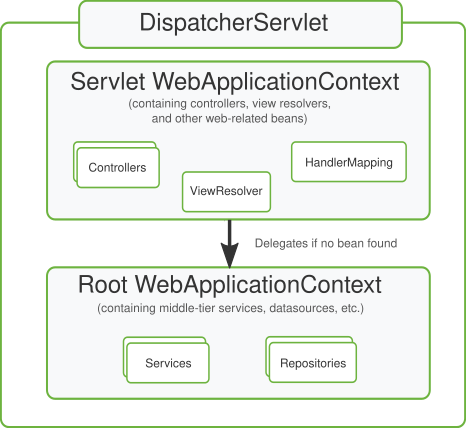

# Spring MVC 请求处理链路

> **一句话定位**：Spring MVC 由 DispatcherServlet 统一接收请求，经 HandlerMapping 找到处理器，再由 HandlerAdapter 完成参数解析和方法调用，返回值经过消息转换或视图解析生成响应；拦截器、异常解析器和过滤器分别处在不同层次。

---

## 1. 先给结论

Spring MVC 由 DispatcherServlet 统一接收请求，经 HandlerMapping 找到处理器，再由 HandlerAdapter 完成参数解析和方法调用，返回值经过消息转换或视图解析生成响应；拦截器、异常解析器和过滤器分别处在不同层次。

### 面试答题路线

回答这类题不要从名词堆砌开始，按下面四步展开最稳：

1. **先定边界**：它解决什么问题，不解决什么问题。
2. **再讲机制**：把核心数据结构、状态机或调用链讲清楚。
3. **补充取舍**：说明复杂度、正确性、资源和可维护性的代价。
4. **落到生产**：给出超时、幂等、观测、压测与回滚方案。

---

## 2. 核心原理

### 前端控制器流程

DispatcherServlet 协调 HandlerMapping、HandlerAdapter、HandlerExceptionResolver 和 ViewResolver。理解链路有助于定位 404、参数绑定、序列化和异常映射问题。

### 参数与返回值解析

HandlerMethodArgumentResolver 把路径、查询、Header、Body 和认证上下文转换为方法参数；HttpMessageConverter 根据媒体类型序列化和反序列化正文。

### Filter、Interceptor 与 Advice

Filter 属于 Servlet 容器层，可覆盖非 MVC 请求；Interceptor 围绕 Handler；ControllerAdvice 适合统一异常和绑定规则。三者职责重叠会造成顺序和重复处理问题。

### 2.1 一张图建立整体心智模型



> **图：Spring MVC 的上下文层次**
> （图源与许可见 [assets/CREDITS.md](./assets/CREDITS.md)）
>
> 对照本文阅读时，把图中的输入、状态、执行器和输出依次映射为：
> **请求进入 Filter 链 → DispatcherServlet 查找 Handler → Interceptor 执行前置逻辑 → 返回值处理、异常解析与响应写回**。
> 图负责建立全局位置，具体正确性仍要回到本文的数据流、状态边界和失败路径。

---

## 3. 工作流程与关键路径

```text
[请求进入 Filter 链]
    │
    ▼
[DispatcherServlet 查找 Handler]
    │
    ▼
[Interceptor 执行前置逻辑]
    │
    ▼
[参数绑定并调用 Controller]
    │
    ▼
[返回值处理、异常解析与响应写回]
```

### 3.1 每一步分别承担什么

- **入口与约束**：`请求进入 Filter 链` 决定后续处理的语义、权限和容量边界。
- **核心决策**：`DispatcherServlet 查找 Handler` 与 `Interceptor 执行前置逻辑` 是最容易答成“只会背名词”的地方，要讲清状态如何变化。
- **执行与副作用**：中间步骤必须说明失败是否可重试、是否会重复，以及资源何时释放。
- **完成条件**：`返回值处理、异常解析与响应写回` 不能只看“没有抛异常”，还要有业务结果、指标或持久化证据。

### 3.2 复杂度不只是一行大 O

面试里给出时间复杂度后，还要补三件事：**数据规模是否会放大常数项、最坏路径何时触发、资源上限在哪里**。生产环境更常被队列等待、锁竞争、网络、序列化、缓存失效或外部限流拖慢；因此复杂度分析必须和实际访问分布、尾延迟及容量模型一起讲。

---

## 4. 关键实现

下面的片段不是完整框架，而是把最关键的边界写出来：

```java
@RestController
@RequestMapping("/orders")
class OrderController {
    @GetMapping("/{id}")
    OrderView get(@PathVariable long id,
                  @RequestHeader("X-Request-Id") String requestId) {
        return service.find(id, requestId);
    }

    @ExceptionHandler(OrderNotFoundException.class)
    ProblemDetail notFound(OrderNotFoundException e) {
        return ProblemDetail.forStatusAndDetail(HttpStatus.NOT_FOUND, e.getMessage());
    }
}
```

### 4.1 实现时盯住的状态

| 状态 | 需要回答的问题 |
|---|---|
| 输入 | `请求进入 Filter 链` 是否已经校验语义、权限、大小与版本？ |
| 中间状态 | `Interceptor 执行前置逻辑` 能否持久化、观测或在并发下保持不变量？ |
| 副作用 | 失败重试会不会重复执行？是否有幂等键、事务或补偿？ |
| 完成 | `返回值处理、异常解析与响应写回` 由什么证据确认？调用方能否区分成功、部分成功与失败？ |

---

## 5. 对比与选型

| 决策维度 | 面试中要说清 | 生产验证 |
|---|---|---|
| **边界** | 明确容器、代理、Web、事务和数据访问各自负责什么 | 避免把业务规则藏进框架回调 |
| **代理** | 说明哪些调用会穿过代理，哪些会绕过 | 用集成测试覆盖 self-invocation、final 与异常路径 |
| **数据** | 从索引访问路径、事务边界和连接占用解释性能 | 核对执行计划、锁等待与连接池指标 |
| **可替换性** | 抽象应允许测试替身和实现替换 | 避免全局静态访问与过度自动配置 |

真正的选型结论应带条件：**在什么规模、读写比例、故障模型、SLO 和团队维护能力下选择它**。离开约束谈“谁更快”“谁更高级”没有工程意义。

---

## 6. 工程实践

- 统一响应体有利于客户端，但不要把文件流、健康检查和标准 HTTP 语义强行包装。
- 参数校验应在边界尽早失败，领域不变量仍需在业务层再次保护。
- 大文件和流式响应避免完整读入内存，异步请求也要正确传播安全和日志上下文。

### 6.1 落地检查表

- 用集成测试验证代理、事务、MVC 与数据库真实边界。
- 配置提供默认值、校验、版本和回滚，不把环境差异写死。
- 监控连接池、慢 SQL、事务时长、错误分类和请求 Trace。
- 对自动装配和动态 SQL 保留可解释的启动报告与执行计划。

---

## 7. 常见故障

1. Content-Type 与 Accept 不匹配导致 415 或 406。
2. 全局异常处理器捕获过宽，把系统故障错误映射为业务成功。
3. 请求体被 Filter 提前读取且未包装，Controller 再读取为空。

### 7.1 推荐排查顺序

1. **先确认现象**：影响哪些请求、数据、租户与时间窗，是否与发布或流量变化相关。
2. **再沿关键路径定位**：从 `请求进入 Filter 链` 逐步检查到 `返回值处理、异常解析与响应写回`，不要跳过排队、缓存、代理或外部依赖。
3. **区分原因和结果**：高 CPU、线程多、token 多、连接满可能只是症状；用日志、指标、Trace 和状态快照互相印证。
4. **最后验证修复**：用最小复现、压力或故障注入证明问题消失，同时保留一键回滚。

最常见的错误是：**Content-Type 与 Accept 不匹配导致 415 或 406。**


---

## 8. 最简记忆

```text
一句话：Spring MVC 由 DispatcherServlet 统一接收请求，经 HandlerMapping 找到处理器，再由 HandlerAdapter 完成参数解析和方法调用，返回值经过消息转换或视图解析生成响应；拦截器、异常解析器和过滤器分别处在不同层次。

主链路：请求进入 Filter 链 → DispatcherServlet 查找 Handler → Interceptor 执行前置逻辑 → 参数绑定并调用 Controller → 返回值处理、异常解析与响应写回
核心状态：Interceptor 执行前置逻辑
完成证据：返回值处理、异常解析与响应写回
高频坑：Content-Type 与 Accept 不匹配导致 415 或 406。
```

---

## 🎯 高频追问

1. **请用一分钟说明Spring MVC 请求处理链路的核心目标与工作机制。**

   Spring MVC 由 DispatcherServlet 统一接收请求，经 HandlerMapping 找到处理器，再由 HandlerAdapter 完成参数解析和方法调用，返回值经过消息转换或视图解析生成响应；拦截器、异常解析器和过滤器分别处在不同层次。

2. **前端控制器流程的核心机制是什么？**

   DispatcherServlet 协调 HandlerMapping、HandlerAdapter、HandlerExceptionResolver 和 ViewResolver。理解链路有助于定位 404、参数绑定、序列化和异常映射问题。

3. **参数与返回值解析为什么重要，实际如何落地？**

   HandlerMethodArgumentResolver 把路径、查询、Header、Body 和认证上下文转换为方法参数；HttpMessageConverter 根据媒体类型序列化和反序列化正文。

4. **Spring MVC 请求处理链路在工程落地时如何做取舍？**

   统一响应体有利于客户端，但不要把文件流、健康检查和标准 HTTP 语义强行包装；参数校验应在边界尽早失败，领域不变量仍需在业务层再次保护；大文件和流式响应避免完整读入内存，异步请求也要正确传播安全和日志上下文。

5. **Spring MVC 请求处理链路最常见的故障与排查重点是什么？**

   Content-Type 与 Accept 不匹配导致 415 或 406；全局异常处理器捕获过宽，把系统故障错误映射为业务成功；请求体被 Filter 提前读取且未包装，Controller 再读取为空。排查时应先用指标和日志确认现象，再缩小到线程、资源、依赖或数据边界。
