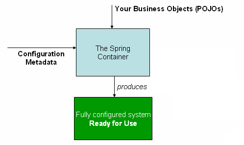

# Spring Boot 自动配置与启动机制

> **一句话定位**：Spring Boot 通过约定、条件化自动配置和 Starter 依赖减少装配代码。

---

## 1. 先给结论

Spring Boot 通过约定、条件化自动配置和 Starter 依赖减少装配代码。启动时创建 ApplicationContext、加载环境与配置、选择满足条件的自动配置并注册 Bean；排查问题要看条件评估报告，而不是盲目排除整个自动配置。

### 面试答题路线

回答这类题不要从名词堆砌开始，按下面四步展开最稳：

1. **先定边界**：它解决什么问题，不解决什么问题。
2. **再讲机制**：把核心数据结构、状态机或调用链讲清楚。
3. **补充取舍**：说明复杂度、正确性、资源和可维护性的代价。
4. **落到生产**：给出超时、幂等、观测、压测与回滚方案。

---

## 2. 核心原理

### 条件化配置

自动配置使用 classpath、Bean、属性和 Web 类型等条件决定是否生效，并通常在用户未提供自定义 Bean 时给出默认实现。

### 配置绑定

Environment 汇总命令行、系统变量、配置文件等属性源，再绑定到类型安全配置对象。属性优先级、profile 和命名规则是部署差异的常见来源。

### 启动扩展点

ApplicationContextInitializer、ApplicationListener、Runner 和 BeanFactory/BeanPostProcessor 位于不同阶段。扩展点应只做对应阶段的工作，避免在容器未就绪时访问业务 Bean。

### 2.1 一张图建立整体心智模型



> **图：自动配置最终仍落到容器装配**
> （图源与许可见 [assets/CREDITS.md](./assets/CREDITS.md)）
>
> 对照本文阅读时，把图中的输入、状态、执行器和输出依次映射为：
> **SpringApplication 准备环境 → 加载配置与监听器 → 创建 ApplicationContext → 实例化 Bean 并启动 WebServer**。
> 图负责建立全局位置，具体正确性仍要回到本文的数据流、状态边界和失败路径。

---

## 3. 工作流程与关键路径

```text
[SpringApplication 准备环境]
    │
    ▼
[加载配置与监听器]
    │
    ▼
[创建 ApplicationContext]
    │
    ▼
[条件化导入自动配置]
    │
    ▼
[实例化 Bean 并启动 WebServer]
```

### 3.1 每一步分别承担什么

- **入口与约束**：`SpringApplication 准备环境` 决定后续处理的语义、权限和容量边界。
- **核心决策**：`加载配置与监听器` 与 `创建 ApplicationContext` 是最容易答成“只会背名词”的地方，要讲清状态如何变化。
- **执行与副作用**：中间步骤必须说明失败是否可重试、是否会重复，以及资源何时释放。
- **完成条件**：`实例化 Bean 并启动 WebServer` 不能只看“没有抛异常”，还要有业务结果、指标或持久化证据。

### 3.2 复杂度不只是一行大 O

面试里给出时间复杂度后，还要补三件事：**数据规模是否会放大常数项、最坏路径何时触发、资源上限在哪里**。生产环境更常被队列等待、锁竞争、网络、序列化、缓存失效或外部限流拖慢；因此复杂度分析必须和实际访问分布、尾延迟及容量模型一起讲。

---

## 4. 关键实现

下面的片段不是完整框架，而是把最关键的边界写出来：

```java
@AutoConfiguration
@ConditionalOnClass(PaymentClient.class)
@EnableConfigurationProperties(PaymentProperties.class)
class PaymentAutoConfiguration {
    @Bean
    @ConditionalOnMissingBean
    PaymentClient paymentClient(PaymentProperties properties) {
        return new HttpPaymentClient(properties.baseUrl(), properties.timeout());
    }
}

// META-INF/spring/org.springframework.boot.autoconfigure.AutoConfiguration.imports
// com.example.PaymentAutoConfiguration
```

### 4.1 实现时盯住的状态

| 状态 | 需要回答的问题 |
|---|---|
| 输入 | `SpringApplication 准备环境` 是否已经校验语义、权限、大小与版本？ |
| 中间状态 | `创建 ApplicationContext` 能否持久化、观测或在并发下保持不变量？ |
| 副作用 | 失败重试会不会重复执行？是否有幂等键、事务或补偿？ |
| 完成 | `实例化 Bean 并启动 WebServer` 由什么证据确认？调用方能否区分成功、部分成功与失败？ |

---

## 5. 对比与选型

| 决策维度 | 面试中要说清 | 生产验证 |
|---|---|---|
| **边界** | 明确容器、代理、Web、事务和数据访问各自负责什么 | 避免把业务规则藏进框架回调 |
| **代理** | 说明哪些调用会穿过代理，哪些会绕过 | 用集成测试覆盖 self-invocation、final 与异常路径 |
| **数据** | 从索引访问路径、事务边界和连接占用解释性能 | 核对执行计划、锁等待与连接池指标 |
| **可替换性** | 抽象应允许测试替身和实现替换 | 避免全局静态访问与过度自动配置 |

真正的选型结论应带条件：**在什么规模、读写比例、故障模型、SLO 和团队维护能力下选择它**。离开约束谈“谁更快”“谁更高级”没有工程意义。

---

## 6. 工程实践

- Starter 应提供合理默认值并允许局部覆盖，不能用隐藏副作用换取“零配置”。
- 配置类要配套校验和元数据，敏感值由密钥系统注入而非写入仓库。
- 大型服务可结合懒加载、AOT 或拆分上下文优化启动，但需评估首请求延迟与调试成本。

### 6.1 落地检查表

- 用集成测试验证代理、事务、MVC 与数据库真实边界。
- 配置提供默认值、校验、版本和回滚，不把环境差异写死。
- 监控连接池、慢 SQL、事务时长、错误分类和请求 Trace。
- 对自动装配和动态 SQL 保留可解释的启动报告与执行计划。

---

## 7. 常见故障

1. 自定义 Bean 名称或泛型不匹配，预期覆盖失败而出现两个实现。
2. 不同环境属性源优先级不同，线上读取到意外配置。
3. 启动监听器执行网络请求，依赖抖动导致应用无法启动。

### 7.1 推荐排查顺序

1. **先确认现象**：影响哪些请求、数据、租户与时间窗，是否与发布或流量变化相关。
2. **再沿关键路径定位**：从 `SpringApplication 准备环境` 逐步检查到 `实例化 Bean 并启动 WebServer`，不要跳过排队、缓存、代理或外部依赖。
3. **区分原因和结果**：高 CPU、线程多、token 多、连接满可能只是症状；用日志、指标、Trace 和状态快照互相印证。
4. **最后验证修复**：用最小复现、压力或故障注入证明问题消失，同时保留一键回滚。

最常见的错误是：**自定义 Bean 名称或泛型不匹配，预期覆盖失败而出现两个实现。**


---

## 8. 最简记忆

```text
一句话：Spring Boot 通过约定、条件化自动配置和 Starter 依赖减少装配代码。

主链路：SpringApplication 准备环境 → 加载配置与监听器 → 创建 ApplicationContext → 条件化导入自动配置 → 实例化 Bean 并启动 WebServer
核心状态：创建 ApplicationContext
完成证据：实例化 Bean 并启动 WebServer
高频坑：自定义 Bean 名称或泛型不匹配，预期覆盖失败而出现两个实现。
```

---

## 🎯 高频追问

1. **请用一分钟说明Spring Boot 自动配置与启动机制的核心目标与工作机制。**

   Spring Boot 通过约定、条件化自动配置和 Starter 依赖减少装配代码。启动时创建 ApplicationContext、加载环境与配置、选择满足条件的自动配置并注册 Bean；排查问题要看条件评估报告，而不是盲目排除整个自动配置。

2. **条件化配置的核心机制是什么？**

   自动配置使用 classpath、Bean、属性和 Web 类型等条件决定是否生效，并通常在用户未提供自定义 Bean 时给出默认实现。

3. **配置绑定为什么重要，实际如何落地？**

   Environment 汇总命令行、系统变量、配置文件等属性源，再绑定到类型安全配置对象。属性优先级、profile 和命名规则是部署差异的常见来源。

4. **Spring Boot 自动配置与启动机制在工程落地时如何做取舍？**

   Starter 应提供合理默认值并允许局部覆盖，不能用隐藏副作用换取“零配置”；配置类要配套校验和元数据，敏感值由密钥系统注入而非写入仓库；大型服务可结合懒加载、AOT 或拆分上下文优化启动，但需评估首请求延迟与调试成本。

5. **Spring Boot 自动配置与启动机制最常见的故障与排查重点是什么？**

   自定义 Bean 名称或泛型不匹配，预期覆盖失败而出现两个实现；不同环境属性源优先级不同，线上读取到意外配置；启动监听器执行网络请求，依赖抖动导致应用无法启动。排查时应先用指标和日志确认现象，再缩小到线程、资源、依赖或数据边界。
