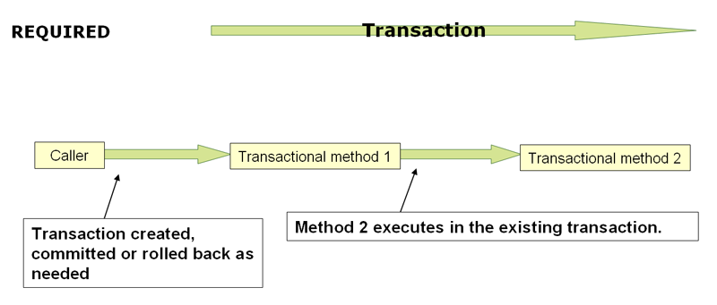

# Spring 事务传播与隔离

> **一句话定位**：Spring 声明式事务由代理和 TransactionManager 管理。

---

## 1. 先给结论

Spring 声明式事务由代理和 TransactionManager 管理。传播行为决定嵌套调用如何加入、挂起或创建物理事务，隔离级别约束并发可见性；事务边界必须围绕一致性用例，并避免把慢 RPC 放入数据库事务。

### 面试答题路线

回答这类题不要从名词堆砌开始，按下面四步展开最稳：

1. **先定边界**：它解决什么问题，不解决什么问题。
2. **再讲机制**：把核心数据结构、状态机或调用链讲清楚。
3. **补充取舍**：说明复杂度、正确性、资源和可维护性的代价。
4. **落到生产**：给出超时、幂等、观测、压测与回滚方案。

---

## 2. 核心原理

### 逻辑与物理事务

REQUIRED 的多个方法可形成多个逻辑事务范围但共享同一物理事务；内部范围标记 rollback-only 后，外层提交可能得到 UnexpectedRollbackException。

### REQUIRES_NEW 与 NESTED

REQUIRES_NEW 挂起外层并占用独立连接；NESTED 通常依赖保存点并仍处于同一物理事务。两者语义和连接池压力完全不同。

### 隔离与回滚规则

隔离级别最终受数据库支持；默认通常只对 RuntimeException 和 Error 回滚。自调用、private 方法和异常被吞都会让声明式事务偏离预期。

### 2.1 一张图建立整体心智模型



> **图：REQUIRED 传播下的事务边界**
> （图源与许可见 [assets/CREDITS.md](./assets/CREDITS.md)）
>
> 对照本文阅读时，把图中的输入、状态、执行器和输出依次映射为：
> **代理拦截 @Transactional 方法 → 事务管理器获取连接并开启事务 → 内层调用按传播行为加入或新建事务 → 提交并释放连接**。
> 图负责建立全局位置，具体正确性仍要回到本文的数据流、状态边界和失败路径。

---

## 3. 工作流程与关键路径

```text
[代理拦截 @Transactional 方法]
    │
    ▼
[事务管理器获取连接并开启事务]
    │
    ▼
[内层调用按传播行为加入或新建事务]
    │
    ▼
[异常触发回滚规则]
    │
    ▼
[提交并释放连接]
```

### 3.1 每一步分别承担什么

- **入口与约束**：`代理拦截 @Transactional 方法` 决定后续处理的语义、权限和容量边界。
- **核心决策**：`事务管理器获取连接并开启事务` 与 `内层调用按传播行为加入或新建事务` 是最容易答成“只会背名词”的地方，要讲清状态如何变化。
- **执行与副作用**：中间步骤必须说明失败是否可重试、是否会重复，以及资源何时释放。
- **完成条件**：`提交并释放连接` 不能只看“没有抛异常”，还要有业务结果、指标或持久化证据。

### 3.2 复杂度不只是一行大 O

面试里给出时间复杂度后，还要补三件事：**数据规模是否会放大常数项、最坏路径何时触发、资源上限在哪里**。生产环境更常被队列等待、锁竞争、网络、序列化、缓存失效或外部限流拖慢；因此复杂度分析必须和实际访问分布、尾延迟及容量模型一起讲。

---

## 4. 关键实现

下面的片段不是完整框架，而是把最关键的边界写出来：

```java
@Transactional
public void placeOrder(Command command) {
    orderRepository.insert(command.order());
    outboxRepository.append(OrderPlaced.from(command));
}

@Transactional(propagation = Propagation.REQUIRES_NEW)
public void writeAudit(AuditEvent event) {
    auditRepository.insert(event);
}

// 注意：同类内部 this.writeAudit(...) 不经过代理。
```

### 4.1 实现时盯住的状态

| 状态 | 需要回答的问题 |
|---|---|
| 输入 | `代理拦截 @Transactional 方法` 是否已经校验语义、权限、大小与版本？ |
| 中间状态 | `内层调用按传播行为加入或新建事务` 能否持久化、观测或在并发下保持不变量？ |
| 副作用 | 失败重试会不会重复执行？是否有幂等键、事务或补偿？ |
| 完成 | `提交并释放连接` 由什么证据确认？调用方能否区分成功、部分成功与失败？ |

---

## 5. 对比与选型

| 决策维度 | 面试中要说清 | 生产验证 |
|---|---|---|
| **边界** | 明确容器、代理、Web、事务和数据访问各自负责什么 | 避免把业务规则藏进框架回调 |
| **代理** | 说明哪些调用会穿过代理，哪些会绕过 | 用集成测试覆盖 self-invocation、final 与异常路径 |
| **数据** | 从索引访问路径、事务边界和连接占用解释性能 | 核对执行计划、锁等待与连接池指标 |
| **可替换性** | 抽象应允许测试替身和实现替换 | 避免全局静态访问与过度自动配置 |

真正的选型结论应带条件：**在什么规模、读写比例、故障模型、SLO 和团队维护能力下选择它**。离开约束谈“谁更快”“谁更高级”没有工程意义。

---

## 6. 工程实践

- 事务应尽量短，先完成外部准备再进入事务，提交后再异步触发非关键动作。
- REQUIRES_NEW 需要为并发外层事务额外预留连接，否则可能形成连接池死锁。
- 跨库、消息和远程服务不能仅靠本地 @Transactional，应使用 outbox、Saga 或补偿。

### 6.1 落地检查表

- 用集成测试验证代理、事务、MVC 与数据库真实边界。
- 配置提供默认值、校验、版本和回滚，不把环境差异写死。
- 监控连接池、慢 SQL、事务时长、错误分类和请求 Trace。
- 对自动装配和动态 SQL 保留可解释的启动报告与执行计划。

---

## 7. 常见故障

1. 同类自调用绕过事务代理。
2. 捕获异常正常返回导致事务提交。
3. 事务中等待外部接口，锁和连接长期占用。

### 7.1 推荐排查顺序

1. **先确认现象**：影响哪些请求、数据、租户与时间窗，是否与发布或流量变化相关。
2. **再沿关键路径定位**：从 `代理拦截 @Transactional 方法` 逐步检查到 `提交并释放连接`，不要跳过排队、缓存、代理或外部依赖。
3. **区分原因和结果**：高 CPU、线程多、token 多、连接满可能只是症状；用日志、指标、Trace 和状态快照互相印证。
4. **最后验证修复**：用最小复现、压力或故障注入证明问题消失，同时保留一键回滚。

最常见的错误是：**同类自调用绕过事务代理。**


---

## 8. 参考规范

- Spring Transaction Propagation：https://docs.spring.io/spring-framework/reference/data-access/transaction/declarative/tx-propagation.html

---

## 9. 最简记忆

```text
一句话：Spring 声明式事务由代理和 TransactionManager 管理。

主链路：代理拦截 @Transactional 方法 → 事务管理器获取连接并开启事务 → 内层调用按传播行为加入或新建事务 → 异常触发回滚规则 → 提交并释放连接
核心状态：内层调用按传播行为加入或新建事务
完成证据：提交并释放连接
高频坑：同类自调用绕过事务代理。
```

---

## 🎯 高频追问

1. **请用一分钟说明Spring 事务传播与隔离的核心目标与工作机制。**

   Spring 声明式事务由代理和 TransactionManager 管理。传播行为决定嵌套调用如何加入、挂起或创建物理事务，隔离级别约束并发可见性；事务边界必须围绕一致性用例，并避免把慢 RPC 放入数据库事务。

2. **逻辑与物理事务的核心机制是什么？**

   REQUIRED 的多个方法可形成多个逻辑事务范围但共享同一物理事务；内部范围标记 rollback-only 后，外层提交可能得到 UnexpectedRollbackException。

3. **REQUIRES_NEW 与 NESTED为什么重要，实际如何落地？**

   REQUIRES_NEW 挂起外层并占用独立连接；NESTED 通常依赖保存点并仍处于同一物理事务。两者语义和连接池压力完全不同。

4. **Spring 事务传播与隔离在工程落地时如何做取舍？**

   事务应尽量短，先完成外部准备再进入事务，提交后再异步触发非关键动作；REQUIRES_NEW 需要为并发外层事务额外预留连接，否则可能形成连接池死锁；跨库、消息和远程服务不能仅靠本地 @Transactional，应使用 outbox、Saga 或补偿。

5. **Spring 事务传播与隔离最常见的故障与排查重点是什么？**

   同类自调用绕过事务代理；捕获异常正常返回导致事务提交；事务中等待外部接口，锁和连接长期占用。排查时应先用指标和日志确认现象，再缩小到线程、资源、依赖或数据边界。
