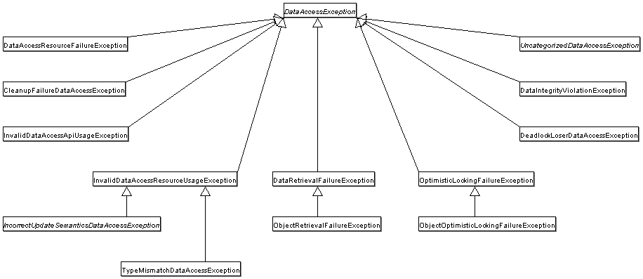

# MyBatis 与 ORM 数据访问

> **先记住**：MyBatis 让开发者显式控制 SQL 和映射，ORM 则通过实体映射、持久化上下文和变更检测提高领域开发效率。

---

## 1. 它在解决什么问题？

MyBatis 让开发者显式控制 SQL 和映射，ORM 则通过实体映射、持久化上下文和变更检测提高领域开发效率。选择关键在查询复杂度、团队 SQL 能力、领域模型和性能可预测性，不能把框架当作数据库原理的替代品。

读这一节时，先带着三个问题：

1. **核心对象是什么？** 哪些状态会在处理过程中发生变化？
2. **主链路怎么走？** 一次处理从哪里开始，到哪里才算结束？
3. **边界在哪里？** 数据量、并发或故障出现后，哪一环最先承压？

---

## 2. 先看全貌



<p class="diagram-caption">先建立整体位置感：Mapper 方法被代理拦截 → 解析 MappedStatement 与动态 SQL → 绑定参数并执行 JDBC → 一级 / 二级缓存按边界生效</p>

### 主链路

```text
[Mapper 方法被代理拦截]
    │
    ▼
[解析 MappedStatement 与动态 SQL]
    │
    ▼
[绑定参数并执行 JDBC]
    │
    ▼
[映射 ResultSet 到对象]
    │
    ▼
[一级 / 二级缓存按边界生效]
```

先把这条链路记住即可。接下来再逐层拆开每一步为什么这样设计。

---

## 3. 核心机制，逐层拆开

### SQL 映射与参数安全

预编译参数使用占位符绑定，字符串替换只适合经过白名单校验的标识符。resultMap、类型处理器和动态 SQL 应保持数据库字段与领域对象的清晰映射。

### 持久化上下文

典型 ORM 在事务内维护一级缓存和实体状态，通过 dirty checking 生成更新。延迟加载和级联操作简化代码，也可能隐藏 SQL 数量和锁范围。

### N+1 与批处理

关联对象逐条懒加载会产生 N+1；应通过 join fetch、批量查询或 DTO 投影解决。批量写要控制 batch size、事务大小和生成键策略。

---

## 4. 用一段实现把概念落地

下面只保留最关键的主干。阅读时，把代码与上一节的流程一一对应：

```xml
<select id="findRecent" resultType="Order">
  SELECT id, user_id, status, amount, created_at
  FROM orders
  WHERE user_id = #{userId}
  <if test="status != null">
    AND status = #{status}
  </if>
  ORDER BY created_at DESC
  LIMIT #{limit}
</select>
```

### 对照着看

- **从哪里开始**：Mapper 方法被代理拦截
- **关键状态变化**：绑定参数并执行 JDBC
- **怎样才算完成**：一级 / 二级缓存按边界生效

---

## 5. 怎么选才不容易错

| 关注点 | 怎么理解 | 怎么验证 |
|---|---|---|
| **边界** | 明确容器、代理、Web、事务和数据访问各自负责什么 | 避免把业务规则藏进框架回调 |
| **代理** | 说明哪些调用会穿过代理，哪些会绕过 | 用集成测试覆盖 self-invocation、final 与异常路径 |
| **数据** | 从索引访问路径、事务边界和连接占用解释性能 | 核对执行计划、锁等待与连接池指标 |
| **可替换性** | 抽象应允许测试替身和实现替换 | 避免全局静态访问与过度自动配置 |

没有脱离场景的“最佳方案”。先写清数据规模、读写比例、故障模型和延迟目标，再做选择。

---

## 6. 放进真实系统，还要考虑什么

- 读模型复杂、SQL 强优化场景偏向显式 SQL；聚合状态迁移可从 ORM 的持久化上下文获益。
- 不要让数据库实体直接成为外部 API 模型，避免字段泄露和懒加载越界。
- 二级缓存仅适合失效边界清晰的数据，缓存一致性成本通常高于收益。

### 上线前检查

- 用集成测试验证代理、事务、MVC 与数据库真实边界。
- 配置提供默认值、校验、版本和回滚，不把环境差异写死。
- 监控连接池、慢 SQL、事务时长、错误分类和请求 Trace。
- 对自动装配和动态 SQL 保留可解释的启动报告与执行计划。

---

## 7. 常见误区与排查

### 容易踩的坑

1. 使用字符串拼接动态列造成 SQL 注入。
2. 序列化实体时触发大量懒加载查询。
3. 批量循环每条提交一次，吞吐和日志量急剧恶化。

### 出现问题时，按这个顺序看

1. **还原现场**：确认受影响的请求、数据、时间窗，以及最近是否有发布或流量变化。
2. **沿链路定位**：从“Mapper 方法被代理拦截”一路检查到“一级 / 二级缓存按边界生效”，找出状态第一次偏离预期的位置。
3. **验证修复**：用最小复现、压力测试或故障注入证明问题消失，同时保留回滚方案。

---

## 8. 最后做一次复盘

> **一句话**：MyBatis 让开发者显式控制 SQL 和映射，ORM 则通过实体映射、持久化上下文和变更检测提高领域开发效率。
>
> **主链路**：Mapper 方法被代理拦截 → 解析 MappedStatement 与动态 SQL → 绑定参数并执行 JDBC → 映射 ResultSet 到对象 → 一级 / 二级缓存按边界生效
>
> **关键状态**：绑定参数并执行 JDBC
>
> **最容易踩的坑**：使用字符串拼接动态列造成 SQL 注入。

---

## 9. 高频追问

### Q1. 请用一分钟说明MyBatis 与 ORM 数据访问的核心目标与工作机制。

MyBatis 让开发者显式控制 SQL 和映射，ORM 则通过实体映射、持久化上下文和变更检测提高领域开发效率。选择关键在查询复杂度、团队 SQL 能力、领域模型和性能可预测性，不能把框架当作数据库原理的替代品。

### Q2. SQL 映射与参数安全的核心机制是什么？

预编译参数使用占位符绑定，字符串替换只适合经过白名单校验的标识符。resultMap、类型处理器和动态 SQL 应保持数据库字段与领域对象的清晰映射。

### Q3. 持久化上下文为什么重要，实际如何落地？

典型 ORM 在事务内维护一级缓存和实体状态，通过 dirty checking 生成更新。延迟加载和级联操作简化代码，也可能隐藏 SQL 数量和锁范围。

### Q4. MyBatis 与 ORM 数据访问在工程落地时如何做取舍？

读模型复杂、SQL 强优化场景偏向显式 SQL；聚合状态迁移可从 ORM 的持久化上下文获益；不要让数据库实体直接成为外部 API 模型，避免字段泄露和懒加载越界；二级缓存仅适合失效边界清晰的数据，缓存一致性成本通常高于收益。

### Q5. MyBatis 与 ORM 数据访问最常见的故障与排查重点是什么？

使用字符串拼接动态列造成 SQL 注入；序列化实体时触发大量懒加载查询；批量循环每条提交一次，吞吐和日志量急剧恶化。排查时应先用指标和日志确认现象，再缩小到线程、资源、依赖或数据边界。
