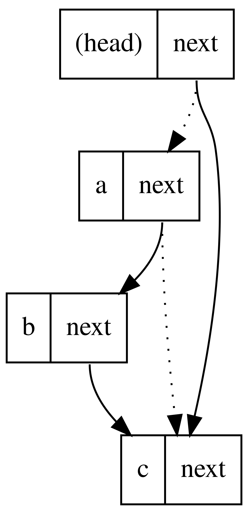

# synchronized、Lock 与 AQS

> **一句话定位**：synchronized 提供结构化互斥和内存语义，Lock 提供可中断、超时、公平和多条件队列等能力；AQS 以同步状态、CAS 和等待队列支撑 ReentrantLock、Semaphore、CountDownLatch 等同步器。

---

## 1. 先给结论

synchronized 提供结构化互斥和内存语义，Lock 提供可中断、超时、公平和多条件队列等能力；AQS 以同步状态、CAS 和等待队列支撑 ReentrantLock、Semaphore、CountDownLatch 等同步器。

### 面试答题路线

回答这类题不要从名词堆砌开始，按下面四步展开最稳：

1. **先定边界**：它解决什么问题，不解决什么问题。
2. **再讲机制**：把核心数据结构、状态机或调用链讲清楚。
3. **补充取舍**：说明复杂度、正确性、资源和可维护性的代价。
4. **落到生产**：给出超时、幂等、观测、压测与回滚方案。

---

## 2. 核心原理

### 监视器与锁范围

进入 synchronized 前获取监视器，退出时释放并建立 happens-before。锁对象必须稳定且私有，临界区只覆盖共享不变量。

### AQS 队列

AQS 用 state 表示同步状态，获取失败的线程进入 FIFO 等待队列，并由子类定义独占或共享获取/释放逻辑。

### Condition 与中断

Condition 可建立多个条件等待队列；await 应放在 while 条件循环中处理虚假唤醒，并明确响应或恢复中断。

### 2.1 一张图建立整体心智模型



> **图：并发更新中的竞争窗口**
> （图源与许可见 [assets/CREDITS.md](./assets/CREDITS.md)）
>
> 对照本文阅读时，把图中的输入、状态、执行器和输出依次映射为：
> **线程尝试 CAS 获取同步状态 → 失败后封装为节点入队 → 前驱释放时唤醒后继 → finally 释放状态并传播唤醒**。
> 图负责建立全局位置，具体正确性仍要回到本文的数据流、状态边界和失败路径。

---

## 3. 工作流程与关键路径

```text
[线程尝试 CAS 获取同步状态]
    │
    ▼
[失败后封装为节点入队]
    │
    ▼
[前驱释放时唤醒后继]
    │
    ▼
[线程重试并获得锁]
    │
    ▼
[finally 释放状态并传播唤醒]
```

### 3.1 每一步分别承担什么

- **入口与约束**：`线程尝试 CAS 获取同步状态` 决定后续处理的语义、权限和容量边界。
- **核心决策**：`失败后封装为节点入队` 与 `前驱释放时唤醒后继` 是最容易答成“只会背名词”的地方，要讲清状态如何变化。
- **执行与副作用**：中间步骤必须说明失败是否可重试、是否会重复，以及资源何时释放。
- **完成条件**：`finally 释放状态并传播唤醒` 不能只看“没有抛异常”，还要有业务结果、指标或持久化证据。

### 3.2 复杂度不只是一行大 O

面试里给出时间复杂度后，还要补三件事：**数据规模是否会放大常数项、最坏路径何时触发、资源上限在哪里**。生产环境更常被队列等待、锁竞争、网络、序列化、缓存失效或外部限流拖慢；因此复杂度分析必须和实际访问分布、尾延迟及容量模型一起讲。

---

## 4. 关键实现

下面的片段不是完整框架，而是把最关键的边界写出来：

```java
private final Lock lock = new ReentrantLock();
private final Condition notEmpty = lock.newCondition();

E take() throws InterruptedException {
    lock.lockInterruptibly();
    try {
        while (queue.isEmpty()) notEmpty.await();
        return queue.removeFirst();
    } finally {
        lock.unlock();
    }
}
```

### 4.1 实现时盯住的状态

| 状态 | 需要回答的问题 |
|---|---|
| 输入 | `线程尝试 CAS 获取同步状态` 是否已经校验语义、权限、大小与版本？ |
| 中间状态 | `前驱释放时唤醒后继` 能否持久化、观测或在并发下保持不变量？ |
| 副作用 | 失败重试会不会重复执行？是否有幂等键、事务或补偿？ |
| 完成 | `finally 释放状态并传播唤醒` 由什么证据确认？调用方能否区分成功、部分成功与失败？ |

---

## 5. 对比与选型

| 决策维度 | 面试中要说清 | 生产验证 |
|---|---|---|
| **正确性** | 先定义共享状态、不变量和 happens-before | 用压力测试、竞态测试和线程转储验证 |
| **吞吐** | 线程数不能突破 CPU、连接池和下游容量 | 观察排队时间而非只看完成量 |
| **延迟** | 区分锁等待、队列等待、I/O 等待和调度 | 记录 p95/p99 与超时、取消传播 |
| **故障隔离** | 任务必须有界、可取消、可拒绝 | 按依赖拆池，禁止无限队列与无限重试 |

真正的选型结论应带条件：**在什么规模、读写比例、故障模型、SLO 和团队维护能力下选择它**。离开约束谈“谁更快”“谁更高级”没有工程意义。

---

## 6. 工程实践

- 优先使用 synchronized 的结构化释放，只有需要高级能力时再用 Lock。
- 公平锁减少饥饿但降低吞吐，默认非公平锁通常更适合普通服务。
- 锁粒度过粗影响并发，过细则增加组合一致性和死锁难度。

### 6.1 落地检查表

- 队列、等待、重试和并发度全部有界。
- 中断、取消、超时沿调用链传播，finally 释放锁与资源。
- 按依赖隔离执行器，避免一个慢下游占满全部线程。
- 压测同时观察吞吐、排队、上下文切换、锁竞争和尾延迟。

---

## 7. 常见故障

1. Lock 未放在 finally 中释放。
2. 不同路径按不同顺序获取多个锁形成死锁。
3. Condition 使用 if 而不是 while，虚假唤醒后破坏状态。

### 7.1 推荐排查顺序

1. **先确认现象**：影响哪些请求、数据、租户与时间窗，是否与发布或流量变化相关。
2. **再沿关键路径定位**：从 `线程尝试 CAS 获取同步状态` 逐步检查到 `finally 释放状态并传播唤醒`，不要跳过排队、缓存、代理或外部依赖。
3. **区分原因和结果**：高 CPU、线程多、token 多、连接满可能只是症状；用日志、指标、Trace 和状态快照互相印证。
4. **最后验证修复**：用最小复现、压力或故障注入证明问题消失，同时保留一键回滚。

最常见的错误是：**Lock 未放在 finally 中释放。**


---

## 8. 最简记忆

```text
一句话：synchronized 提供结构化互斥和内存语义，Lock 提供可中断、超时、公平和多条件队列等能力；AQS 以同步状态、CAS 和等待队列支撑 ReentrantLock、Semaphore、CountDownLatch 等同步器。

主链路：线程尝试 CAS 获取同步状态 → 失败后封装为节点入队 → 前驱释放时唤醒后继 → 线程重试并获得锁 → finally 释放状态并传播唤醒
核心状态：前驱释放时唤醒后继
完成证据：finally 释放状态并传播唤醒
高频坑：Lock 未放在 finally 中释放。
```

---

## 🎯 高频追问

1. **请用一分钟说明synchronized、Lock 与 AQS的核心目标与工作机制。**

   synchronized 提供结构化互斥和内存语义，Lock 提供可中断、超时、公平和多条件队列等能力；AQS 以同步状态、CAS 和等待队列支撑 ReentrantLock、Semaphore、CountDownLatch 等同步器。

2. **监视器与锁范围的核心机制是什么？**

   进入 synchronized 前获取监视器，退出时释放并建立 happens-before。锁对象必须稳定且私有，临界区只覆盖共享不变量。

3. **AQS 队列为什么重要，实际如何落地？**

   AQS 用 state 表示同步状态，获取失败的线程进入 FIFO 等待队列，并由子类定义独占或共享获取/释放逻辑。

4. **synchronized、Lock 与 AQS在工程落地时如何做取舍？**

   优先使用 synchronized 的结构化释放，只有需要高级能力时再用 Lock；公平锁减少饥饿但降低吞吐，默认非公平锁通常更适合普通服务；锁粒度过粗影响并发，过细则增加组合一致性和死锁难度。

5. **synchronized、Lock 与 AQS最常见的故障与排查重点是什么？**

   Lock 未放在 finally 中释放；不同路径按不同顺序获取多个锁形成死锁；Condition 使用 if 而不是 while，虚假唤醒后破坏状态。排查时应先用指标和日志确认现象，再缩小到线程、资源、依赖或数据边界。
