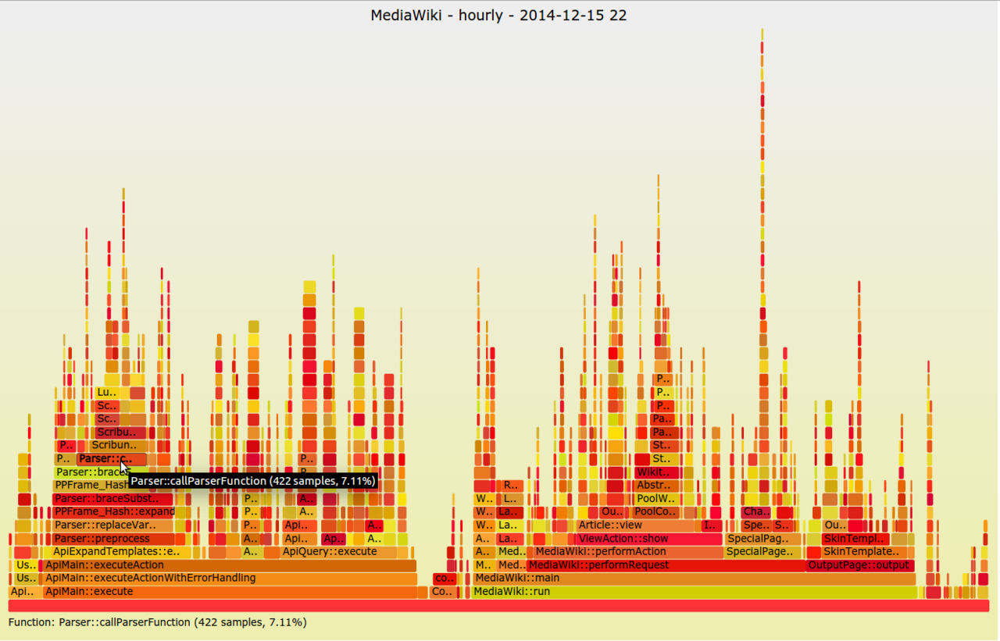

# JVM 故障诊断工具链

> **先记住**：JVM 故障排查要先保留现场，再按 CPU、内存、线程、锁、GC 或 I/O 分类。

---

## 1. 它在解决什么问题？

JVM 故障排查要先保留现场，再按 CPU、内存、线程、锁、GC 或 I/O 分类。线程转储、JFR、GC 日志、堆转储和系统指标相互印证；工具本身可能带来停顿和数据量，生产操作要预估风险。

读这一节时，先带着三个问题：

1. **核心对象是什么？** 哪些状态会在处理过程中发生变化？
2. **主链路怎么走？** 一次处理从哪里开始，到哪里才算结束？
3. **边界在哪里？** 数据量、并发或故障出现后，哪一环最先承压？

---

## 2. 先看全貌



<p class="diagram-caption">先建立整体位置感：确认故障时间窗与影响面 → 抓取线程、堆、GC 和系统指标 → 关联日志与 Trace → 用低风险实验验证并复盘</p>

### 主链路

```text
[确认故障时间窗与影响面]
    │
    ▼
[抓取线程、堆、GC 和系统指标]
    │
    ▼
[关联日志与 Trace]
    │
    ▼
[提出可证伪假设]
    │
    ▼
[用低风险实验验证并复盘]
```

先把这条链路记住即可。接下来再逐层拆开每一步为什么这样设计。

---

## 3. 核心机制，逐层拆开

### 线程与 CPU

top/perf 先定位进程和热点线程，再将本地线程 ID 与 jstack/JFR 栈对应，区分计算热点、锁等待、忙轮询和系统调用。

### 内存证据

类直方图适合快速看对象数量，heap dump 和 dominator tree 用于分析保留大小与 GC Roots；dump 大堆可能产生明显停顿和磁盘压力。

### JFR 与连续观测

JFR 以较低开销记录分配、锁、线程、I/O、GC 和执行采样，适合保留问题前后的时间线，比故障后单次快照更完整。

---

## 4. 用一段实现把概念落地

下面只保留最关键的主干。阅读时，把代码与上一节的流程一一对应：

```bash
jcmd <pid> Thread.print -l > threads.txt
jcmd <pid> GC.class_histogram > histogram.txt
jcmd <pid> VM.native_memory summary > native-memory.txt
jcmd <pid> JFR.start name=incident duration=120s filename=incident.jfr

# 容器内还要同时看 cgroup CPU / memory、磁盘与网络指标，
# 不要把所有高延迟都归因于 JVM。
```

### 对照着看

- **从哪里开始**：确认故障时间窗与影响面
- **关键状态变化**：关联日志与 Trace
- **怎样才算完成**：用低风险实验验证并复盘

---

## 5. 怎么选才不容易错

| 关注点 | 怎么理解 | 怎么验证 |
|---|---|---|
| **证据** | 先抓低开销证据，再做堆转储等重操作 | 所有结论都对应时间窗、指标和 Trace |
| **目标** | 明确优化吞吐、尾延迟、内存还是启动时间 | 一次只改一个变量并保留基线 |
| **环境** | 区分 JVM、容器限制、操作系统和下游问题 | 同时核对 cgroup、磁盘、网络与连接池 |
| **回归** | 微基准不能替代业务压测 | 用生产形态流量验证收益和副作用 |

没有脱离场景的“最佳方案”。先写清数据规模、读写比例、故障模型和延迟目标，再做选择。

---

## 6. 放进真实系统，还要考虑什么

- 生产默认开启可滚动的 GC 日志和低开销 JFR，比故障时临时抓取更可靠。
- 先用低风险指标缩小范围，再决定是否 dump。
- 诊断数据需脱敏并设置保留周期，堆转储可能包含完整用户数据。

### 上线前检查

- 事故现场先保留时间戳、版本、流量和容器资源基线。
- 采集线程转储、GC、JFR 等证据时评估额外开销。
- 调优一次只改一个变量，并保留可立即回退的配置。
- 微基准、组件压测与端到端压测分别回答不同问题。

---

## 7. 常见误区与排查

### 容易踩的坑

1. 在磁盘不足时生成超大 heap dump，进一步拖垮服务。
2. 只看一个线程快照，把瞬时状态误判为持续热点。
3. 未对齐应用、容器和宿主机时间，无法还原事件顺序。

### 出现问题时，按这个顺序看

1. **还原现场**：确认受影响的请求、数据、时间窗，以及最近是否有发布或流量变化。
2. **沿链路定位**：从“确认故障时间窗与影响面”一路检查到“用低风险实验验证并复盘”，找出状态第一次偏离预期的位置。
3. **验证修复**：用最小复现、压力测试或故障注入证明问题消失，同时保留回滚方案。

---

## 8. 最后做一次复盘

> **一句话**：JVM 故障排查要先保留现场，再按 CPU、内存、线程、锁、GC 或 I/O 分类。
>
> **主链路**：确认故障时间窗与影响面 → 抓取线程、堆、GC 和系统指标 → 关联日志与 Trace → 提出可证伪假设 → 用低风险实验验证并复盘
>
> **关键状态**：关联日志与 Trace
>
> **最容易踩的坑**：在磁盘不足时生成超大 heap dump，进一步拖垮服务。

---

## 9. 高频追问

### Q1. 请用一分钟说明JVM 故障诊断工具链的核心目标与工作机制。

JVM 故障排查要先保留现场，再按 CPU、内存、线程、锁、GC 或 I/O 分类。线程转储、JFR、GC 日志、堆转储和系统指标相互印证；工具本身可能带来停顿和数据量，生产操作要预估风险。

### Q2. 线程与 CPU的核心机制是什么？

top/perf 先定位进程和热点线程，再将本地线程 ID 与 jstack/JFR 栈对应，区分计算热点、锁等待、忙轮询和系统调用。

### Q3. 内存证据为什么重要，实际如何落地？

类直方图适合快速看对象数量，heap dump 和 dominator tree 用于分析保留大小与 GC Roots；dump 大堆可能产生明显停顿和磁盘压力。

### Q4. JVM 故障诊断工具链在工程落地时如何做取舍？

生产默认开启可滚动的 GC 日志和低开销 JFR，比故障时临时抓取更可靠；先用低风险指标缩小范围，再决定是否 dump；诊断数据需脱敏并设置保留周期，堆转储可能包含完整用户数据。

### Q5. JVM 故障诊断工具链最常见的故障与排查重点是什么？

在磁盘不足时生成超大 heap dump，进一步拖垮服务；只看一个线程快照，把瞬时状态误判为持续热点；未对齐应用、容器和宿主机时间，无法还原事件顺序。排查时应先用指标和日志确认现象，再缩小到线程、资源、依赖或数据边界。
