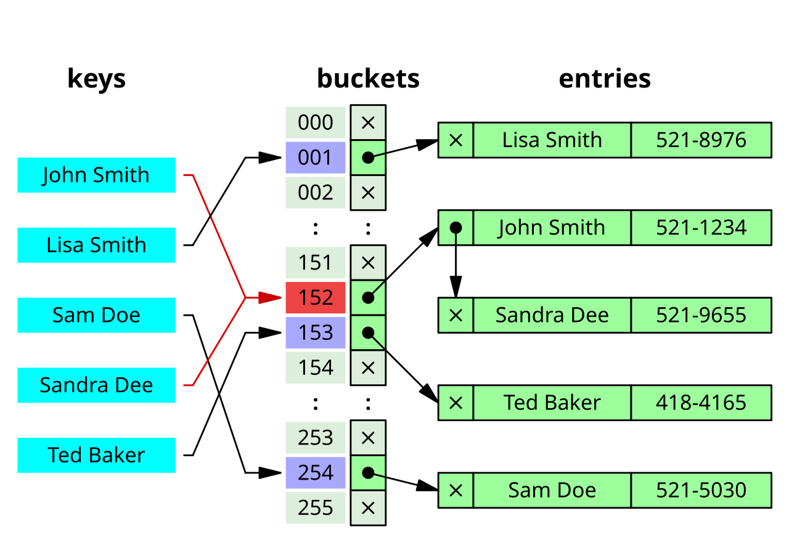

# 缓存一致性、穿透与高可用

> **一句话定位**：缓存与数据库是两个独立系统，常用 cache-aside 在读 miss 时回源并写缓存，写入时先更新数据库再删除缓存。

---

## 1. 先给结论

缓存与数据库是两个独立系统，常用 cache-aside 在读 miss 时回源并写缓存，写入时先更新数据库再删除缓存。可靠方案还需处理并发竞态、穿透、击穿、雪崩、热 key 和故障降级。

### 面试答题路线

回答这类题不要从名词堆砌开始，按下面四步展开最稳：

1. **先定边界**：它解决什么问题，不解决什么问题。
2. **再讲机制**：把核心数据结构、状态机或调用链讲清楚。
3. **补充取舍**：说明复杂度、正确性、资源和可维护性的代价。
4. **落到生产**：给出超时、幂等、观测、压测与回滚方案。

---

## 2. 核心原理

### Cache Aside

读路径先查缓存，未命中回源；写路径提交数据库后删除缓存，让下一次读取重建。删除失败需通过重试、消息或 binlog 订阅最终修正。

### 并发重建

热点 key 失效时可用 singleflight、互斥重建、逻辑过期或提前刷新避免大量请求同时打到数据库。

### 高可用语义

主从、哨兵或集群提升可用性，但故障切换仍可能有短暂不可用和数据丢失窗口，业务必须定义缓存不可用时的降级路径。

### 2.1 一张图建立整体心智模型



> **图：缓存键查找的基础数据结构**
> （图源与许可见 [assets/CREDITS.md](./assets/CREDITS.md)）
>
> 对照本文阅读时，把图中的输入、状态、执行器和输出依次映射为：
> **请求先查缓存 → 未命中回源数据库 → 回填带 TTL 的缓存 → 通过防穿透、互斥与高可用控制异常**。
> 图负责建立全局位置，具体正确性仍要回到本文的数据流、状态边界和失败路径。

---

## 3. 工作流程与关键路径

```text
[请求先查缓存]
    │
    ▼
[未命中回源数据库]
    │
    ▼
[回填带 TTL 的缓存]
    │
    ▼
[写请求更新数据库并失效缓存]
    │
    ▼
[通过防穿透、互斥与高可用控制异常]
```

### 3.1 每一步分别承担什么

- **入口与约束**：`请求先查缓存` 决定后续处理的语义、权限和容量边界。
- **核心决策**：`未命中回源数据库` 与 `回填带 TTL 的缓存` 是最容易答成“只会背名词”的地方，要讲清状态如何变化。
- **执行与副作用**：中间步骤必须说明失败是否可重试、是否会重复，以及资源何时释放。
- **完成条件**：`通过防穿透、互斥与高可用控制异常` 不能只看“没有抛异常”，还要有业务结果、指标或持久化证据。

### 3.2 复杂度不只是一行大 O

面试里给出时间复杂度后，还要补三件事：**数据规模是否会放大常数项、最坏路径何时触发、资源上限在哪里**。生产环境更常被队列等待、锁竞争、网络、序列化、缓存失效或外部限流拖慢；因此复杂度分析必须和实际访问分布、尾延迟及容量模型一起讲。

---

## 4. 关键实现

下面的片段不是完整框架，而是把最关键的边界写出来：

```java
User load(String id) {
    User cached = cache.get("user:" + id);
    if (cached != null) return cached;

    User loaded = repository.find(id);
    cache.set("user:" + id, loaded, jitteredTtl());
    return loaded;
}

@Transactional
void update(User user) {
    repository.update(user);
    afterCommit(() -> cache.delete("user:" + user.id()));
}
```

### 4.1 实现时盯住的状态

| 状态 | 需要回答的问题 |
|---|---|
| 输入 | `请求先查缓存` 是否已经校验语义、权限、大小与版本？ |
| 中间状态 | `回填带 TTL 的缓存` 能否持久化、观测或在并发下保持不变量？ |
| 副作用 | 失败重试会不会重复执行？是否有幂等键、事务或补偿？ |
| 完成 | `通过防穿透、互斥与高可用控制异常` 由什么证据确认？调用方能否区分成功、部分成功与失败？ |

---

## 5. 对比与选型

| 决策维度 | 面试中要说清 | 生产验证 |
|---|---|---|
| **一致性** | 明确允许的陈旧窗口、重复和丢失语义 | 设计幂等、对账与补偿而非口头承诺 exactly-once |
| **访问路径** | 从索引、分区、key 和队列说明数据怎么被定位 | 验证热点、倾斜、扫描量和回表 |
| **持久性** | 区分内存确认、日志落盘、复制完成与消费完成 | 故障注入验证崩溃和切主语义 |
| **容量** | 按峰值流量、保留期和积压估算 | 监控 lag、命中率、淘汰、磁盘和复制延迟 |

真正的选型结论应带条件：**在什么规模、读写比例、故障模型、SLO 和团队维护能力下选择它**。离开约束谈“谁更快”“谁更高级”没有工程意义。

---

## 6. 工程实践

- 一致性要求极高的数据不应把缓存作为权威源。
- 空值缓存和 Bloom Filter 可缓解穿透，但都需更新与误判策略。
- 过期时间加随机抖动，配合容量和回源限流治理雪崩。

### 6.1 落地检查表

- 所有重试路径都带业务幂等键，消费者能识别重复。
- 容量模型包含峰值、保留期、积压、复制和故障切换余量。
- 用 kill、断网、磁盘满和主从切换验证持久性语义。
- 建立慢查询、命中率、lag、死信和对账差异告警。

---

## 7. 常见故障

1. 更新数据库后删除缓存失败，长期读到旧值。
2. 缓存重建没有并发控制，数据库被击穿。
3. Redis 故障时全部请求无保护回源。

### 7.1 推荐排查顺序

1. **先确认现象**：影响哪些请求、数据、租户与时间窗，是否与发布或流量变化相关。
2. **再沿关键路径定位**：从 `请求先查缓存` 逐步检查到 `通过防穿透、互斥与高可用控制异常`，不要跳过排队、缓存、代理或外部依赖。
3. **区分原因和结果**：高 CPU、线程多、token 多、连接满可能只是症状；用日志、指标、Trace 和状态快照互相印证。
4. **最后验证修复**：用最小复现、压力或故障注入证明问题消失，同时保留一键回滚。

最常见的错误是：**更新数据库后删除缓存失败，长期读到旧值。**


---

## 8. 最简记忆

```text
一句话：缓存与数据库是两个独立系统，常用 cache-aside 在读 miss 时回源并写缓存，写入时先更新数据库再删除缓存。

主链路：请求先查缓存 → 未命中回源数据库 → 回填带 TTL 的缓存 → 写请求更新数据库并失效缓存 → 通过防穿透、互斥与高可用控制异常
核心状态：回填带 TTL 的缓存
完成证据：通过防穿透、互斥与高可用控制异常
高频坑：更新数据库后删除缓存失败，长期读到旧值。
```

---

## 🎯 高频追问

1. **请用一分钟说明缓存一致性、穿透与高可用的核心目标与工作机制。**

   缓存与数据库是两个独立系统，常用 cache-aside 在读 miss 时回源并写缓存，写入时先更新数据库再删除缓存。可靠方案还需处理并发竞态、穿透、击穿、雪崩、热 key 和故障降级。

2. **Cache Aside的核心机制是什么？**

   读路径先查缓存，未命中回源；写路径提交数据库后删除缓存，让下一次读取重建。删除失败需通过重试、消息或 binlog 订阅最终修正。

3. **并发重建为什么重要，实际如何落地？**

   热点 key 失效时可用 singleflight、互斥重建、逻辑过期或提前刷新避免大量请求同时打到数据库。

4. **缓存一致性、穿透与高可用在工程落地时如何做取舍？**

   一致性要求极高的数据不应把缓存作为权威源；空值缓存和 Bloom Filter 可缓解穿透，但都需更新与误判策略；过期时间加随机抖动，配合容量和回源限流治理雪崩。

5. **缓存一致性、穿透与高可用最常见的故障与排查重点是什么？**

   更新数据库后删除缓存失败，长期读到旧值；缓存重建没有并发控制，数据库被击穿；Redis 故障时全部请求无保护回源。排查时应先用指标和日志确认现象，再缩小到线程、资源、依赖或数据边界。
