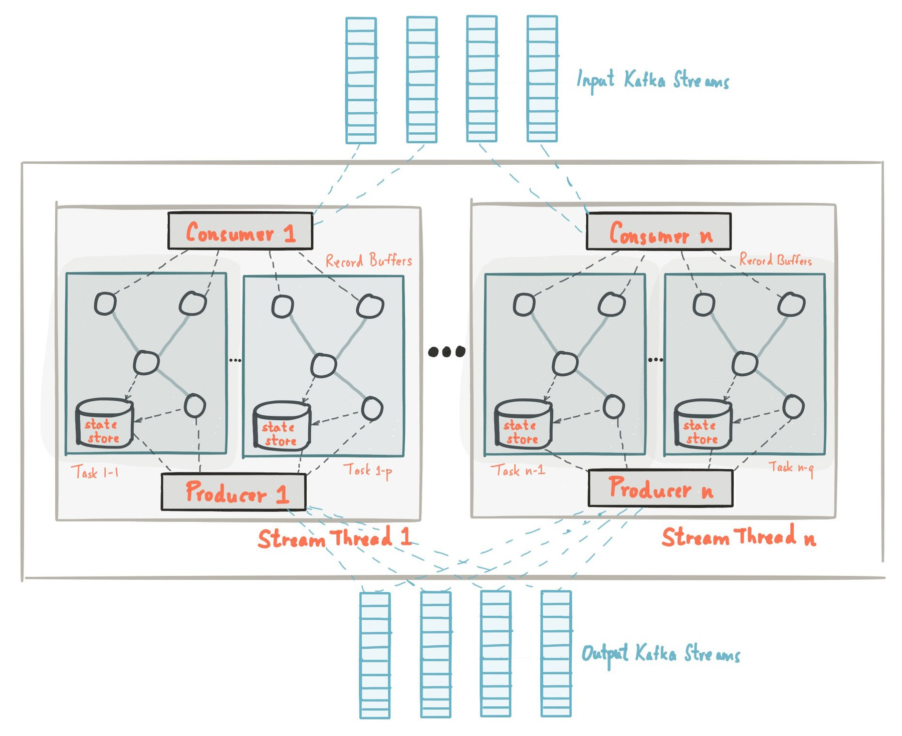

# Kafka 核心机制与可靠性

> **先记住**：Kafka 以分区追加日志实现高吞吐和顺序读写，副本机制提供容错，消费组让同一分区在组内由一个消费者处理。

---

## 1. 它在解决什么问题？

Kafka 以分区追加日志实现高吞吐和顺序读写，副本机制提供容错，消费组让同一分区在组内由一个消费者处理。可靠性要联合配置生产确认、幂等、事务、复制、消费位点和下游幂等，不能笼统声称端到端 exactly-once。

读这一节时，先带着三个问题：

1. **核心对象是什么？** 哪些状态会在处理过程中发生变化？
2. **主链路怎么走？** 一次处理从哪里开始，到哪里才算结束？
3. **边界在哪里？** 数据量、并发或故障出现后，哪一环最先承压？

---

## 2. 先看全貌



<p class="diagram-caption">先建立整体位置感：Producer 按 key 选择分区 → Leader 追加顺序日志 → Follower 拉取复制 → Consumer Group 提交 offset 并处理重平衡</p>

### 主链路

```text
[Producer 按 key 选择分区]
    │
    ▼
[Leader 追加顺序日志]
    │
    ▼
[Follower 拉取复制]
    │
    ▼
[达到 ack 条件后确认]
    │
    ▼
[Consumer Group 提交 offset 并处理重平衡]
```

先把这条链路记住即可。接下来再逐层拆开每一步为什么这样设计。

---

## 3. 核心机制，逐层拆开

### 分区与消费组

分区是并行和局部有序的单位；组内消费者通过协调器分配分区。扩缩容会触发 rebalance，处理时间和位点提交必须配合。

### 生产可靠性

acks、min.insync.replicas、重试和幂等生产者共同决定丢失与重复风险；事务生产者可原子写多个分区并提交消费位点。

### 消费语义

先提交位点再处理可能丢数据，处理后提交可能重复。跨 Kafka 外部数据库的端到端一致性仍需幂等、outbox/inbox 或事务协调。

---

## 4. 用一段实现把概念落地

下面只保留最关键的主干。阅读时，把代码与上一节的流程一一对应：

```properties
enable.idempotence=true
acks=all
max.in.flight.requests.per.connection=5
delivery.timeout.ms=120000

# Consumer 侧
enable.auto.commit=false
isolation.level=read_committed

# 业务处理成功后再提交 offset；副作用仍要幂等。
```

### 对照着看

- **从哪里开始**：Producer 按 key 选择分区
- **关键状态变化**：Follower 拉取复制
- **怎样才算完成**：Consumer Group 提交 offset 并处理重平衡

---

## 5. 怎么选才不容易错

| 关注点 | 怎么理解 | 怎么验证 |
|---|---|---|
| **一致性** | 明确允许的陈旧窗口、重复和丢失语义 | 设计幂等、对账与补偿而非口头承诺 exactly-once |
| **访问路径** | 从索引、分区、key 和队列说明数据怎么被定位 | 验证热点、倾斜、扫描量和回表 |
| **持久性** | 区分内存确认、日志落盘、复制完成与消费完成 | 故障注入验证崩溃和切主语义 |
| **容量** | 按峰值流量、保留期和积压估算 | 监控 lag、命中率、淘汰、磁盘和复制延迟 |

没有脱离场景的“最佳方案”。先写清数据规模、读写比例、故障模型和延迟目标，再做选择。

---

## 6. 放进真实系统，还要考虑什么

- 分区数决定并行上限和元数据成本，扩分区会改变 key 到分区映射。
- 追求低延迟与批量吞吐需权衡 linger、batch 和压缩。
- 消息保留、重放和 schema 演进应作为数据产品治理。

### 上线前检查

- 所有重试路径都带业务幂等键，消费者能识别重复。
- 容量模型包含峰值、保留期、积压、复制和故障切换余量。
- 用 kill、断网、磁盘满和主从切换验证持久性语义。
- 建立慢查询、命中率、lag、死信和对账差异告警。

---

## 7. 常见误区与排查

### 容易踩的坑

1. 消费者处理超过 max.poll.interval 导致频繁 rebalance。
2. 只依赖 Kafka 幂等生产者，却在数据库落库时产生重复。
3. 热点 key 让单分区积压。

### 出现问题时，按这个顺序看

1. **还原现场**：确认受影响的请求、数据、时间窗，以及最近是否有发布或流量变化。
2. **沿链路定位**：从“Producer 按 key 选择分区”一路检查到“Consumer Group 提交 offset 并处理重平衡”，找出状态第一次偏离预期的位置。
3. **验证修复**：用最小复现、压力测试或故障注入证明问题消失，同时保留回滚方案。

---

## 8. 延伸阅读

- Apache Kafka Design：https://kafka.apache.org/41/design/design/
- KafkaProducer idempotence and transactions：https://kafka.apache.org/41/javadoc/org/apache/kafka/clients/producer/KafkaProducer.html

---

## 9. 最后做一次复盘

> **一句话**：Kafka 以分区追加日志实现高吞吐和顺序读写，副本机制提供容错，消费组让同一分区在组内由一个消费者处理。
>
> **主链路**：Producer 按 key 选择分区 → Leader 追加顺序日志 → Follower 拉取复制 → 达到 ack 条件后确认 → Consumer Group 提交 offset 并处理重平衡
>
> **关键状态**：Follower 拉取复制
>
> **最容易踩的坑**：消费者处理超过 max.poll.interval 导致频繁 rebalance。

---

## 10. 高频追问

### Q1. 请用一分钟说明Kafka 核心机制与可靠性的核心目标与工作机制。

Kafka 以分区追加日志实现高吞吐和顺序读写，副本机制提供容错，消费组让同一分区在组内由一个消费者处理。可靠性要联合配置生产确认、幂等、事务、复制、消费位点和下游幂等，不能笼统声称端到端 exactly-once。

### Q2. 分区与消费组的核心机制是什么？

分区是并行和局部有序的单位；组内消费者通过协调器分配分区。扩缩容会触发 rebalance，处理时间和位点提交必须配合。

### Q3. 生产可靠性为什么重要，实际如何落地？

acks、min.insync.replicas、重试和幂等生产者共同决定丢失与重复风险；事务生产者可原子写多个分区并提交消费位点。

### Q4. Kafka 核心机制与可靠性在工程落地时如何做取舍？

分区数决定并行上限和元数据成本，扩分区会改变 key 到分区映射；追求低延迟与批量吞吐需权衡 linger、batch 和压缩；消息保留、重放和 schema 演进应作为数据产品治理。

### Q5. Kafka 核心机制与可靠性最常见的故障与排查重点是什么？

消费者处理超过 max.poll.interval 导致频繁 rebalance；只依赖 Kafka 幂等生产者，却在数据库落库时产生重复；热点 key 让单分区积压。排查时应先用指标和日志确认现象，再缩小到线程、资源、依赖或数据边界。
