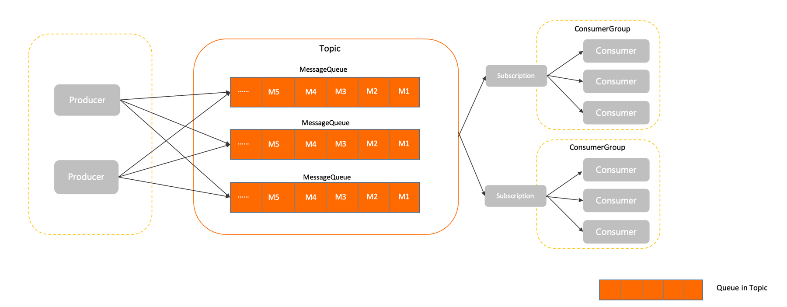

# RocketMQ 顺序、延迟与事务消息

> **先记住**：RocketMQ 提供普通、顺序、延迟和事务消息等模型。

---

## 1. 它在解决什么问题？

RocketMQ 提供普通、顺序、延迟和事务消息等模型。顺序只在同一队列内成立，延迟消息用于未来投递，事务消息通过半消息和事务状态回查协调本地事务；消费端仍必须幂等。

读这一节时，先带着三个问题：

1. **核心对象是什么？** 哪些状态会在处理过程中发生变化？
2. **主链路怎么走？** 一次处理从哪里开始，到哪里才算结束？
3. **边界在哪里？** 数据量、并发或故障出现后，哪一环最先承压？

---

## 2. 先看全貌



<p class="diagram-caption">先建立整体位置感：Producer 选择 Topic 队列 → Broker 持久化消息 → 消费者按队列拉取 → 消费成功后确认，失败则重试或进入死信</p>

### 主链路

```text
[Producer 选择 Topic 队列]
    │
    ▼
[Broker 持久化消息]
    │
    ▼
[消费者按队列拉取]
    │
    ▼
[顺序 / 延迟 / 事务语义控制投递]
    │
    ▼
[消费成功后确认，失败则重试或进入死信]
```

先把这条链路记住即可。接下来再逐层拆开每一步为什么这样设计。

---

## 3. 核心机制，逐层拆开

### 局部顺序

生产端把同一业务 key 路由到同一队列，消费端串行处理该队列，才能保持局部顺序；全局顺序会牺牲并行度和可用性。

### 延迟与重试

延迟消息适合超时关闭、提醒和补偿调度；失败重试与死信队列需要明确最大次数、不可重试错误和人工处理流程。

### 事务消息

Broker 先保存半消息，生产者执行本地事务后提交或回滚；状态不确定时 Broker 回查。它提供最终一致性协调，不等于分布式 ACID。

---

## 4. 用一段实现把概念落地

下面只保留最关键的主干。阅读时，把代码与上一节的流程一一对应：

```java
TransactionSendResult result = producer.sendMessageInTransaction(
    new Message("order-events", orderId.getBytes(UTF_8)),
    orderId);

class Listener implements TransactionListener {
    public LocalTransactionState executeLocalTransaction(Message msg, Object arg) {
        return orderService.persistWithTransactionLog((String) arg);
    }
    public LocalTransactionState checkLocalTransaction(MessageExt msg) {
        return orderService.queryTransactionState(msg.getKeys());
    }
}
```

### 对照着看

- **从哪里开始**：Producer 选择 Topic 队列
- **关键状态变化**：消费者按队列拉取
- **怎样才算完成**：消费成功后确认，失败则重试或进入死信

---

## 5. 怎么选才不容易错

| 关注点 | 怎么理解 | 怎么验证 |
|---|---|---|
| **一致性** | 明确允许的陈旧窗口、重复和丢失语义 | 设计幂等、对账与补偿而非口头承诺 exactly-once |
| **访问路径** | 从索引、分区、key 和队列说明数据怎么被定位 | 验证热点、倾斜、扫描量和回表 |
| **持久性** | 区分内存确认、日志落盘、复制完成与消费完成 | 故障注入验证崩溃和切主语义 |
| **容量** | 按峰值流量、保留期和积压估算 | 监控 lag、命中率、淘汰、磁盘和复制延迟 |

没有脱离场景的“最佳方案”。先写清数据规模、读写比例、故障模型和延迟目标，再做选择。

---

## 6. 放进真实系统，还要考虑什么

- 根据业务 key 设计队列分片，避免热点集中。
- 消息体保持小而自包含，大对象放对象存储并传引用。
- 消费成功必须与业务落库和位点语义一起考虑。

### 上线前检查

- 所有重试路径都带业务幂等键，消费者能识别重复。
- 容量模型包含峰值、保留期、积压、复制和故障切换余量。
- 用 kill、断网、磁盘满和主从切换验证持久性语义。
- 建立慢查询、命中率、lag、死信和对账差异告警。

---

## 7. 常见误区与排查

### 容易踩的坑

1. 顺序消费中一条毒消息阻塞整个队列。
2. 事务回查接口非幂等，重复执行本地动作。
3. 死信队列无人监控，失败长期静默。

### 出现问题时，按这个顺序看

1. **还原现场**：确认受影响的请求、数据、时间窗，以及最近是否有发布或流量变化。
2. **沿链路定位**：从“Producer 选择 Topic 队列”一路检查到“消费成功后确认，失败则重试或进入死信”，找出状态第一次偏离预期的位置。
3. **验证修复**：用最小复现、压力测试或故障注入证明问题消失，同时保留回滚方案。

---

## 8. 最后做一次复盘

> **一句话**：RocketMQ 提供普通、顺序、延迟和事务消息等模型。
>
> **主链路**：Producer 选择 Topic 队列 → Broker 持久化消息 → 消费者按队列拉取 → 顺序 / 延迟 / 事务语义控制投递 → 消费成功后确认，失败则重试或进入死信
>
> **关键状态**：消费者按队列拉取
>
> **最容易踩的坑**：顺序消费中一条毒消息阻塞整个队列。

---

## 9. 高频追问

### Q1. 请用一分钟说明RocketMQ 顺序、延迟与事务消息的核心目标与工作机制。

RocketMQ 提供普通、顺序、延迟和事务消息等模型。顺序只在同一队列内成立，延迟消息用于未来投递，事务消息通过半消息和事务状态回查协调本地事务；消费端仍必须幂等。

### Q2. 局部顺序的核心机制是什么？

生产端把同一业务 key 路由到同一队列，消费端串行处理该队列，才能保持局部顺序；全局顺序会牺牲并行度和可用性。

### Q3. 延迟与重试为什么重要，实际如何落地？

延迟消息适合超时关闭、提醒和补偿调度；失败重试与死信队列需要明确最大次数、不可重试错误和人工处理流程。

### Q4. RocketMQ 顺序、延迟与事务消息在工程落地时如何做取舍？

根据业务 key 设计队列分片，避免热点集中；消息体保持小而自包含，大对象放对象存储并传引用；消费成功必须与业务落库和位点语义一起考虑。

### Q5. RocketMQ 顺序、延迟与事务消息最常见的故障与排查重点是什么？

顺序消费中一条毒消息阻塞整个队列；事务回查接口非幂等，重复执行本地动作；死信队列无人监控，失败长期静默。排查时应先用指标和日志确认现象，再缩小到线程、资源、依赖或数据边界。
