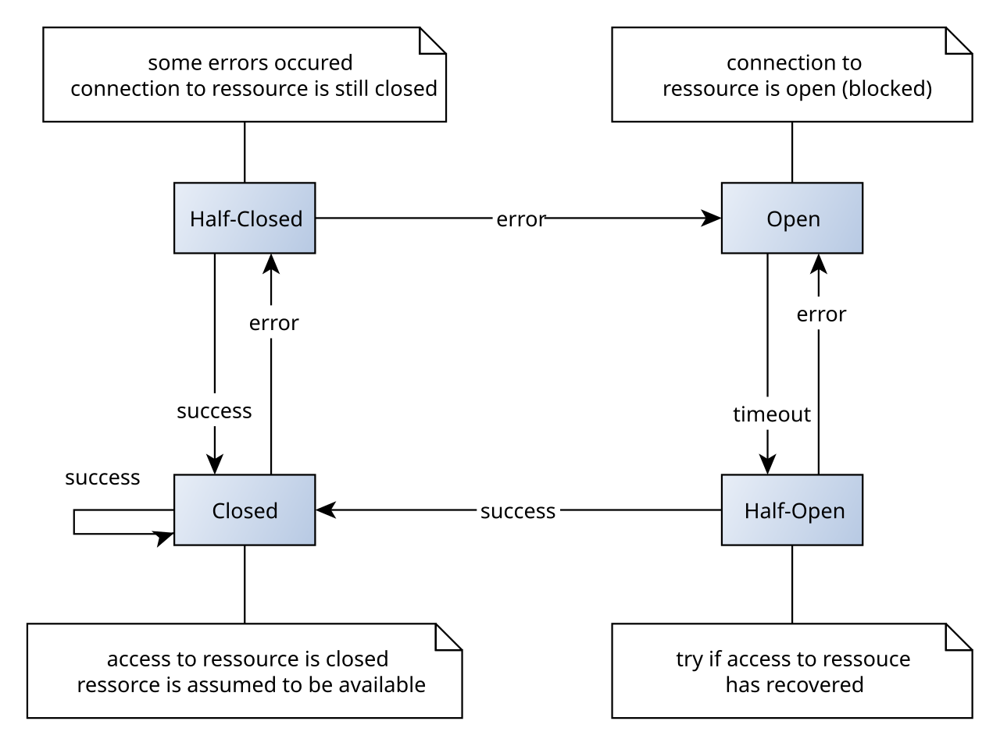

# 限流、熔断与降级

> **先记住**：限流保护入口和依赖容量，熔断在失败率或慢调用超过阈值时快速失败，降级提供受控的低质量能力。

---

## 1. 它在解决什么问题？

限流保护入口和依赖容量，熔断在失败率或慢调用超过阈值时快速失败，降级提供受控的低质量能力。三者必须基于 SLO、调用拓扑和恢复机制设计，避免保护策略本身造成同步雪崩。

读这一节时，先带着三个问题：

1. **核心对象是什么？** 哪些状态会在处理过程中发生变化？
2. **主链路怎么走？** 一次处理从哪里开始，到哪里才算结束？
3. **边界在哪里？** 数据量、并发或故障出现后，哪一环最先承压？

---

## 2. 先看全貌



<p class="diagram-caption">先建立整体位置感：入口按容量限流 → 调用使用超时与隔离 → 失败 / 慢调用进入熔断统计 → 半开态小流量探测恢复</p>

### 主链路

```text
[入口按容量限流]
    │
    ▼
[调用使用超时与隔离]
    │
    ▼
[失败 / 慢调用进入熔断统计]
    │
    ▼
[打开态快速失败并降级]
    │
    ▼
[半开态小流量探测恢复]
```

先把这条链路记住即可。接下来再逐层拆开每一步为什么这样设计。

---

## 3. 核心机制，逐层拆开

### 限流算法

固定窗口简单但边界突刺，滑动窗口更平滑，令牌桶允许可控突发，漏桶强调稳定输出。分布式限流还要考虑时钟、网络和一致性成本。

### 熔断状态机

关闭态统计失败，超过阈值进入打开态；等待后半开试探恢复。错误分类、最小样本和慢调用阈值决定是否误熔断。

### 隔离与降级

线程池、信号量、连接池和舱壁隔离限制故障扩散；降级结果要标明新鲜度和完整性，不能静默返回错误数据。

---

## 4. 用一段实现把概念落地

下面只保留最关键的主干。阅读时，把代码与上一节的流程一一对应：

```java
Supplier<Quote> guarded = Decorators.ofSupplier(() -> client.quote(request))
    .withRateLimiter(rateLimiter)
    .withBulkhead(bulkhead)
    .withCircuitBreaker(circuitBreaker)
    .withRetry(retry)
    .decorate();

try {
    return CompletableFuture.supplyAsync(guarded, executor)
        .orTimeout(800, TimeUnit.MILLISECONDS)
        .exceptionally(error -> staleQuoteCache.get(request.key()))
        .join();
} catch (CompletionException error) {
    throw unwrap(error);
}
```

### 对照着看

- **从哪里开始**：入口按容量限流
- **关键状态变化**：失败 / 慢调用进入熔断统计
- **怎样才算完成**：半开态小流量探测恢复

---

## 5. 怎么选才不容易错

| 关注点 | 怎么理解 | 怎么验证 |
|---|---|---|
| **一致性边界** | 先说明哪些状态必须原子，哪些可最终一致 | 把补偿、对账和人工兜底写进方案 |
| **故障模型** | 考虑超时、重复、乱序、分区和部分成功 | 通过故障注入而非正常路径证明可靠性 |
| **容量保护** | 入口、服务和依赖分别限流与隔离 | 阈值来自压测和 SLO，不靠拍脑袋 |
| **可观测性** | 每个跨服务操作携带业务键与 trace_id | 告警能直接跳到证据和回滚动作 |

没有脱离场景的“最佳方案”。先写清数据规模、读写比例、故障模型和延迟目标，再做选择。

---

## 6. 放进真实系统，还要考虑什么

- 限流位置越靠前越省资源，但业务维度限流通常需要服务内信息。
- 阈值通过容量压测与线上基线确定，并支持动态调整。
- 恢复要渐进放量，避免所有实例同一时刻探测下游。

### 上线前检查

- 先写 SLO、故障模型和降级结果，再选中间件。
- 跨服务操作记录业务键、版本、trace_id 和补偿状态。
- 恢复策略使用退避、抖动、限次和渐进放量。
- 定期演练单实例、单机房、依赖和数据不一致故障。

---

## 7. 常见误区与排查

### 容易踩的坑

1. 把所有异常都计入熔断，包括用户参数错误。
2. 降级缓存无限期返回陈旧关键数据。
3. 单机限流在扩容后总容量失控。

### 出现问题时，按这个顺序看

1. **还原现场**：确认受影响的请求、数据、时间窗，以及最近是否有发布或流量变化。
2. **沿链路定位**：从“入口按容量限流”一路检查到“半开态小流量探测恢复”，找出状态第一次偏离预期的位置。
3. **验证修复**：用最小复现、压力测试或故障注入证明问题消失，同时保留回滚方案。

---

## 8. 最后做一次复盘

> **一句话**：限流保护入口和依赖容量，熔断在失败率或慢调用超过阈值时快速失败，降级提供受控的低质量能力。
>
> **主链路**：入口按容量限流 → 调用使用超时与隔离 → 失败 / 慢调用进入熔断统计 → 打开态快速失败并降级 → 半开态小流量探测恢复
>
> **关键状态**：失败 / 慢调用进入熔断统计
>
> **最容易踩的坑**：把所有异常都计入熔断，包括用户参数错误。

---

## 9. 高频追问

### Q1. 请用一分钟说明限流、熔断与降级的核心目标与工作机制。

限流保护入口和依赖容量，熔断在失败率或慢调用超过阈值时快速失败，降级提供受控的低质量能力。三者必须基于 SLO、调用拓扑和恢复机制设计，避免保护策略本身造成同步雪崩。

### Q2. 限流算法的核心机制是什么？

固定窗口简单但边界突刺，滑动窗口更平滑，令牌桶允许可控突发，漏桶强调稳定输出。分布式限流还要考虑时钟、网络和一致性成本。

### Q3. 熔断状态机为什么重要，实际如何落地？

关闭态统计失败，超过阈值进入打开态；等待后半开试探恢复。错误分类、最小样本和慢调用阈值决定是否误熔断。

### Q4. 限流、熔断与降级在工程落地时如何做取舍？

限流位置越靠前越省资源，但业务维度限流通常需要服务内信息；阈值通过容量压测与线上基线确定，并支持动态调整；恢复要渐进放量，避免所有实例同一时刻探测下游。

### Q5. 限流、熔断与降级最常见的故障与排查重点是什么？

把所有异常都计入熔断，包括用户参数错误；降级缓存无限期返回陈旧关键数据；单机限流在扩容后总容量失控。排查时应先用指标和日志确认现象，再缩小到线程、资源、依赖或数据边界。
