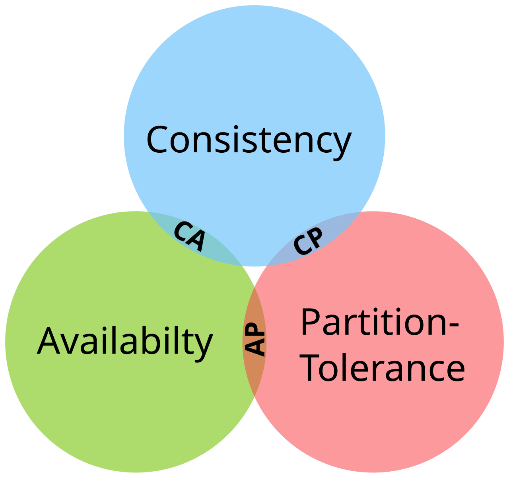

# 分库分表与全局 ID

> **先记住**：分库分表通过路由键把数据和流量拆到多个节点，解决单库容量与吞吐上限，但会增加跨分片查询、事务、扩容和运维复杂度。

---

## 1. 它在解决什么问题？

分库分表通过路由键把数据和流量拆到多个节点，解决单库容量与吞吐上限，但会增加跨分片查询、事务、扩容和运维复杂度。全局 ID 需要唯一、趋势递增、可用和信息安全之间的权衡。

读这一节时，先带着三个问题：

1. **核心对象是什么？** 哪些状态会在处理过程中发生变化？
2. **主链路怎么走？** 一次处理从哪里开始，到哪里才算结束？
3. **边界在哪里？** 数据量、并发或故障出现后，哪一环最先承压？

---

## 2. 先看全貌



<p class="diagram-caption">先建立整体位置感：根据分片键路由 → 在目标分片内查询或写入 → 全局 ID 保证跨分片唯一 → 扩容时迁移数据并校验双写</p>

### 主链路

```text
[根据分片键路由]
    │
    ▼
[在目标分片内查询或写入]
    │
    ▼
[全局 ID 保证跨分片唯一]
    │
    ▼
[聚合层合并结果]
    │
    ▼
[扩容时迁移数据并校验双写]
```

先把这条链路记住即可。接下来再逐层拆开每一步为什么这样设计。

---

## 3. 核心机制，逐层拆开

### 分片键与路由

高基数、分布均匀且常用于查询的字段适合作为分片键；错误分片键会产生热点和大量跨分片查询。

### 扩容迁移

从 N 到 M 的直接取模会移动大量数据，一致性哈希、虚拟桶或路由表可降低迁移范围；迁移期间需要双读写、校验和切换状态机。

### 全局 ID

数据库号段、Snowflake 类算法和集中服务各有取舍。时间型 ID 要处理时钟回拨，号段要处理缓存和步长，任何方案都需容量评估。

---

## 4. 用一段实现把概念落地

下面只保留最关键的主干。阅读时，把代码与上一节的流程一一对应：

```java
long nextId(long nowMillis) {
    if (nowMillis < lastMillis) throw new ClockMovedBackwardsException();
    if (nowMillis == lastMillis) {
        sequence = (sequence + 1) & MAX_SEQUENCE;
        if (sequence == 0) nowMillis = waitNextMillis(lastMillis);
    } else {
        sequence = 0;
    }
    lastMillis = nowMillis;
    return ((nowMillis - EPOCH) << TIME_SHIFT)
        | (workerId << WORKER_SHIFT) | sequence;
}
```

### 对照着看

- **从哪里开始**：根据分片键路由
- **关键状态变化**：全局 ID 保证跨分片唯一
- **怎样才算完成**：扩容时迁移数据并校验双写

---

## 5. 怎么选才不容易错

| 关注点 | 怎么理解 | 怎么验证 |
|---|---|---|
| **一致性边界** | 先说明哪些状态必须原子，哪些可最终一致 | 把补偿、对账和人工兜底写进方案 |
| **故障模型** | 考虑超时、重复、乱序、分区和部分成功 | 通过故障注入而非正常路径证明可靠性 |
| **容量保护** | 入口、服务和依赖分别限流与隔离 | 阈值来自压测和 SLO，不靠拍脑袋 |
| **可观测性** | 每个跨服务操作携带业务键与 trace_id | 告警能直接跳到证据和回滚动作 |

没有脱离场景的“最佳方案”。先写清数据规模、读写比例、故障模型和延迟目标，再做选择。

---

## 6. 放进真实系统，还要考虑什么

- 达到单库瓶颈前优先优化索引、归档、读写分离和业务拆分。
- 跨分片聚合可使用搜索、分析库或预计算。
- ID 中暴露时间、机器和业务量可能带来安全问题。

### 上线前检查

- 先写 SLO、故障模型和降级结果，再选中间件。
- 跨服务操作记录业务键、版本、trace_id 和补偿状态。
- 恢复策略使用退避、抖动、限次和渐进放量。
- 定期演练单实例、单机房、依赖和数据不一致故障。

---

## 7. 常见误区与排查

### 容易踩的坑

1. 按低基数字段分片形成热点。
2. 扩容脚本没有幂等和校验，数据重复或遗漏。
3. Snowflake 节点号重复或时钟回拨产生冲突。

### 出现问题时，按这个顺序看

1. **还原现场**：确认受影响的请求、数据、时间窗，以及最近是否有发布或流量变化。
2. **沿链路定位**：从“根据分片键路由”一路检查到“扩容时迁移数据并校验双写”，找出状态第一次偏离预期的位置。
3. **验证修复**：用最小复现、压力测试或故障注入证明问题消失，同时保留回滚方案。

---

## 8. 最后做一次复盘

> **一句话**：分库分表通过路由键把数据和流量拆到多个节点，解决单库容量与吞吐上限，但会增加跨分片查询、事务、扩容和运维复杂度。
>
> **主链路**：根据分片键路由 → 在目标分片内查询或写入 → 全局 ID 保证跨分片唯一 → 聚合层合并结果 → 扩容时迁移数据并校验双写
>
> **关键状态**：全局 ID 保证跨分片唯一
>
> **最容易踩的坑**：按低基数字段分片形成热点。

---

## 9. 高频追问

### Q1. 请用一分钟说明分库分表与全局 ID的核心目标与工作机制。

分库分表通过路由键把数据和流量拆到多个节点，解决单库容量与吞吐上限，但会增加跨分片查询、事务、扩容和运维复杂度。全局 ID 需要唯一、趋势递增、可用和信息安全之间的权衡。

### Q2. 分片键与路由的核心机制是什么？

高基数、分布均匀且常用于查询的字段适合作为分片键；错误分片键会产生热点和大量跨分片查询。

### Q3. 扩容迁移为什么重要，实际如何落地？

从 N 到 M 的直接取模会移动大量数据，一致性哈希、虚拟桶或路由表可降低迁移范围；迁移期间需要双读写、校验和切换状态机。

### Q4. 分库分表与全局 ID在工程落地时如何做取舍？

达到单库瓶颈前优先优化索引、归档、读写分离和业务拆分；跨分片聚合可使用搜索、分析库或预计算；ID 中暴露时间、机器和业务量可能带来安全问题。

### Q5. 分库分表与全局 ID最常见的故障与排查重点是什么？

按低基数字段分片形成热点；扩容脚本没有幂等和校验，数据重复或遗漏；Snowflake 节点号重复或时钟回拨产生冲突。排查时应先用指标和日志确认现象，再缩小到线程、资源、依赖或数据边界。
