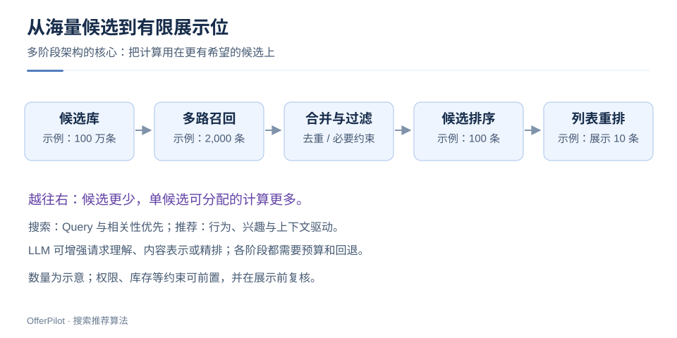
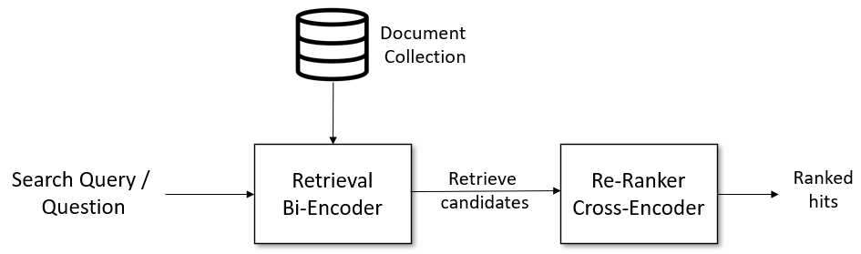
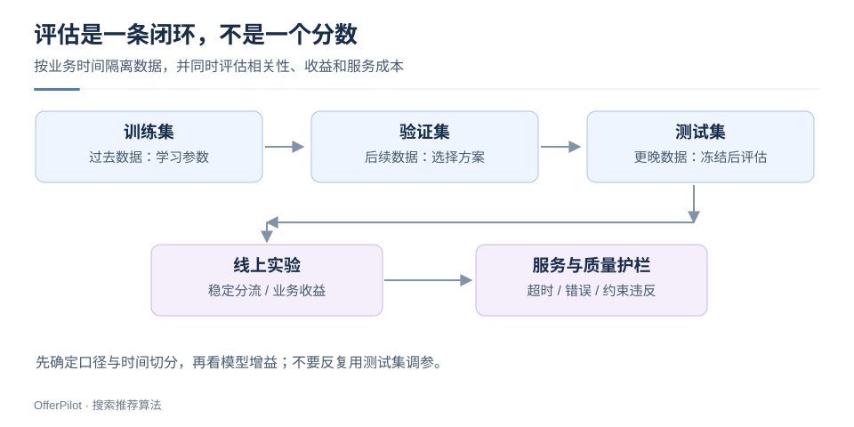

# 搜推全链路：从候选到用户反馈

> 搜索与推荐都在有限延迟内，从海量内容里选出最有价值的结果。搜索更强调显式 Query 与相关性，推荐更依赖用户行为和上下文。多阶段架构的关键是分配计算预算，而不只是堆叠模型。

## 1. 搜索与推荐的区别

用户搜索“预算 500 元，适合雨天通勤的双肩包”。系统需要理解预算、场景、品类和防水需求；某商品虽然“很热门”，也不能因为点击率高就忽略价格约束。

首页推荐则根据历史行为和当前场景推测需求。搜索也能个性化，但应先满足明确的查询条件。

| 维度 | 搜索 | 推荐 |
|---|---|---|
| 请求信号 | Query、筛选条件、上下文 | 用户行为、场景、上下文 |
| 主要问题 | 是否满足这次需求 | 用户此刻可能需要什么 |
| 典型难点 | 意图歧义、长尾 Query、语义匹配 | 兴趣漂移、冷启动、反馈偏差 |
| 共同能力 | 多路召回、排序、重排、实验评估 | 多路召回、排序、重排、实验评估 |

## 2. 为什么需要召回、排序和重排？

候选逐层减少，单个候选可分配的计算增加。图中数量仅为示例。

**召回**：用倒排、向量或协同过滤等策略找到候选，合并去重。权限、库存等必要约束应尽量前置，并在展示前复核。

**排序**：结合相关性、用户偏好、质量与时效评分。候选规模较大时，可进一步拆为粗排和精排。

**列表重排**：优化多样性、频控和去重。搜索中的 Reranker 通常侧重相关性精排，推荐中的重排还常包含列表级优化。

### 2.1 召回决定候选覆盖

设相关集合为 $R$，召回候选为 $C_K$，最终展示集合为 $F$。对于不新增候选的普通级联，$F\subseteq C_K$，因此：

$$\frac{|F\cap R|}{|R|}\leq\frac{|C_K\cap R|}{|R|}=\operatorname{Recall@K}$$

**召回漏掉的相关项，下游排序无法找回。** 扩大候选也会增加延迟和噪声，需要同时比较召回率与成本。

### 2.2 检索与重排

Query 经 Bi-Encoder 从文档库召回候选，再由 Cross-Encoder 精排。前者控制搜索范围，后者增加文本间的交互计算。

这是两阶段检索链路；实际业务还可能加入融合、过滤和列表约束。

> 图源：[Sentence Transformers](https://github.com/huggingface/sentence-transformers/blob/f3864a53cfafb40a6f03f029ce96da70591e9931/docs/img/InformationRetrieval.png) · [Apache-2.0](./assets/CREDITS-classic.md)

## 3. 分层评估

按时间切分训练、验证和测试数据。方案冻结后再测试，避免反复用测试结果调参。

| 层次 | 可观察指标 | 常见误读 |
|---|---|---|
| 召回 | Recall@K、候选覆盖、延迟 | 只提升 K，忽略预算变化 |
| 排序 | NDCG、MRR、AUC、校准误差 | 不同标签、候选集的分数直接比较 |
| 列表 | 多样性、重复率、覆盖度 | 多样性越高就一定越好 |
| 在线 | 点击、转化、长期留存等业务指标 | 点击提升等同于用户收益提升 |
| 护栏 | 错误率、P95/P99 延迟、投诉等 | 只看平均延迟掩盖慢请求 |

### 3.1 手算一次 NDCG

对于分级相关性标签 $rel_i$，常见定义是：

$$DCG@K=\sum_{i=1}^{K}\frac{2^{rel_i}-1}{\log_2(i+1)},\qquad NDCG@K=\frac{DCG@K}{IDCG@K}$$

$IDCG$ 是同一评估协议下的理想排序得分。标签 `[3, 0, 2]` 的 DCG@3 为 $7+0+3/2=8.5$；理想顺序 `[3, 2, 0]` 的 IDCG 约为 $8.893$，因此 NDCG 约为 **0.956**。如果没有相关结果使 IDCG 为零，需要预先约定跳过或记零，并保持所有实验一致。

NDCG 关注相关结果的位置，AUC 关注正负样本的相对顺序。点击标签受曝光位置影响，应注意评估偏差。

## 4. LLM 可以放在哪些位置？

1. **请求理解**：把“雨天通勤”解析为防水、便携等软偏好，提取预算为可验证约束。改写不能凭空添加品牌或删除否定条件。
2. **内容理解**：抽取标签、形成文本或多模态表示，改善长尾匹配。结构化事实仍要回到可信数据源。
3. **候选重排**：对少量 Query—候选对做更精细的语义判断；是否值得上线取决于质量收益与延迟成本。
4. **离线教师**：生成辅助标注或偏好，再蒸馏给小模型。教师标签要抽检，不能把模型自评当成唯一真值。

两阶段推荐架构可进一步阅读 [YouTube 推荐论文](https://research.google/pubs/deep-neural-networks-for-youtube-recommendations/)。

## 5. 面试场景：离线 NDCG 提升，线上点击却下降

按以下顺序排查：

- **口径**：离线候选是否固定？标签是不是由点击直接代替相关性？
- **分布**：训练数据是否覆盖新用户、长尾 Query、移动端？是否存在未来特征泄漏？
- **服务**：新模型是否造成超时、回退或特征缺失？模型与索引版本是否一致？
- **实验**：分流是否稳定？实验组比例是否异常？指标差异是否超过随机波动？
- **目标**：更相关的结果是否减少了无效点击，但提高了任务完成率？

用日志、分桶指标和实验验证原因，避免仅凭总体指标归因。

## 6. 面试要点

明确需求与指标 → 保障召回覆盖 → 优化排序和列表 → 离线验证 → 线上实验。LLM 的收益需与延迟、成本一起评估。

**继续阅读**：[双塔召回](/basics/search-rec-two-tower) · [LLM 增强搜索](/basics/search-rec-llm-reranking)
