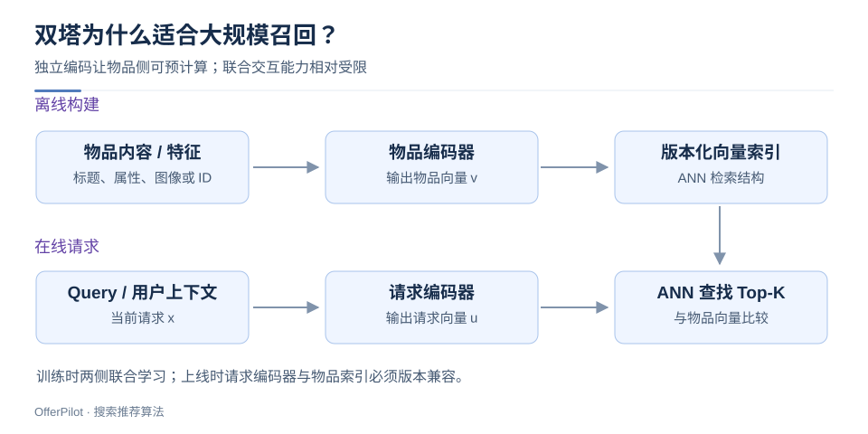
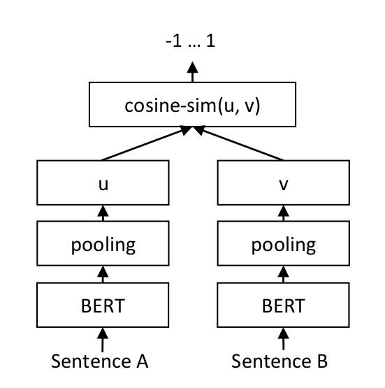
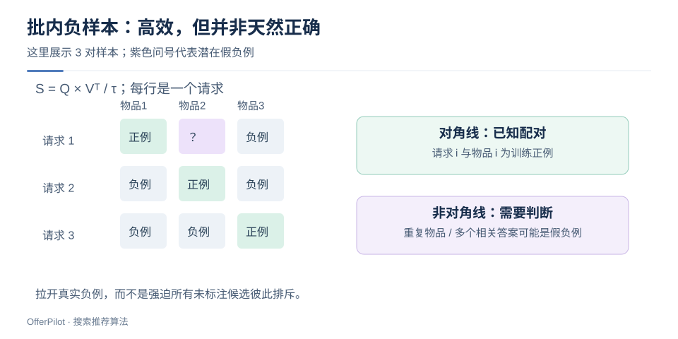

# 双塔召回：对比学习、负样本与向量索引

> 双塔把请求侧和物品侧分别编码成向量，用内积或余弦近似匹配程度。独立编码允许离线预计算物品向量，再在线用 ANN 检索；代价是请求与物品之间的细粒度交互受到限制。

## 1. 双塔的输入与输出

请求塔读取 Query，或用户历史与场景；物品塔读取标题、属性、图像或 ID 特征。两塔输出维度兼容即可，结构和参数可以不同。



物品向量离线入库，请求向量在线计算。若物品塔依赖当前用户，就难以为每个物品复用一份通用向量。

### 1.1 打分函数与形状

设请求向量为 $u=f_\theta(x)\in\mathbb R^d$，物品向量为 $v=g_\phi(y)\in\mathbb R^d$，常见打分为：

$$s(x,y)=u^Tv$$

两侧向量经 L2 归一化后，内积等于余弦相似度；否则模长也影响排序。训练与检索应使用一致的度量。

请求向量 `[1,0]` 与三个单位向量 `[1,0]`、`[0.8,0.6]`、`[0,1]` 的内积分别为 `1、0.8、0`。

### 1.2 SBERT 的孪生编码结构



两段文本分别经过 BERT 与 pooling，得到向量 $u$、$v$，再计算余弦相似度。pooling 将 token 表示聚合为句子表示。

SBERT 两侧共享编码器参数，通用双塔不一定共享。用于检索时，还需匹配 Query—文档训练目标；余弦值 $[-1,1]$ 不等于相关概率。

> 图源：[Sentence Transformers](https://github.com/huggingface/sentence-transformers/blob/f3864a53cfafb40a6f03f029ce96da70591e9931/docs/img/SBERT_Siamese_Network.png) · [Apache-2.0](./assets/CREDITS-classic.md)

## 2. 对比学习怎样把正样本拉近？

一个 batch 有 $B$ 对训练样本 $(x_i,y_i)$。令正配对在对角线上，其他物品暂作负例：

$$S_{ij}=\frac{u_i^Tv_j}{\tau}$$

$$L=-\frac{1}{B}\sum_{i=1}^{B}\log\frac{\exp(S_{ii})}{\sum_{j=1}^{B}\exp(S_{ij})}$$

- $S\in\mathbb R^{B\times B}$：请求—物品的打分矩阵。
- $\tau>0$：温度；越小，概率分布通常越尖锐，但梯度行为和稳定性也会改变。
- 分母是当前采样候选集合，**不是天然的全库概率分母**。



绿色对角线是已知正例，紫色问号是潜在假负例。重复物品或多个相关答案，都可能使非对角线包含正例。

### 2.1 最小训练代码

```python
import torch
import torch.nn.functional as F

def contrastive_loss(query_vectors, item_vectors, temperature=0.1):
    # 输入都是 [B, d]；假设一一配对且没有重复物品/多正例。
    if temperature <= 0:
        raise ValueError("temperature must be positive")
    q = F.normalize(query_vectors, dim=-1)
    v = F.normalize(item_vectors, dim=-1)
    logits = q @ v.T / temperature  # [B, B]
    labels = torch.arange(q.size(0), device=q.device)
    return F.cross_entropy(logits, labels)
```

代码假设一一配对、无重复物品。多正例场景需屏蔽假负例或调整目标；直接使用交叉熵可避免手算 `exp` 的数值溢出。

## 3. 负样本不是越难越好

| 来源 | 优点 | 需要防范的问题 |
|---|---|---|
| 随机物品 | 容易构造，覆盖广 | 太容易，无法学习细微区别 |
| 批内物品 | 复用计算，训练高效 | 热门采样偏差、重复物品、假负例 |
| 已曝光未点击 | 接近业务候选 | 未点击可能仅因没看见或位置差 |
| 当前模型高分负例 | 能暴露模型薄弱点 | 可能其实相关，旧模型偏差会被放大 |

例如 Query 为“防水通勤包”，普通旅游介绍是容易负例；“不防水但轻便的通勤包”是更有区分度的负例；另一款确实防水的通勤包可能是**未标注正例**。

混合负样本来源、抽检难例，并验证采样偏差。负例比例需通过实验选择。

## 4. 从模型分数到 ANN 检索

如果有 $N$ 个物品，全量点积计算量约为 $O(Nd)$；ANN 用近似检索换取速度。它不保证与精确 Top-K 完全一致，因此需要区分两类召回率：

1. **算法业务 Recall@K**：候选中覆盖了多少标注相关物品。
2. **ANN Recall@K**：近似结果覆盖了多少精确向量检索的 Top-K。

精确检索效果差，先查模型；精确结果好而 ANN 结果差，再查索引参数。

上线时检查模型与索引版本、维度、归一化、相似度及更新策略。维度相同不代表新旧表示空间兼容。

## 5. LLM 与双塔怎样结合？

LLM 可编码 Query 和物品描述，也可生成训练对供小模型学习。[Qwen3 Embedding](https://qwenlm.github.io/blog/qwen3-embedding/) 展示了基于语言模型的双编码器与对比训练路线。

内容表示能缓解新物品冷启动，但仍需曝光探索和行为反馈。语义相似不一定等于用户偏好。

## 6. 面试追问：为什么不用 Cross-Encoder 检索全库？

Cross-Encoder 联合编码请求与候选，交互更细，但通常需要逐对推理。因此常先用双塔召回，再用 Cross-Encoder 精排。

交互能力更强不保证效果更好；结果仍取决于数据、训练和截断方式。

**自检**：能否说明向量为何能预计算、批内负例为何可能错误、ANN 召回与业务召回有何区别？

**继续阅读**：[搜推全链路](/basics/search-rec-pipeline) · [LLM 增强搜索](/basics/search-rec-llm-reranking)
