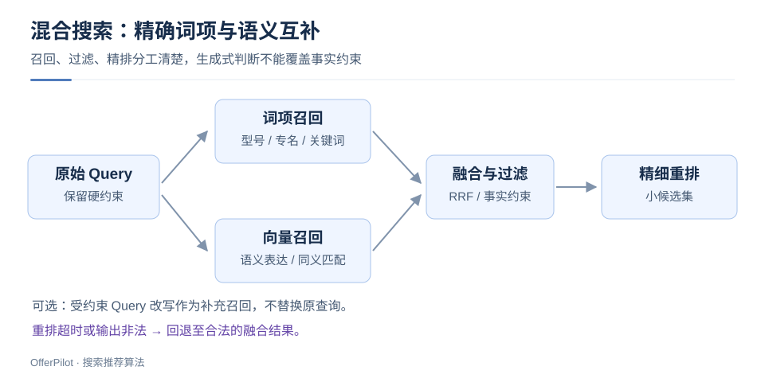
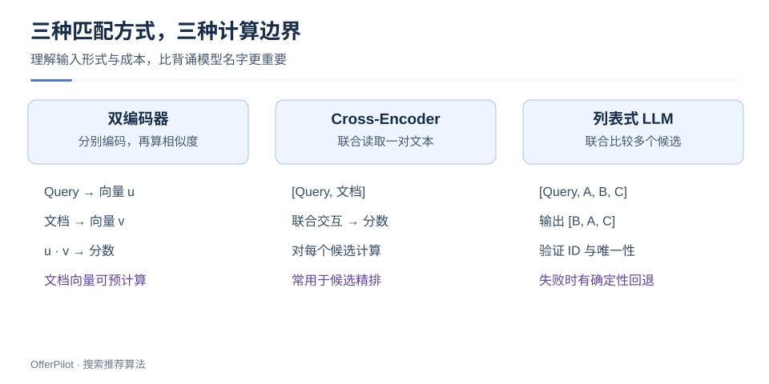
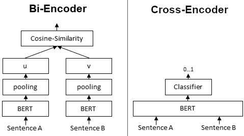

# LLM 增强搜索：混合召回、重排与可控上线

> LLM 可增强 Query 理解、召回和排序。常见链路是：保留原查询 → 混合召回 → 候选重排，并设置输出校验与超时回退。

## 1. 理解查询意图

用户查询：“500 元以内，能放 14 寸电脑，雨天通勤用的包，不要皮质。”

预算、尺寸、材质排除是明确条件；“雨天通勤”可提供防水偏好。硬约束尽量由可信字段验证，改写不得丢失否定条件或擅自添加品牌。

保留原 Query，把改写作为补充召回。改写失败或超时时，仍返回原查询结果。

## 2. 为什么混合召回？



词项召回擅长型号、错误码和专名；向量召回补充同义表达与语义匹配。按 Query 类型评估两者的互补收益。

不同检索器的分数未必同尺度。RRF 通过名次融合结果：

$$RRF(d)=\sum_{m\in M}\frac{1}{c+rank_m(d)}$$

$M$ 为检索通路，名次从 1 开始，未命中的通路贡献为零。$c$ 是在验证集选择的平滑参数。

### 2.1 RRF 实现

```python
def rrf(rankings, c=60):
    if c <= 0:
        raise ValueError("c must be positive")
    scores = {}
    for ranking in rankings:
        seen = set()
        for rank, doc_id in enumerate(ranking, 1):
            if doc_id in seen:
                continue
            seen.add(doc_id)
            scores[doc_id] = scores.get(doc_id, 0) + 1 / (c + rank)
    return sorted(scores, key=lambda doc_id: (-scores[doc_id], doc_id))

assert rrf([["A", "B"], ["B", "C"]]) == ["B", "A", "C"]
```

B 在两路中都被召回，因此融合得分更高。最终结果仍需满足权限、价格、库存等约束。

## 3. 三种精排方法如何选择？



| 方法 | 输入与输出 | 主要优势 | 主要限制 |
|---|---|---|---|
| 双编码器 | 两个向量 → 相似度 | 文档侧可预计算 | 细粒度交互受限 |
| Cross-Encoder | Query + 单篇文档 → 分数 | 联合建模匹配细节 | 每个候选需成对计算 |
| 列表式 LLM | Query + 候选列表 → ID 顺序 | 可比较多个候选 | 上下文成本、顺序敏感、结构化输出可靠性 |

[Qwen3 Embedding / Reranker](https://qwenlm.github.io/blog/qwen3-embedding/) 分别采用双编码器与交叉编码器；[RankGPT](https://arxiv.org/abs/2304.09542) 研究生成式排序及其蒸馏。

### 3.1 独立编码与联合编码



左侧分别编码两段文本，再比较向量；右侧联合编码文本对，由分类头打分。后者能直接建模跨文本交互。

双编码器可预计算文档向量；Cross-Encoder 的分数依赖具体 Query—文档对，不能同样预计算。

图中 `0…1` 是分类头的示例输出；其他模型可能返回 logit，分数不能直接跨模型比较。

> 图源：[Sentence Transformers](https://github.com/huggingface/sentence-transformers/blob/f3864a53cfafb40a6f03f029ce96da70591e9931/docs/img/Bi_vs_Cross-Encoder.png) · [Apache-2.0](./assets/CREDITS-classic.md)

## 4. 列表式 LLM 输出为什么必须校验？

候选为 `[A, B, C]`，输出 `[B, X, B]` 时，X 不存在且 B 重复，必须判为无效。

约束模型返回 ID 列表，校验类型、范围、唯一性和完整性。失败时有限重试或回退；候选文档中的文字不得作为排序指令。

```python
def valid_permutation(candidate_ids, predicted_ids):
    return (
        isinstance(predicted_ids, list)
        and all(isinstance(x, str) for x in predicted_ids)
        and len(candidate_ids) == len(set(candidate_ids))
        and len(predicted_ids) == len(candidate_ids)
        and set(predicted_ids) == set(candidate_ids)
    )

assert valid_permutation(["A", "B"], ["B", "A"])
assert not valid_permutation(["A", "B"], ["B", "B"])
assert not valid_permutation(["A", "B"], ["B", "X"])
```

只返回 Top-K 时改用合法子集校验。排序结果始终要服从权限和事实约束。

## 5. 怎样确定是否值得上线？

先固定候选和标签，比较排序方法；再单独评估改写与召回，便于归因。

| 维度 | 至少观察什么 |
|---|---|
| 质量 | NDCG/MRR、硬约束违反率、长尾 Query 分桶 |
| 可靠性 | 非法 ID、重复输出、格式失败、超时回退比例 |
| 性能 | 候选数、文本截断长度、输入 token、P95/P99 延迟 |
| 稳健性 | 候选顺序打乱、等义 Query、无答案 Query、文档指令注入 |
| 线上 | 用户任务完成相关指标、稳定分流、服务护栏 |

为召回、特征读取和重排分别预留延迟预算。重排超时时，返回合法的融合结果。

## 6. 用蒸馏降低在线成本

用大模型离线标注，经抽检后训练小模型，可减少在线成本。隔离训练、验证和测试数据，防止泄漏及教师错误传播。

记录教师版本、提示词与采样方式，用独立标签评估蒸馏效果。

## 7. 面试要点

保留原查询 → 融合召回 → 验证约束 → 精排 → 校验输出。离线看增量收益，线上同时看质量、延迟和回退率。

**前置知识**：[搜推全链路](/basics/search-rec-pipeline) · [双塔召回](/basics/search-rec-two-tower)
