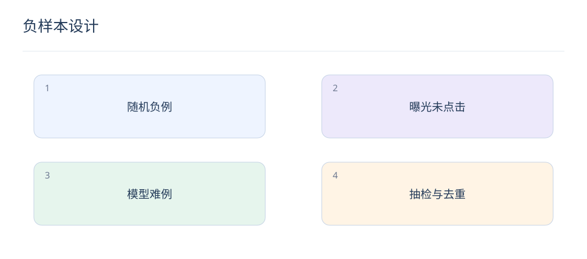

# 负样本设计：难例、假负例与采样校正

> 负样本定义了模型要区分什么。随机、曝光和难负例各有价值，混合比例必须与线上候选分布一起验证。

## 1. 未点击为什么不一定是不喜欢？

用户可能没有滚动到该位置，也可能被更早的结果满足。曝光日志应区分下发、渲染与可见曝光。把所有未点击物品当作同等可靠负例，会把位置和界面影响混进偏好。

## 2. 三类负样本怎样搭配？

随机负例提供全库覆盖，曝光未点击接近实际竞争，模型高分难例训练细粒度边界。初期可从随机与曝光开始，再逐步引入难例；比例是超参数，不存在适用于所有业务的固定配方。

## 3. 假负例怎样处理？

同一商品的多个版本、同义答案、批内重复 ID 都可能产生假负例。先去重并屏蔽已知正例；多正例任务可改用多正例对比目标。不能把教师模型高分直接等同于真实相关，应抽样人工复核。

## 4. 采样会改变概率吗？

会。若正例全保留、每个负例独立以概率 s 保留，采样数据上的概率 p_s 满足 logit(p)=logit(p_s)+log(s)。这依赖按标签独立采样的假设，不能直接用于依赖用户或模型分数的复杂采样。

## 5. 怎样计算一个校正例子？

若负例保留率 s=0.1，采样模型给出 p_s=0.5，则原分布概率为 0.1/(1+0.1)，约 0.0909。排序次序可能不变，但概率校准会显著改变；校准评估应在未下采样的验证流量上进行。

## 6. 难负例为何可能让效果下降？

过难集合可能包含大量相关但未标注的答案，或把训练集中某种语言风格当捷径。保留容易与中等难度样本，记录挖掘模型版本，并用独立标注集检查相关性，而不是只看训练 loss。

## 7. 训练与评估候选需要相同吗？

训练可采样以控制成本，评估应尽量接近线上全库或真实候选。随机挑少量负例的 Recall 不能与全库 Recall 直接比较；报告候选规模、负例来源、去重方式和是否有时间约束。

## 8. LLM 如何参与负样本构造？

可生成保留主题但改变关键约束的文本，如“防水”改为“不防水”，再人工抽检事实与标签。合成数据只补充真实分布；保留原始 Query、生成版本及审查结果，避免评估集被反复用于挖掘。

## 延伸阅读

- [BPR](https://arxiv.org/abs/1205.2618)
- [Unbiased Learning-to-Rank](https://arxiv.org/abs/1608.04468)
