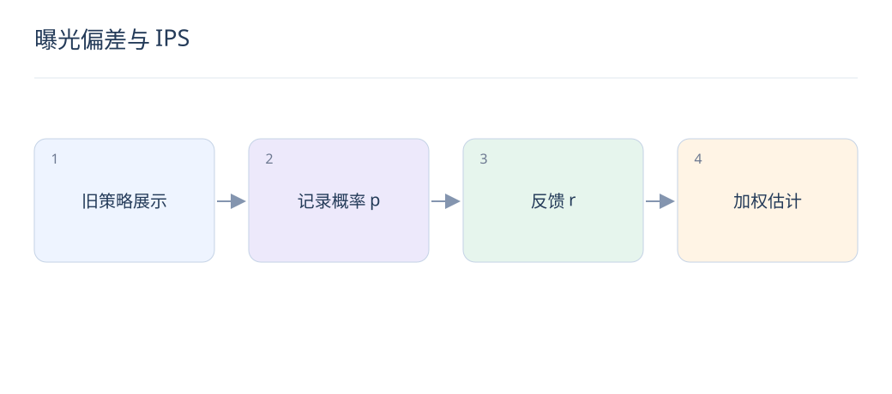

# 曝光偏差与 IPS：从点击到可解释的评估

> 点击既受相关性影响，也受展示策略影响。IPS 用展示概率重加权，但只有在记录正确且覆盖足够时才有意义。

## 1. 位置偏差和选择偏差有什么区别？

位置偏差指靠前更易被看到；选择偏差指日志只包含旧策略愿意展示的物品。前者常用检查概率建模，后者涉及策略覆盖。仅把位置作为 CTR 特征，并不自动恢复无偏的相关性。

## 2. IPS 的分子和分母分别是什么？

分母 μ 是日志策略在上下文 x 下选择动作 a 的概率，分子 π 是待评估策略选择该动作的概率，r 是观察到的奖励。按两者比值重加权可估计目标策略价值；这里的动作定义必须与日志一致。

$$
\widehat V_{\mathrm{IPS}}=\frac{1}{n}\sum_{i=1}^{n}\frac{\pi(a_i\mid x_i)}{\mu(a_i\mid x_i)}r_i
$$

## 3. IPS 成立需要哪些条件？

目标策略可能选择的动作，在日志策略下必须有非零概率，即支持集覆盖；概率记录需准确，奖励定义需一致，还需适当的因果识别假设。没有曝光过的物品不能靠除法凭空产生效果证据。

## 4. 位置检查概率能替代完整策略概率吗？

不能直接替代。位置检查模型用于特定点击假设下的相关性纠偏；完整策略 IPS 用于策略价值估计。多槽位列表的联合概率可能很小，逐项估计也依赖可分解奖励等额外假设。

## 5. 为什么小概率会造成高方差？

某条展示概率为 0.01 的样本，其逆概率权重可达 100，少量反馈就能主导均值。需检查权重分布、有效样本量和置信区间，不能只报告一个加权点估计。

## 6. 裁剪与 SNIPS 的代价是什么？

权重裁剪限制极端值，通常降低方差但引入偏差。SNIPS 用权重和归一化，也不是有限样本下无偏。应报告阈值敏感性；若结论随少量权重变化翻转，说明证据不足。

## 7. 怎样获得更可靠的日志？

在允许的候选范围内做小规模随机探索，记录决策时的候选、动作、实际概率、位置和奖励窗口。概率必须来自真实采样机制，不能事后用点击率或模型 softmax 猜测替代。

## 8. LLM 排序可以直接用 IPS 验证吗？

只有日志覆盖其选择且概率可靠时才可以。LLM 新增了旧日志从未展示的候选时，先用独立相关性标注检查，再通过受控实验获得在线证据。离线纠偏与 A/B 验证互补。

## 延伸阅读

- [Unbiased Learning-to-Rank](https://arxiv.org/abs/1608.04468)
