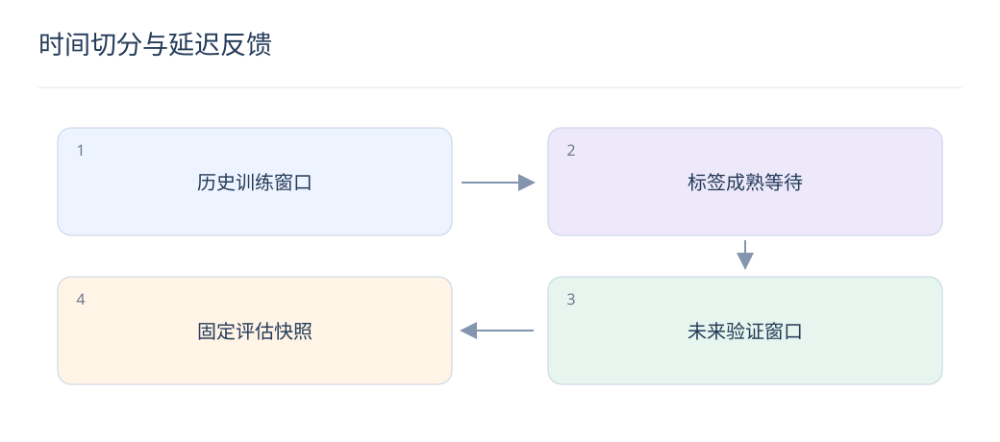

# 时间切分与延迟反馈：让离线结果可信

> 一次看似漂亮的提升，可能来自未来信息或尚未成熟的标签。数据集必须重现模型当时真正能看到的世界。

## 1. 为什么随机切分容易乐观？

同一用户相邻行为、重复曝光或同一会话可能同时进入训练与测试，模型间接看到未来偏好。按时间先训练后验证更接近部署；如果业务关心新用户，还需额外做用户分组的冷启动评估。

## 2. 标签窗口怎样定义？

例如点击后七天内购买为正例，就要等七天后才能把未购买样本确认为负例。训练截止日附近的数据要截断、等待成熟或专门建模延迟；不能把“还没买”与“最终没买”混为一谈。

## 3. 特征时间和标签时间如何分离？

特征只读曝光前已可用信息，标签从曝光后的固定归因窗口读取。每条样本记录曝光时间、特征版本、标签截止时间；离线聚合要做 point-in-time join，防止拿最新画像回填旧请求。

## 4. 重复样本怎样影响评估？

重复 Query—物品对可能让模型记忆文本；重复曝光又可能是真实频次信号。根据预测单位处理：训练可保留合理重复，评估需报告去重口径，并检查跨窗口近重复内容和共享素材。

## 5. 一个七天转化窗口怎样切分？

假设模型在 8 月 15 日训练，只能使用标签已成熟的曝光；8 月 8 日后的曝光不能直接按完整七天负例处理。验证数据同样等其归因窗口结束，再计算 CVR 和转化收益。

## 6. 离线候选库需要冻结吗？

需要按请求时刻检查可售、已发布和权限。今天才发布的商品不应成为上月请求的候选。ANN 索引、内容编码器与商品快照要有版本，否则召回提升可能只是候选库变化。

## 7. LLM 生成标注有什么额外风险？

教师可能利用答案中的未来事实，或生成与测试题高度相似的训练样本。保留数据来源和生成时间，对评估集做文本与语义去重，并由独立人工标注集校验教师偏差。

## 8. 结果如何做到可复现？

固定时间边界、归因规则、候选集、随机种子和模型版本；记录各阶段样本数量及过滤原因。保存总体与长尾、新用户、短 Query 等切片，让下一次实验能区分模型变化和数据变化。

## 延伸阅读

- [ESMM](https://arxiv.org/abs/1804.07931)
