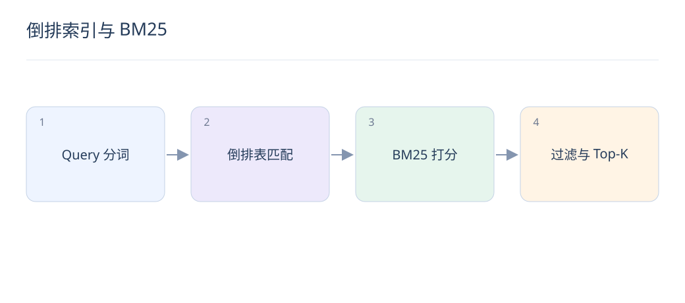

# 倒排索引与 BM25：关键词检索的可靠基线

> 关键词检索擅长精确约束、型号和罕见实体。理解 BM25，有助于判断何时需要语义检索，何时应保留字面匹配。

## 1. 倒排索引保存什么？

它把词映射到包含该词的文档列表，通常还记录词频与位置。查询时读取相关 posting lists，而不是扫描全部正文。分词、大小写和同义词策略会直接改变哪些文档有资格被召回。

## 2. BM25 的三个核心因素是什么？

IDF 增强稀有词，词频项随出现次数增加逐渐饱和，长度归一化避免长文仅因词多占优。公式中的 f 为词频，|d| 为文档长度，avgdl 为平均长度；不同实现的 IDF 细节可能不同。

$$
\mathrm{score}(q,d)=\sum_{t\in q}\mathrm{IDF}(t)\frac{f(t,d)(k_1+1)}{f(t,d)+k_1(1-b+b|d|/\mathrm{avgdl})}
$$

## 3. k1 与 b 分别控制什么？

k1 控制词频饱和速度；b 控制长度归一化强度，b=0 时不做该项长度校正。它们应在自己的字段与语料上调参，不能照搬某套参数就断言最优。

## 4. 字段应该怎样设计？

标题、品牌、型号和正文可使用不同权重与分析器。型号等精确字段适合 keyword 或专门规则，中文正文要检查分词结果。库存、权限和价格等硬条件应用过滤表达，不靠相关性分数“尽量满足”。

## 5. 为什么同义表达可能搜不到？

Query“续航久”与文档“电池可用两天”可能没有共享词。可加受控同义词、Query 扩展或向量召回；但“手机壳”扩成“手机”会改变需求，扩展后仍要保留原 Query 与约束。

## 6. BM25 分数能直接与余弦相加吗？

两者尺度和分布不同，直接加权往往不稳定。可在标注集上做归一化和学习融合，或用 RRF 按名次融合；融合后仍需检查精确实体是否被语义相似但错误的结果挤走。

## 7. 怎样评估关键词链路？

构建包含型号、拼写错误、长 Query、中文切词与罕见实体的集合，检查 Recall@K、NDCG 和无结果率。先看分析器输出与过滤条件，再调分数，避免把召回为空误判为排序模型问题。

## 8. LLM 可以替代倒排索引吗？

LLM 可提取意图、改写 Query 或重排候选，但不能保证精确匹配和权限约束。实用系统常保留倒排通道作为稳定基线与降级路径，特别是价格、版本、品牌等不可随意改写的约束。

## 延伸阅读

- [BM25 公式与参数](https://www.elastic.co/blog/practical-bm25-part-2-the-bm25-algorithm-and-its-variables)
