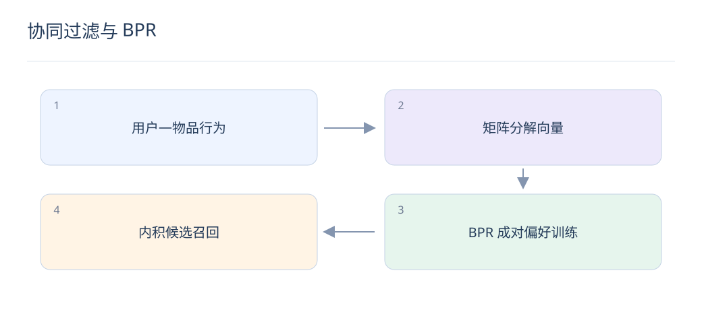

# 协同过滤与 BPR：用行为学习偏好

> 协同过滤利用“谁与谁互动过”，不要求物品文本相似。它适合成熟物品，也需要正视稀疏和冷启动。

## 1. ItemCF 怎样产生候选？

根据共同交互用户计算物品相似度，再把用户历史物品的邻居合并。需要抑制热门物品和异常高活跃用户的影响，并排除已看、失效或不适用内容。相似不等于因果上的偏好关联。

## 2. 矩阵分解与 ItemCF 有什么区别？

矩阵分解为用户和物品学习低维向量，用内积估计偏好；ItemCF 通常直接保存近邻关系。前者能做隐空间泛化，后者易解释、更新路径直观；两者都依赖历史交互覆盖。

$$
L=-\sum_{(u,i,j)}\log\sigma(s_{ui}-s_{uj})+\lambda\|\Theta\|_2^2
$$

## 3. BPR 优化的是什么？

对用户 u 的已交互物品 i 和采样未交互物品 j，推动分数差 s_ui−s_uj 为正。σ 为 sigmoid，正则约束参数。它学习相对次序，不直接输出校准的点击概率。

## 4. 没有交互可以直接当负例吗？

这是隐反馈训练的常见近似，可能把没看到的好物品当负例。采样分布会改变任务难度和热门偏差；应排除已知正例，并用时间窗口与真实曝光数据帮助判断样本可靠性。

## 5. 一个成对训练例子是什么？

用户看过摄影课程 A，采样未交互课程 B。若两者分数分别为 0.2 和 0.8，BPR 会推动 A 高于 B；但 B 可能只是没被看到，所以不能把一次采样当作用户明确讨厌 B 的证据。

## 6. 如何处理新用户和新物品？

新用户可结合入口意图、上下文和受控热门；新物品可用类目、文本或图像向量。成熟后逐渐引入行为信号，分别监测零交互、少交互与成熟物品，避免总体均值掩盖冷启动失败。

## 7. 离线评价如何避免虚高？

用时间切分，只用历史行为建相似图或向量，评估未来交互。明确候选是全库还是采样库，并报告覆盖率、长尾召回和热门基线；随机负例过容易会使模型看起来都很强。

## 8. 怎样与 LLM 内容向量结合？

可以保留协同通道，并新增文本语义通道后融合候选，或将内容作为向量初始化与辅助损失。分别做协同、内容、融合三组消融，检查收益来自新物品覆盖还是已有物品排序。

## 延伸阅读

- [BPR](https://arxiv.org/abs/1205.2618)
