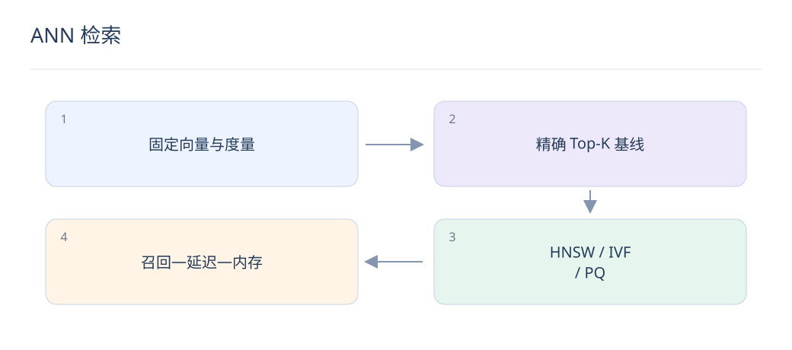
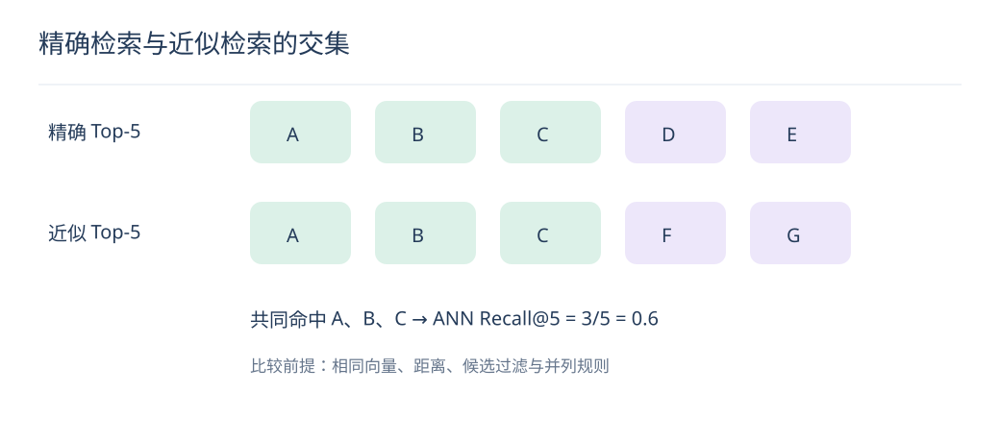

# ANN 检索：HNSW、IVF 与 PQ 的取舍

> ANN 的任务是在预算内逼近精确向量 Top-K。先固定向量与距离，再比较索引，否则难以定位召回损失。

## 1. ANN Recall 与业务 Recall 有什么区别？

ANN Recall 比较近似结果与同一向量空间的精确 Top-K；业务 Recall 比较结果与相关物品标注。向量模型差时，ANN 即使完全复现精确检索，也可能召回不相关内容。

## 2. HNSW 怎样加速搜索？

它在多层近邻图上导航，在较粗层快速定位，再在底层扩展候选。增加搜索宽度通常提高召回并增加耗时；构图参数还影响内存与建库成本。过滤、删除等能力取决于具体实现。

## 3. IVF 的近似来自哪里？

先把向量分到粗聚类桶，查询时只搜索部分桶。探测桶数 nprobe 越大，通常越接近精确结果但更慢。聚类训练样本需覆盖真实数据，分布漂移后应重新评估桶分配。

## 4. PQ 压缩牺牲什么？

PQ 把向量拆为子空间，用码本索引近似原向量，减少存储与距离计算成本，但产生量化误差。可对候选做原向量重排；是否值得要同时算压缩率、额外读盘和召回损失。

## 5. 怎样计算 ANN Recall@10？

某请求的近似前十与精确前十有八个相同 ID，则该请求 Recall@10 为 0.8。对请求求平均并明确并列分数规则。精确基线与近似检索必须使用相同的过滤条件和距离。

## 6. 过滤为什么会导致返回不足？

先取少量 Top-K 再过滤库存、权限或类目，可能删掉大多数候选。可采用支持过滤的索引、分片或过量召回后重排；过量规模需测延迟，不能保证固定扩倍覆盖所有高选择性条件。

## 7. 索引更新为什么要配合模型版本？

新请求塔与旧物品塔的向量坐标系可能不兼容。模型、归一化方式、维度和索引应成套发布，通过影子查询比较后原子切换，并保留上一版本以便回滚。

## 8. 怎样选索引？

先用 Flat 建精确基线，再在真实并发和过滤比例下测 Recall、P95/P99 延迟、内存、更新速度与构建时间。HNSW、IVF、PQ 也可组合；没有脱离数据规模与更新约束的唯一最优方案。

## 延伸阅读

- [Faiss 索引说明](https://github.com/facebookresearch/faiss/wiki/Faiss-indexes)
