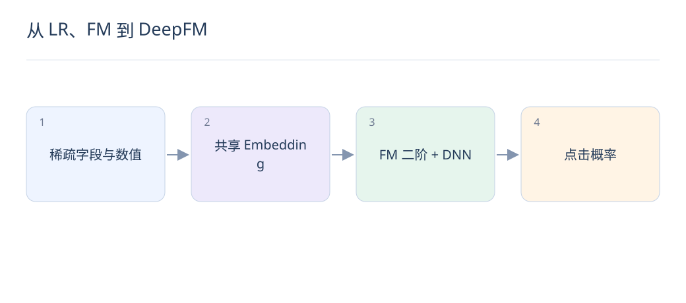

# 从 LR、FM 到 DeepFM：理解特征交互

> 排序模型需要学习“某类用户在某种场景偏好某种物品”。比较模型时，先看它表达了哪些交互，再看参数和线上成本。

## 1. LR 为什么需要人工交叉？

逻辑回归在线性 logit 上组合输入。若只有“用户城市”和“商品类别”两个独立字段，它不能直接表达某城市对某类别的特殊偏好；需新增交叉特征，或换用能够学习交互的结构。

## 2. FM 如何缓解交叉稀疏？

FM 用两个特征隐向量的内积表示二阶交互，而不是为每个组合独立存参数。一个字段可从多个组合共享学习信号，但未出现或极少出现的字段仍然难以学好。

$$
\hat y=\sigma\!\left(w_0+\sum_i w_i x_i+\sum_{i<j}\langle v_i,v_j\rangle x_i x_j+f_{\mathrm{DNN}}(x)\right)
$$

## 3. DeepFM 的两个分支是什么？

FM 分支显式建模低阶交互，DNN 分支从嵌入拼接中学习更复杂的模式，常见结构共享输入 embedding。两者 logit 相加再过 sigmoid；DNN 的层数不直接等于可解释的交互阶数。

## 4. Wide & Deep 与 DeepFM 怎样区分？

Wide & Deep 结合线性记忆能力与深层泛化能力，Wide 侧常用人工交叉；DeepFM 用 FM 学二阶交互，减少这部分人工设计。是否更好仍依赖样本、字段、正则和服务预算。

## 5. 一个二阶交互怎样计算？

若两个激活字段的隐向量为 [1,2] 和 [3,1]，内积为 5，这个数进入 logit 的交互部分；它不是 500% 点击率。最终还要与其他项相加，再经过 sigmoid 得到预测概率。

## 6. 为什么 AUC 涨了概率却不准？

AUC 主要看相对次序，负例下采样、分布漂移或过拟合可使概率偏高。应同时检查 logloss、预测/真实点击比和分桶校准；用于收益乘法时，概率偏差尤其重要。

## 7. 如何做公平的模型对比？

固定时间窗口、特征、采样和训练预算，比较 LR、FM、DNN 与融合模型。报告总体和低频字段切片，并计入 Embedding 查表成本；否则新增特征带来的收益容易被误认为模型结构收益。

## 8. LLM 特征放在哪里？

可将文本向量或结构化语义字段作为额外输入，与 ID 和统计特征融合。先冻结编码器建立基线，检查新增成本与冷启动收益；不要把每次候选排序都调用大模型当作默认方案。

## 延伸阅读

- [DeepFM](https://arxiv.org/abs/1703.04247)
- [Wide & Deep](https://arxiv.org/abs/1606.07792)
