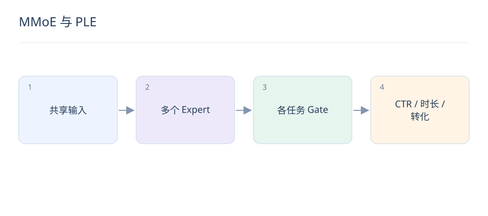

# MMoE 与 PLE：多目标共享多少才合适

> 点击、停留和转化既相关又不相同。多任务学习的关键，是共享有效信息，同时控制任务间的干扰。

## 1. 共享底座为什么会负迁移？

不同任务的最优特征方向可能冲突，例如标题党提高点击却降低满意度。完全共享底座时，一个任务的梯度可能损害另一个任务；标签稀疏和损失尺度也会放大这种现象。

## 2. MMoE 的门控有什么作用？

多个专家产生表示，每个任务有独立 gate，根据输入分配专家权重，再送入任务塔。门控是样本相关的软组合；专家并不天然分别代表点击、转化等固定含义。

$$
h_t(x)=\sum_{k=1}^{K}g_{t,k}(x)E_k(x),\qquad \sum_k g_{t,k}(x)=1
$$

## 3. PLE 与 MMoE 有何区别？

PLE 显式区分共享专家和任务专属专家，并通过逐层提取与门控组织信息流。它为共享与专属信息提供结构边界，但也增加参数和调试成本，不能保证所有任务同时提升。

## 4. 多任务损失怎样设置？

总损失常为各任务损失的加权和。权重影响优化方向，需考虑样本数量、标签掩码和量纲；缺失转化标签不能随意填零。动态权重也要与固定权重基线比较。

## 5. 一个门控结果怎样理解？

同一请求下，点击任务对两个专家分配 [0.8,0.2]，转化任务分配 [0.3,0.7]，说明组合偏好不同。这不证明第二个专家“只懂转化”；要结合专家消融与任务效果验证。

## 6. 如何诊断负迁移？

比较单任务、共享底座、MMoE 和 PLE，在相同特征下观察各任务变化；检查梯度方向、损失规模、门控熵和专家使用率。若仅总体提升而某类用户受损，需要保留切片约束。

## 7. 多任务输出怎样形成最终排序？

模型预测各目标，业务仍需明确如何组合，比如点击概率、条件转化概率与收益的乘积。训练损失权重不等于线上排序权重；上线还要检查校准、重复内容与长期体验。

## 8. AI 生成质量标签适合当辅助任务吗？

可以，但先验证标签稳定性和与真实体验的关系。LLM 对文风的偏好可能压过事实质量，应用人工标注集校验，并通过移除该任务的消融判断它是否帮助核心目标。

## 延伸阅读

- [MMoE](https://research.google/pubs/modeling-task-relationships-in-multi-task-learning-with-multi-gate-mixture-of-experts/)
- [PLE](https://dl.acm.org/doi/10.1145/3383313.3412236)
