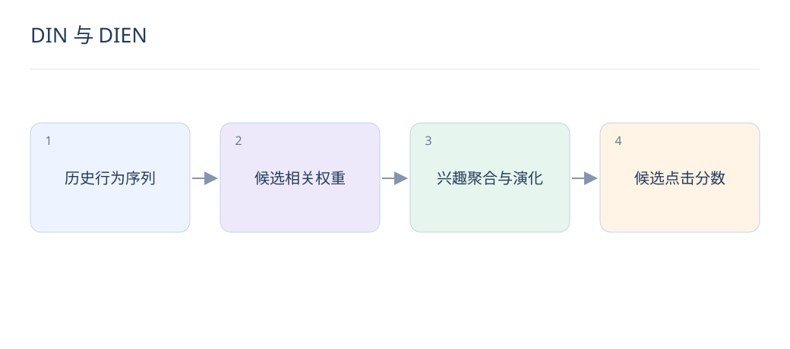

# DIN 与 DIEN：兴趣激活和兴趣演化

> 同一用户有多种兴趣，当前候选只与其中一部分相关。DIN 强调候选相关的兴趣，DIEN 进一步建模兴趣随行为变化。

## 1. DIN 解决什么问题？

将所有历史平均成一个向量，会稀释与当前候选相关的行为。DIN 用候选与历史行为共同计算激活权重，再聚合历史表示，让不同候选读取不同兴趣。

## 2. DIN 权重一定是概率吗？

不一定。原始局部激活思路不要求所有权重经 softmax 后和为一；具体实现可不同。不能把任意注意力权重解释成用户喜欢某行为的概率，也不能直接视为因果解释。

## 3. DIEN 如何描述兴趣演化？

它通过序列网络提取逐步兴趣状态，并使用辅助训练信号帮助状态学习，再结合候选相关注意力建模兴趣演化。与 DIN 相比，它不仅关注历史中哪些行为相关，也关注兴趣的变化过程。

## 4. 序列输入最重要的约束是什么？

所有历史必须发生在预测时刻之前，padding 需被屏蔽，时间顺序和行为类型需一致。点击、收藏、购买可有不同语义；若混为一种 token，模型可能学到错误的兴趣强度。

## 5. 一个候选相关的例子是什么？

用户先看相机，再看跑鞋。对相机镜头候选，摄影历史应更有帮助；对运动袜候选，跑鞋历史更相关。固定平均向量难以清晰区分这两次候选评分。

## 6. 为什么不直接用于全库双塔？

候选相关聚合需针对不同候选重新计算用户侧表示，不易直接缓存成唯一用户向量。通常用于候选数量较少的排序阶段，或通过多兴趣向量、蒸馏等方案近似召回。

## 7. 怎样判断序列模块带来收益？

比较无序 pooling、仅时间顺序和候选注意力的消融，固定历史长度与特征。按活跃度和兴趣切换用户分组，监测延迟；不要让更长历史带来的信息增量混淆结构比较。

## 8. 如何结合 LLM 内容表示？

可用文本或多模态向量补充历史物品 embedding，再投影到排序维度。先验证内容信息对稀疏行为是否有帮助，并控制编码器版本；语义相似不总等于用户会继续点击。

## 延伸阅读

- [DIN](https://arxiv.org/abs/1706.06978)
- [DIEN](https://arxiv.org/abs/1809.03672)
