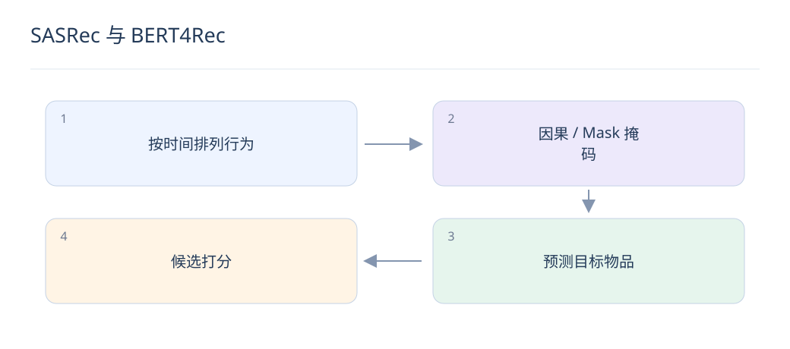
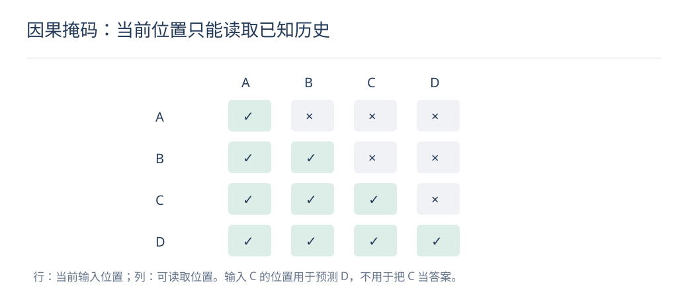

# SASRec 与 BERT4Rec：两种序列训练目标

> 序列推荐常用 Transformer，但注意力掩码与训练目标决定模型能看见什么。两种范式不能只按“单向、双向”机械比较。

## 1. SASRec 如何训练？

利用因果自注意力编码历史，在每个位置根据此前序列预测后续交互。因果掩码阻止访问未来位置；padding 掩码另行处理，两种掩码不能互相替代。

## 2. BERT4Rec 如何训练和推理？

训练时掩盖部分历史物品，用双向上下文恢复被掩盖项；预测下一项时，在已知历史末尾放置 mask。双向只作用于当时已知的输入，不能把真实未来行为放进线上历史。

## 3. 两者评估为什么容易不公平？

训练目标、负采样、序列长度、迭代次数与候选集合都可能不同。需使用相同时间切分和评估库，并分别充分调参；不能根据某次未对齐实验断言一种目标必然优于另一种。

## 4. 位置与时间间隔有什么区别？

位置编码表达先后次序，却不一定知道两次点击相隔一秒还是一周。可加时间间隔或衰减特征，但要防止绝对时间捷径和未来时间泄漏，且需单独验证增益。

## 5. 一个因果掩码例子是什么？

历史为 A、B、C，训练预测 B 时只能读取 A，预测 C 时可读取 A、B。若同一个位置已经能看到 C 再预测 C，就形成答案泄漏，训练 loss 会很好但线上失效。

## 6. 长序列成本如何控制？

普通全注意力在序列长度 L 上有二次交互成本。可截断、分层压缩、检索相关历史或采用适配长序列的结构；应比较保留的信息与 P99 延迟，不能只看最大可支持长度。

## 7. 序列末项一定代表真实偏好吗？

不一定，误触、重复播放和被动曝光都会造成噪声。结合停留、显式反馈与去重策略，区分“下一次交互”和“长期满意度”；任务定义不同，最优训练标签也会不同。

## 8. 怎样接入语义特征？

将 ID 向量与文本或图像表示融合，帮助少交互物品泛化；可冻结内容编码器以降低训练成本。需要对比 ID-only、content-only 和融合，并检查新物品是否在评估时真实可见。

## 延伸阅读

- [SASRec](https://arxiv.org/abs/1808.09781)
- [BERT4Rec](https://arxiv.org/abs/1904.06690)
