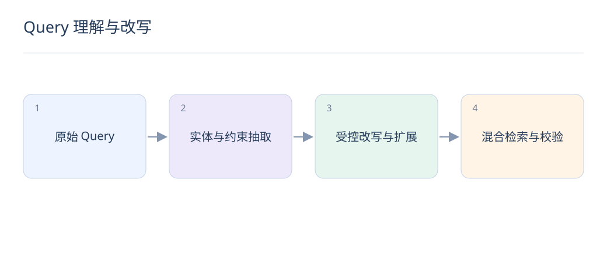

# Query 理解与改写：让 LLM 保留用户约束

> 改写的目标是提高可检索性，而不是替用户改变需求。原始 Query、硬约束和改写结果应分开保存。

## 1. Query 理解应输出什么？

可输出实体、意图、类目和硬约束，例如品牌、价格上限、否定条件。使用固定 schema 并校验类型；不确定字段应允许为空，不能为满足格式而编造用户未表达的偏好。

## 2. 改写与扩展有什么区别？

改写将同一需求表达得更清晰，扩展增加相关检索词或多个查询。扩展覆盖更广但容易语义漂移，应保留原 Query 通道，并限制新增词对精确实体和否定条件的影响。

## 3. 多轮搜索怎样处理指代？

“要轻一点的”应结合本轮之前的对话确定对象，只抽取当前仍有效的约束。用户修正预算时要覆盖旧预算；会话摘要要区分用户明确要求与系统曾提出的建议。

## 4. 如何限制幻觉改写？

把实体和数值约束作为结构化输入，让模型只改写允许的部分；之后检查品牌、型号、单位、否定词是否保留。校验失败就回退原 Query，而不是把错误结果继续送入搜索。

## 5. 一个保留约束的例子是什么？

“500 元内，不要入耳式，通勤降噪耳机”可抽取预算≤500、排除入耳式、场景通勤。可以扩展“头戴式”，但不能把“降噪”直接改成某品牌型号，也不能删掉价格条件。

## 6. 改写怎样接入已有系统？

原 Query 与改写 Query 并行召回、去重和融合，硬过滤统一执行。常见请求可缓存改写，缓存键包含语言、约束和模型版本；超时或格式异常时沿原 Query 链路继续。

## 7. 怎样判断改写真的有用？

对比无改写、规则改写和 LLM 改写，固定下游检索器。检查 Recall、无结果率、约束违反率、P95 延迟与每次成功搜索成本，并单独分析口语、错别字和多轮请求。

## 8. 检索内容能反过来指挥改写吗？

网页或商品描述是不可信数据，里面的指令不应覆盖用户需求和系统约束。用于摘要时明确限定为证据；工具调用只接受校验后的 schema，不能根据文档中的提示随意更改权限过滤。

## 延伸阅读

- [Qwen3 Embedding](https://qwenlm.github.io/blog/qwen3-embedding/)
- [RAG](https://arxiv.org/abs/2005.11401)
