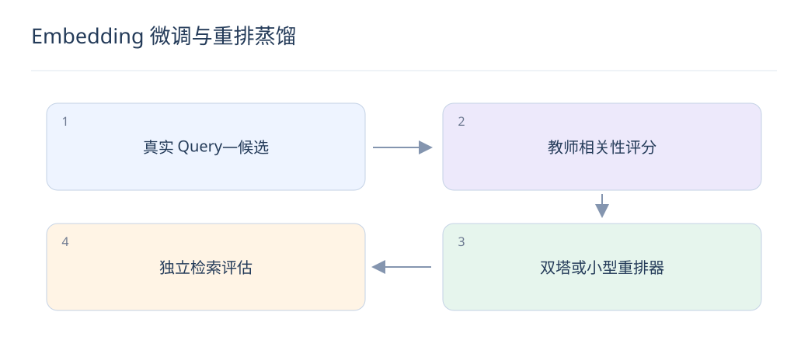

# Embedding 微调与重排蒸馏：把大模型能力迁入检索

> 大模型可提供语义监督，小模型负责大规模服务。蒸馏是否有效，要看真实检索结果，而不是学生是否复现教师的全部偏好。

## 1. Embedding 与重排器微调有何不同？

双塔分别编码 Query 和文档，必须保持可预计算边界；交互式重排器同时读取两者，能捕获细节但按候选重复计算。教师更强不代表其结构能直接部署到全库召回。

## 2. 训练数据怎样组成？

使用真实 Query、已核验正例、不同难度负例和必要的多正例标记。按时间或业务实体隔离评估数据，避免相似模板同时进入训练与测试。优先修复标签和覆盖，再增加模型规模。

$$
L=\alpha L_{\mathrm{label}}+(1-\alpha)T^2\mathrm{KL}(p_T\|p_S)
$$

## 3. 教师可以提供哪些监督？

可以输出点式相关性、成对偏好或候选列表分布。分数要有稳定量表，教师不确定时保留标记；短文本、长文和特定语言上的系统性偏差需要人工抽检。

## 4. 蒸馏公式里的温度有什么作用？

在相同候选集合上，将教师和学生 logits 除以 T 后 softmax 得到 p_T、p_S，KL 传递软分布，硬标签项保留真实监督。T² 是常见梯度尺度补偿；权重 α 与温度都要验证。

## 5. 一个难例怎样帮助学生？

Query“可离线使用的笔记应用”，正例支持离线编辑，难负例只支持离线阅读。教师可指出约束差异，但必须核验产品事实；仅凭语言流畅度打分，会把风格优势误当相关性。

## 6. 双塔能完全复现交互模型吗？

未必。独立向量内积的表达受限，特别是复杂否定和多约束匹配。可以让双塔提高候选覆盖，再保留小规模交互重排，比较端到端效果与成本，而非要求单一模型承担所有阶段。

## 7. 如何验证蒸馏收益？

使用独立人工标注集和真实候选库，比较硬标签训练、教师蒸馏和两者混合。报告 Recall、NDCG、分语言切片、延迟和吞吐；教师一致率只能说明模仿程度，不能替代业务质量。

## 8. 模型更新后索引怎样处理？

若物品编码器变化，需要重新编码并构建兼容索引；仅重排器更新通常不必重建向量库。发布记录包含模型、tokenizer、截断策略和向量归一化版本，避免新旧空间混用。

## 延伸阅读

- [Qwen3 Embedding](https://arxiv.org/abs/2506.05176)
- [RankGPT](https://arxiv.org/abs/2304.09542)
