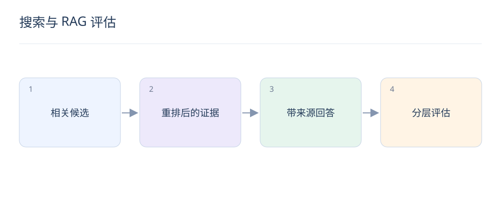

# 搜索与 RAG 评估：相关、可回答和可信引用

> 搜到相关文档，不等于已经找到足够证据。RAG 需要分别检查检索质量、答案支持程度和最终用户体验。

## 1. 相关性与可回答性有什么区别？

“电池原理”可能与续航问题相关，却不能回答某型号实测能用多久。标注时区分主题相关、包含关键证据和证据完整；多文档问题还要检查证据能否共同覆盖所有子问题。

## 2. 常用检索指标怎样选择？

Recall@K 关注相关证据是否进入候选，MRR 关注第一个相关结果位置，NDCG 支持分级相关性与位置折扣。明确零相关 Query 的处理规则，否则不同评估实现的均值不可直接比较。

$$
\mathrm{NDCG@K}=\frac{\sum_{j=1}^{K}(2^{rel_j}-1)/\log_2(j+1)}{\mathrm{IDCG@K}}
$$

## 3. 答案层需要检查什么？

检查事实是否被引用支持、引用是否准确指向证据、是否遗漏关键限制，以及无证据时是否承认不足。流畅度是辅助维度；答案听起来合理，不代表内容来自检索结果。

## 4. LLM-as-a-judge 能替代人工吗？

它适合扩大覆盖和初筛，但可能偏好长答案、特定格式或熟悉模型的文风。使用固定评分规范、盲化模型身份、交换候选顺序，并用独立人工样本检查一致性和系统性误差。

## 5. 如何定位一个错误回答？

先看关键证据是否在库中，再看是否被召回、是否被重排保留、是否因上下文截断丢失，最后检查生成器是否误读。每阶段保存 request_id 与版本，避免所有错误都归咎于生成模型。

## 6. 评估集怎样覆盖业务？

加入常见问题、罕见实体、过期事实、多跳问题、无答案问题和访问权限场景。训练、提示词调试与最终测试应分开；反复根据测试错误改提示词后，该集合就不再是独立测试。

## 7. 怎样计算一个 NDCG 例子？

若前两位相关等级为 [0,2]，DCG=3/log2(3)≈1.893；理想次序 [2,0] 的 IDCG=3，因此 NDCG≈0.631。该例采用 2^rel−1 增益，换用其他增益定义需明确说明。

## 8. 上线应同时观察什么？

观察搜索成功率、可验证引用比例、用户纠错、延迟和成本，并对无答案问题单独看拒答质量。权限过滤必须在证据进入模型前执行，不能依赖模型在生成时自行忽略无权信息。

## 延伸阅读

- [RAG](https://arxiv.org/abs/2005.11401)
- [RankGPT](https://arxiv.org/abs/2304.09542)
