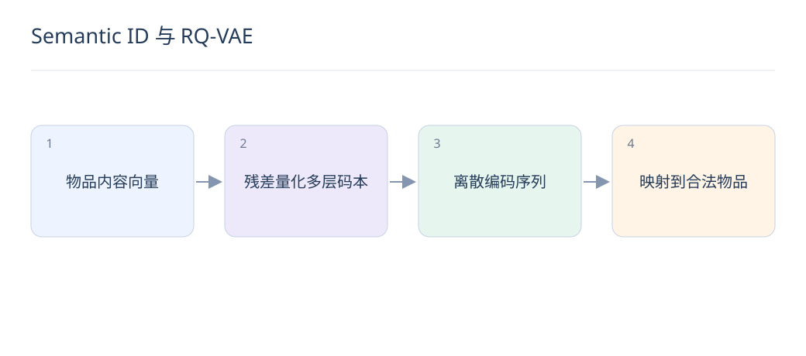
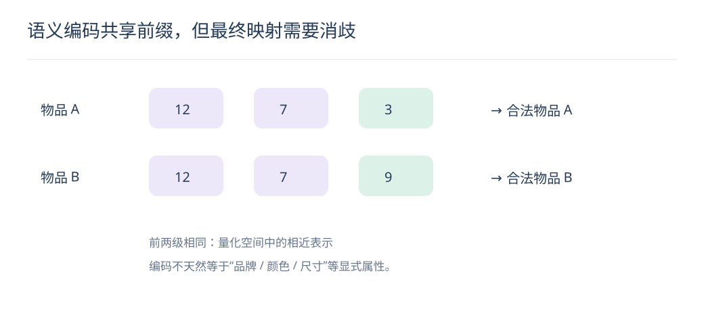

# Semantic ID 与 RQ-VAE：把物品变成可生成的编码

> 生成式推荐可预测物品编码，而不是直接对全库逐个打分。编码设计决定了共享语义、唯一映射和更新成本。

## 1. Semantic ID 与普通 ID 有何区别？

普通 ID 通常没有可解释的邻近关系，Semantic ID 由内容表示离散化得到，设计上希望共享前缀的物品具有相似语义。但量化结果不保证天然对应清晰的人类类目，需要实际检查。

## 2. RQ-VAE 的残差量化做什么？

先将编码向量匹配到第一层码本，再对剩余残差继续量化，最终用多个码字索引表示物品。训练包含重建和量化相关目标；编码长度、码本大小影响压缩、表达和训练稳定性。

## 3. 为什么可能发生编码碰撞？

两个物品可能映射到同一组码字，尤其内容相似或码本利用率低时。需要额外消歧标识、候选映射或其他碰撞处理；编码对应物品必须可确定，不能把碰撞默默当去重。

## 4. 如何保证生成结果合法？

建立物品编码前缀树，在解码每一步限制合法后继 token，再按库存与权限过滤。仅生成语法正确的数字序列还不够，它可能不对应当前可推荐物品；动态目录需要同步维护映射。

## 5. 一个编码例子怎样理解？

示意编码 [12,7,3] 与 [12,7,9] 共享前两级，可视为在该量化空间中较接近，但不能直接断言分别代表品牌、颜色和尺码。若需这类显式约束，应使用可验证的结构化字段。

## 6. 新物品如何加入？

用兼容内容编码器和码本产生编码，检查碰撞并更新合法映射。即使不用给每件新物品重新训练独立输出参数，生成模型也未必立即学会推荐它，仍需新物品曝光与适配评估。

## 7. 如何评价编码质量？

检查重建误差、码本利用率、碰撞率、语义邻居质量和最终推荐 Recall。低重建误差不一定带来高点击收益；内容空间可能忽略协同偏好，应与行为信号结合验证。

## 8. 码本更新有什么风险？

码本变化可能让同一编码指向不同语义，历史序列、生成模型和在线目录同时失配。应版本化内容编码器、码本、历史转换和生成模型，成套迁移并保留回滚路径。

## 延伸阅读

- [TIGER](https://arxiv.org/abs/2305.05065)
- [DSI](https://arxiv.org/abs/2202.06991)
