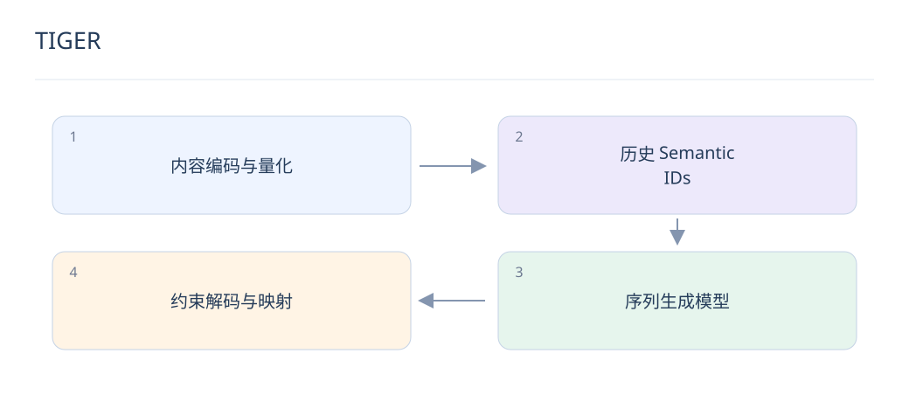

# TIGER：从行为序列生成物品标识

> TIGER 展示了用语义编码进行生成式推荐的路径。理解它时，要分清物品编码阶段与用户序列建模阶段。

## 1. TIGER 的核心流程是什么？

先把物品内容表示转为离散语义编码，再将用户历史编码序列输入序列模型，自回归生成目标物品编码。编码器负责物品空间，推荐模型负责从行为推断下一次选择。

## 2. 它与双塔的检索方式有何不同？

双塔通常生成请求向量后在索引中做近邻搜索；生成式方案沿 token 空间逐步产生物品编码。两者都需要合法物品映射和业务过滤，不能把生成式简单理解成“无需任何索引或目录”。

$$
P(c_1,\ldots,c_m\mid H)=\prod_{j=1}^{m}P(c_j\mid H,c_{<j})
$$

## 3. 自回归目标怎样分解？

目标编码由 m 个 token 组成，联合概率分解为条件概率乘积，训练通常用 teacher forcing。推理时先前 token 来自模型自身，早期错误可能限制后续可达物品。

## 4. Beam search 带来什么取舍？

保留多个前缀可以扩大候选覆盖，但增加解码计算和状态管理成本。beam 分数是模型序列概率，不等同于校准 CTR；最终候选仍可交给排序或重排模块。

## 5. 如何处理同前缀物品扎堆？

共享前缀有利于语义泛化，也可能使候选集中在相近类别。监测唯一物品数、前缀覆盖和长尾召回，可配合多样化解码或后续重排；不要只统计生成 token 的数量。

## 6. 为什么不能直接承诺冷启动解决了？

内容编码给新物品提供可表示性，但模型是否能生成其编码、业务是否给予曝光仍是问题。要在严格时间切分的零交互物品上评估，并区分可入库、可生成和获得有效反馈三个阶段。

## 7. 如何设计公平基线？

与双塔和序列模型使用相同历史、内容信息和候选目录，比较 Recall、NDCG、覆盖率、P99 延迟与更新成本。若只有生成模型使用文本信息，不能把全部收益归因于生成范式。

## 8. 适合怎样落地？

可以先作为一路候选生成器与传统召回合并，记录合法率、去重后候选数和独有命中，再逐步扩量。这是工程接入建议，具体收益需要业务实验，不是论文结果的直接保证。

## 延伸阅读

- [TIGER](https://arxiv.org/abs/2305.05065)
