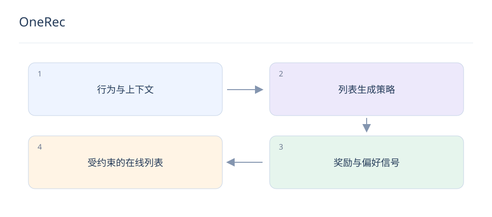

# OneRec：列表生成、多目标与偏好对齐

> 列表生成让推荐模型直接面对一组结果，但约束、反馈偏差和服务成本依然存在。把研究方向转为产品，需要明确可验证的收益。

## 1. 列表生成与逐物品打分有何区别？

逐物品模型先独立打分再组合，列表生成可让后续选择依赖前面已选结果，表达顺序和相互影响。但列表质量仍需明确目标，生成依赖不自动保证多样性或长期满意度。

## 2. OneRec 的研究重点是什么？

OneRec 将历史交互送入编码器，解码目标会话中物品的 Semantic ID，使用 MoE 扩展容量，并以会话级奖励模型进行迭代偏好对齐。先训练 next-token 目标，再结合偏好优化；这里讨论原始 OneRec，不混用后续版本。

## 3. 偏好对齐的奖励从哪里来？

OneRec 的 IPA 用奖励模型评价同一用户的多组生成列表，选择较优与较差列表形成偏好对，结合 DPO 与 next-token 损失训练。奖励仍是目标代理，需检查它与真实满意度、负反馈和长期价值的关系。

## 4. LLM 能直接判定用户喜欢什么吗？

LLM 可辅助评价解释质量、语义约束和内容相关性，但没有观察到的个人偏好不能靠推测当真值。应把语义质量与个性化行为目标分开，使用真实实验验证个体效果。

## 5. 如何发现奖励投机？

如果优化后奖励上升，但真实点击质量、完播或负反馈恶化，就需检查模型是否利用代理漏洞。例如重复高热内容能抬高预测值，却降低列表体验；保留独立指标与人工抽检。

## 6. 列表约束怎样实施？

库存、权限、重复物品和频控等硬条件通过候选限制、解码约束或后处理强制执行。后处理会改变生成分布，训练与评估应使用最终展示列表，不能只看未经约束的原始输出。

## 7. 怎样控制推理成本？

测量列表长度、解码步数、beam 宽度与并发对 P99 的影响，可采用候选生成加轻量重排的渐进方案。超时应返回有效列表；缓存必须考虑用户状态与物品实时可用性。

## 8. 如何设计落地实验？

先固定候选目录比较列表相关性、唯一率和约束违反率，再做小流量实验。将生成范式、额外内容特征和奖励优化分别消融，避免把多个同时变化的因素合成一个无法解释的提升。

## 延伸阅读

- [OneRec](https://arxiv.org/abs/2502.18965)
- [TIGER](https://arxiv.org/abs/2305.05065)
