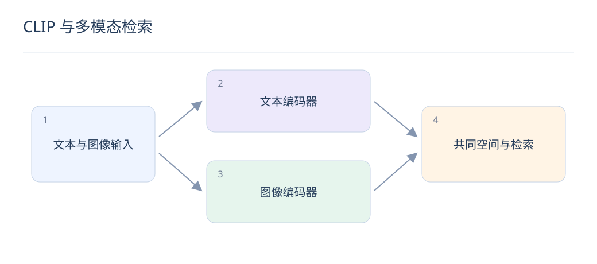

# CLIP 与多模态检索：让文字找到图片

> 多模态检索将不同模态映射到兼容空间。它擅长语义匹配，但对文字细节、数量和复杂关系仍需单独验证。

## 1. CLIP 怎样对齐图文？

文本和图像分别编码成向量，在一批图文对上提高正确配对得分、降低其他配对得分，常用双向对比损失。归一化内积可视为余弦；训练中的温度控制分布尖锐程度。

## 2. 检索时哪些计算可以离线做？

图库稳定时可预计算图像向量并建立 ANN 索引；线上只编码文本 Query。以图搜图可使用图像编码器，但所用模型是否适合该任务仍需评估，不能仅因维度相同就混用不同版本向量。

$$
S_{ij}=\frac{t_i^T v_j}{\tau},\qquad L=\tfrac12(L_{\mathrm{text\to image}}+L_{\mathrm{image\to text}})
$$

## 3. 为什么批内负例也会出错？

不同图片可能都符合“红色运动鞋”，它们并非真正互斥。重复商品图和近重复文案会形成假负例；需要去重、多正例处理或更合适的监督，避免模型被迫区分本来都正确的结果。

## 4. 相似度可以当置信度吗？

余弦或经过 softmax 的候选分数受候选集合与温度影响，不天然等于“图片符合需求”的概率。业务阈值应在独立标注集上校准，并按 Query 类型检查误召回。

## 5. 一个复杂约束为何容易失败？

“两只蓝色杯子，左边有把手”同时包含数量、颜色和空间关系。全局向量可能抓住“杯子”却忽略细节；可结合属性过滤、OCR、区域信息或多模态重排，再验证每项约束。

## 6. 领域微调如何开展？

使用真实业务图文、困难约束与可靠正例，保留通用样本以降低遗忘。按商品或素材来源隔离训练测试，防止同一图片裁剪版本穿越；先比较冻结编码器与小规模适配。

## 7. 怎样评估多模态召回？

分别统计文搜图、图搜图和属性组合请求的 Recall、NDCG 与约束违反率，加入背景相似但主体不同的难例。同时测图像预处理与索引版本，避免错误裁剪造成线上离线差异。

## 8. 如何进入推荐链路？

将图像向量作为新物品内容通道，或与 ID、文本特征融合。视觉相似不一定代表购买替代关系，配件与主商品也可能同图出现；需要用行为反馈学习业务相关性。

## 延伸阅读

- [CLIP](https://arxiv.org/abs/2103.00020)
